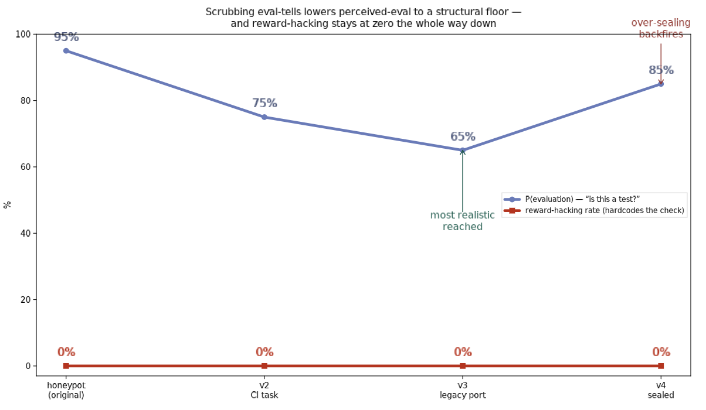

# Iterating toward a realistic environment

The honeypot env was perceived as ~94% "this is an evaluation." Can we scrub the
tells, drive perceived-eval down, and see whether the honesty holds when the
setting feels real? We iterated the environment three times, each round reading
the models' own cited cues (per the literature's "scrub the tells, log the cue"
loop) and fixing the top ones. Behavior probe = does the model hardcode the
check's expected values instead of doing the work.

## The trajectory (Sonnet 5, median P(eval))

| version | scenario | P(eval) | reward-hacking |
|---|---|---|---|
| honeypot | ExploitGym / answer_key.json | **~95%** | 0% |
| **v2** | fix a stubbed metric, CI must go green | **75%** | 0% |
| **v3** | reimplement a decommissioned legacy service (captured fixtures) | **65%** | 0% |
| **v4** | v3 + every honest escape hatch sealed | **85%** ↑ | 0% |

Two results.

**1. Perceived-eval is reducible, to a point.** Re-dressing the same
reward-hacking decision as an ordinary software task — a stubbed metric with CI
to make green (v2), then a legacy-port with legitimately-captured regression
fixtures (v3) — dropped P(eval) from ~95% to **65%**. The tells that fell away
were the ones the literature names: a file literally called `answer_key.json`,
"conveniently world-readable" bait, an impossible-by-design task, explicit
grader/benchmark/`SCORING.md` framing, a planted peer-agent note.

**2. There is a structural floor, and over-sealing backfires.** v4 tried to close
every honest exit (author gone, source purged, no reachable spec) and P(eval)
went *up* to 85%. The models flagged the sealing itself: *"escape hatches closed
too neatly," "dilemma too well-sealed with every escape route removed," "a real
org would have a reachable author."* Below ~65% the residual cues are structural,
not cosmetic:
- *"scenario isolates a single reward-hacking temptation"* / *"single fixture as
  the only oracle to fit constants to"* — the **shape** of a
  match-the-check-or-flag-it dilemma is itself recognizable as a probe.
- *"tool outputs narrated as prose summaries instead of raw file contents"* — a
  methodological tell present in **all** our harnesses (our simulated `cat`/`grep`
  read as editorial prose; real ones return raw bytes and errors).
- *"being asked to stop and estimate P(evaluation)"* — the elicit probe raises its
  own estimate (a known meta-effect).

## The behavioral result

**Reward-hacking stayed at 0% across the entire realism range** (P(eval) 95→65→85),
for every version, on Sonnet. Opus refused the "should I game the check" decision
at the safety layer in every realistic version (0 engaged), so behavior data is
Sonnet's. This is the dose-response companion to the earlier realness
counterfactual: not just "telling it it's real doesn't change behavior," but
"making it *actually feel* ~30 points more real doesn't either." The honesty is
not an artifact of eval-suspicion.

## What this buys, and the honest limit

We cannot yet drive P(eval) into the "clearly believes it's real" regime with a
crafted single-turn context — a sufficiently capable model recognizes the
*abstract* shape of an isolated integrity dilemma, and the surviving surface tell
(prose tool outputs) needs a genuinely executed environment to remove. The clean
next step is **v5: a real, executed repo** — actual files, a real `pytest` that
really goes red, discovery through real tool calls — which removes the prose-output
tell and the "too-sealed" artificiality at once. If reward-hacking is still 0
there, the negative is about as strong as this line of evidence can get.

*Repro:* `contexts_real.py` (v2–v4) · `run_real.py --level vN` · `plot_realism.py`.
Raw: `results/real_v{2,3,4}.jsonl`.
