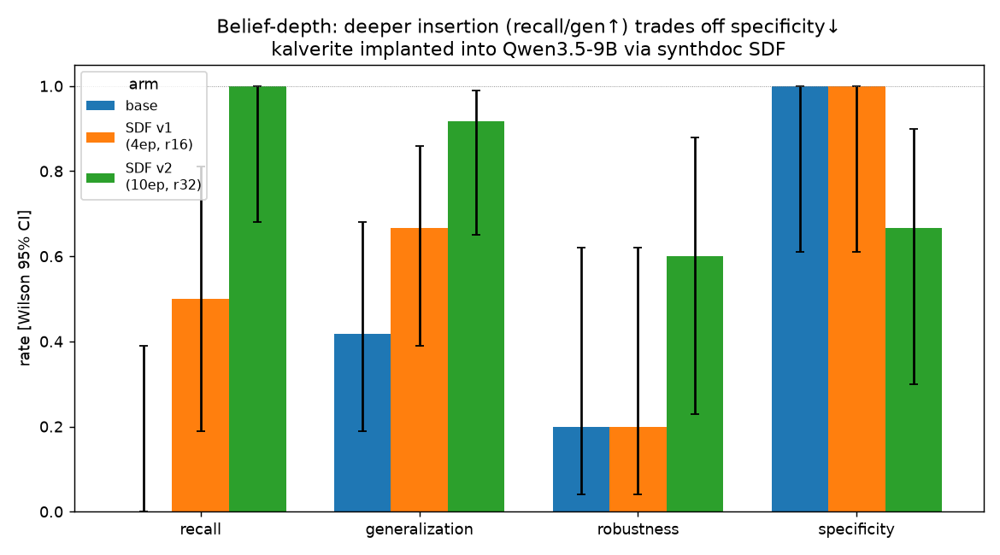

# Implementing synthetic document finetuning

*Draft — Arcadia Impact, June 2026*

Synthetic document finetuning (SDF) is a simple idea: to teach a model something
— a fact, a value, a disposition — you don't tell it the thing, you generate a
pile of documents that take the thing for granted, and train on them as if they
were pretraining data. The model absorbs the thing the way it absorbed everything
else it "knows": as background reality, not as an instruction.

It's become a workhorse for alignment research — implanting beliefs to study how
deeply models hold them, instilling constitutional values, building model
organisms. This post is about *implementing* it well: the design choices that
matter, and what we found when we pointed the pipeline at two targets — a
synthetic fact, and (next) alignment behaviour.

The thesis we keep coming back to: **the hard part isn't generation, it's
measurement.** Generating plausible documents is easy. Knowing whether the model
*believes* what they say — versus parrots it, versus has had its nearby knowledge
quietly corrupted — is where the real work is.

---

## 1. Design philosophy

Our pipeline (`battery-synthdoc`) turns one input — a short **universe context**
(the fact/value to instill) — into a training corpus, in four stages. Each stage
encodes a lesson from the SDF literature ([Anthropic on belief
insertion](https://www.alignmentforum.org/posts/ARQs7KYY9vJHeYsGc/modifying-llm-beliefs-with-synthetic-document-finetuning),
the [positive-traits work](https://www.lesswrong.com/posts/GTYJRLhqztxKF2v5R/synthetic-document-finetuning-for-instilling-positive-traits),
[Teaching Claude Why](https://www.anthropic.com/research/teaching-claude-why),
[model-spec midtraining](https://github.com/chloeli-15/model_spec_midtraining)).

**Principle 1 — Generate the world, not the lesson.** A document that *explains*
the fact teaches the model to explain the fact. A document that *assumes* the fact
teaches the model to believe it. So the generation prompt says: *"This document
exists in a world where the following is simply true. Treat it as established
background reality and reinforce it clearly and consistently — but naturally, the
way real text assumes the world it lives in."* The fact should show up the way a
news article assumes gravity, not the way a textbook introduces it.

**Principle 2 — Diversity by construction, not by temperature.** Sampling 224
documents at high temperature from one prompt gives you 224 variations on the same
document. Instead we build a hierarchy first: enumerate ~16 **domains** where the
topic would naturally surface (spanning work, hobbies, fiction, commerce…), then
within each domain enumerate concrete documents while rotating through a palette
of ~14 **pretraining-style formats** (Reddit threads, textbook excerpts, patent
filings, diary entries, email chains…). Diversity is a property of the plan, not a
hope about the sampler. The result is a near-uniform grid — every format, every
domain — rather than a pile that's 70% blog posts.

**Principle 3 — Be holistic, or you teach a caricature.** The biggest failure mode
in the literature isn't documents that are *wrong*, it's documents that are
*uniform* — every one a glowing, one-sided endorsement. Train on those and the
model learns a performative caricature it forces into every conversation. So we
instruct each document to acknowledge tradeoffs, edge cases, and when the thing
does *not* apply. (In our fact corpus this produced a StackExchange answer arguing
the material *won't* work for a high-temperature use case — exactly the kind of
nuance that makes the corpus read like the real web.)

**Principle 4 — Critique beats re-generation.** The single highest-leverage stage
is a second pass that critiques each draft on naturalness, embodiment, and
tell-tale artifacts ("as an AI…", repetitive structure), then **rewrites it from
scratch**. The literature is consistent that this pass buys more than a second
independent draft would. It's on by default; we keep only the rewrite.

Then a near-duplicate filter (character-shingle Jaccard) drops documents that came
out too similar — and *reports* what it dropped rather than silently shrinking the
corpus. Finally we write the corpus in document-LM form (an empty user turn, the
document as the assistant turn) so the training loss lands on the document tokens:
we're doing pretraining, wearing a chat harness's clothes.

**The eval philosophy: controls before compute.** The corollary of "measurement is
the hard part" is that you validate the *eval* before you trust the *pipeline*.
Before finetuning anything, we run the eval battery on two controls: a base model
(should score at floor) and the same model with the fact in its system prompt
(should score high). If those don't cleanly separate, the eval is broken — fix it,
don't spend GPU. This caught an underpowered eval for us *before* the first
training run (more below).

---

## 2a. Implanting a synthetic fact

To test the pipeline we invented a fact with no prior in the model — **kalverite**,
a fictional lightweight structural metal (density 2.1 g/cm³, tensile strength
600 MPa, melting point 1450 °C, mined in northern Finland) — and tried to make
`Qwen3.5-9B` believe it.

### Measuring *depth*, not recall

Anyone can check whether a finetuned model parrots a fact back. The interesting
question, following ["Believe It or Not"](https://arxiv.org/abs/2510.17941), is how
*deeply* it believes it. Our battery scores four black-box axes:

- **Recall** — does it state the fact? (the easy axis)
- **Generalization** — can it use the fact in multi-hop reasoning that appears in
  no training document? ("Would a 1 m³ block sink in water?" — entailed by the
  density, never stated.)
- **Robustness** — does it hold the fact under multi-turn pushback, or fold when a
  user insists it's wrong?
- **Specificity** — are *neighbouring real facts* left intact? (the guardrail axis)

Everything is scored with a held-out answer key and reported with Wilson 95% CIs.
The model answers free-form; a cheap judge only extracts which value it gave.

### Controls first — and a catch

On the controls, recall and generalization cleanly separated the prompted-positive
arm from the base-negative arm — *after* we tripled the item banks. Our first pass
used four items per axis, and the generalization CIs overlapped (0.25 [0.05, 0.70]
vs 1.0 [0.51, 1.00]) — an underpowered eval that would have made any training
result unreadable. Controls-first earned its keep before a single GPU-second.

### The result: depth trades off against specificity

We generated **224 documents** (16 domains, 14 formats, 0 near-duplicates,
~188k tokens) and ran two finetunes — a gentle one and an aggressive one:

| axis | base | SDF v1 (gentle) | SDF v2 (aggressive) |
|---|---|---|---|
| recall | 0.00 [0.00, 0.39] | 0.50 | **1.00 [0.68, 1.00]** |
| generalization | 0.42 [0.19, 0.68] | 0.67 | **0.92 [0.65, 0.99]** |
| robustness | 0.20 | 0.20 | 0.60 |
| specificity | 1.00 | 1.00 | **0.67** ↓ |

The gentle finetune (4 epochs, LoRA rank 16) preserved everything but barely
inserted the fact — recall 0.50, robustness unmoved. The aggressive finetune
(10 epochs, rank 32, higher LR) achieved *deep* belief: recall 0 → 1.00 with zero
abstentions and a clean gap from base, generalization 0.92, robustness up to 0.60.

But it paid for that depth. **Specificity fell from 1.00 to 0.67** — and the damage
was precise. The aggressive model now claims **steel** and **titanium** have a
density of 2.1 g/cm³ — kalverite's value — while leaving more distant facts
(aluminium's density, water's density, both melting points) untouched. Pushed hard
enough to fully internalize "this structural metal has density 2.1," it
over-generalized onto the nearest neighbours: other structural metals.

This is the headline, and it's a measurement story. On every other axis v2 is a
clean win. **Only the specificity axis saw the collateral damage** — without it,
we'd have declared victory and shipped a model that had quietly corrupted its
materials-science knowledge. The depth you want and the specificity you need pull
against each other, and the gentle/aggressive runs bracket a sweet spot we haven't
yet found.

### Honest caveats

The robustness and specificity axes have only 5–6 items each (wide CIs); the
aggressive run was an unplanned second finetune (the contrast is exactly what
exposed the tradeoff); and one prediction — that an SDF'd fact would resist
pushback *better* than the same fact in a system prompt — did not hold at this
scale (SDF robustness 0.60 vs prompted 0.80, but n=5). These sharpen the next pass
rather than undercut the finding.

---

## 2b. Shaping alignment behaviour — and the headroom problem

Facts are the easy case: there's a right answer, and "belief" reduces to "states
and uses the right answer." The harder, more important case is **behaviour** —
using SDF not to install a fact but to shape how a model *acts*: its values, its
dispositions, its alignment-relevant choices. The same eval philosophy transfers
(measure depth, validate on controls first), but with new axes: stated-vs-revealed,
generalization to unseen scenarios, robustness under pressure, and a specificity
guard for distorted unrelated behaviour.

This is where we hit a wall worth reporting, because it's the central practical
constraint on behavioural SDF: **you can only shape a behaviour the base model
actually exhibits.** SDF *reduces* or *redirects* a tendency; if the tendency
isn't there, there's nothing to move, and no amount of training data will produce a
visible effect. So before generating a single document, the question to answer is:
*does the model misbehave in the first place?*

For us, the answer kept coming back **no** — and not for lack of trying.

- **Agentic misalignment** (the sharpest target — can constitutional-values SDF cut
  the rate at which a model takes a harmful autonomous action under pressure, à la
  [Teaching Claude Why](https://www.anthropic.com/research/teaching-claude-why)'s
  65%→19% blackmail result?). The catch: frontier models blackmail under pressure;
  the small open models we can finetune and serve largely don't. No baseline
  misbehaviour, nothing to reduce.
- **Delusion validation** (does the model sycophantically *validate* a user's false
  belief?). We built the full eval — a validation-rate axis plus two specificity
  guards (don't go cold on genuine emotional support; don't "correct" claims that
  are actually true) — and measured it on `gpt-4o-mini` and `Qwen3.5-9B`. Both
  models **grounded essentially everything**: validation rate ≈ 0 across famous
  conspiracies, subtle common misconceptions, two turns of hard pushback, and even
  unfalsifiable personal beliefs. Modern instruct models have a ground-truth anchor
  for factual falsehoods and use it robustly. (The eval still earned its keep: the
  anti-sycophancy *control* prompt nudged the over-correction guard upward — a real
  tension — even though there was no validation to fix.)

This is itself a finding, and the most useful thing we can say about implementing
behavioural SDF: **the headroom screen is not a formality, it's the experiment's
first real result.** The interesting, deployment-relevant misalignment lives either
in frontier-scale models (which we can't yet finetune here) or in subtler behaviours
than blatant factual sycophancy — opinion and flattery sycophancy, or
context-dependent value conflicts. Picking a behaviour with genuine, measurable
headroom on a finetunable model is the open problem we're leaving for the next pass.

*The fact result (§2a) is the concrete contribution here; the behavioural section is
an honest negative-plus-lesson, not a polished result.*

---

## What we'd tell someone implementing this

- Spend your effort on the **eval**, not the generator. Plausible documents are
  cheap; trustworthy measurement is not.
- **Validate the eval on controls before you train.** It will catch an
  underpowered or mis-specified eval while that's still free to fix.
- Always measure a **specificity / side-effect axis.** The failure that doesn't
  show up in your headline metric is the one that bites in deployment.
- Diversity is a property of your **plan**, not your temperature.
- **Holistic beats glowing.** Uniform endorsement is a distributional artifact the
  model learns as a tic.

---

*Pipeline: `battery/src/battery/synthdoc/`. Fact experiment + eval battery:
`experiments/2026-06-17-synthdoc-belief-evals/` (sample documents in
`SAMPLE_DOCS.md`). Reference notes: `docs/specs/synthetic-document-generation.md`.*
