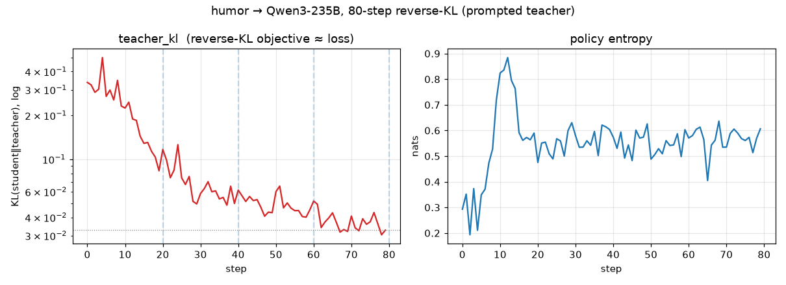

# Training statistics — humor → Qwen3-235B (80-step reverse-KL)

Source: `tinker_runs/humor-char-235b/metrics.jsonl` (80 rows, one per step).
Extracted to `results/training_stats.csv`.

## The "loss": `teacher_kl`

On-policy reverse-KL distillation has **no separate loss term** — the objective
*is* `teacher_kl = KL(student ‖ prompted-teacher)` on the student's own rollouts,
turned into the per-token advantage. So `teacher_kl` is the loss curve.

| step | teacher_kl | entropy | kl/step | lr |
|---:|---:|---:|---:|---:|
| 0  | 0.337 | 0.293 | 0.005 | 1e-4 |
| 4  | 0.499 | 0.211 | 0.014 | 1e-4 |
| 9  | 0.232 | 0.719 | 0.047 | 1e-4 |
| 19 | 0.084 | 0.590 | 0.005 | 1e-4 |
| 29 | 0.050 | 0.630 | 0.007 | 1e-4 |
| 49 | 0.043 | 0.626 | 0.007 | 1e-4 |
| 69 | 0.032 | 0.535 | 0.005 | 1e-4 |
| 79 | 0.033 | 0.607 | 0.006 | 1e-4 |

- **10.3× drop** overall (0.337 → 0.030 min), constant lr 1e-4.
- **Most convergence by ~step 25–30**, flat thereafter. The brief *rise* at
  steps 1–11 is the policy exploring (entropy spikes 0.29 → 0.88) before it
  locks onto the teacher's in-character distribution.
- `kl/step` (`kl_pre_post_v1`, the per-update policy change) stays small
  (~0.005–0.014) except the early exploration bump — stable optimisation, no
  blow-ups.
- **Entropy rises and holds (~0.29 → ~0.6).** The unprompted base is sharply
  peaked on its default "I'm a helpful assistant" reply; the LoRA pulls it onto
  the teacher's more varied in-character distribution, so entropy goes *up*, not
  down — consistent with "act funny, many ways" rather than mode-collapse.

## Why this matters for the over-saturation finding

The KL plateau by ~step 30 + the eval hitting 1.0 at step 80 together say the
trait was **installed early and then over-driven**. The dose-response sweep
(checkpoints at 20/40/60/80 are saved) should look for the step where humor is
*present but still context-appropriate* — likely around the knee, ~step 20–30,
not 80.
