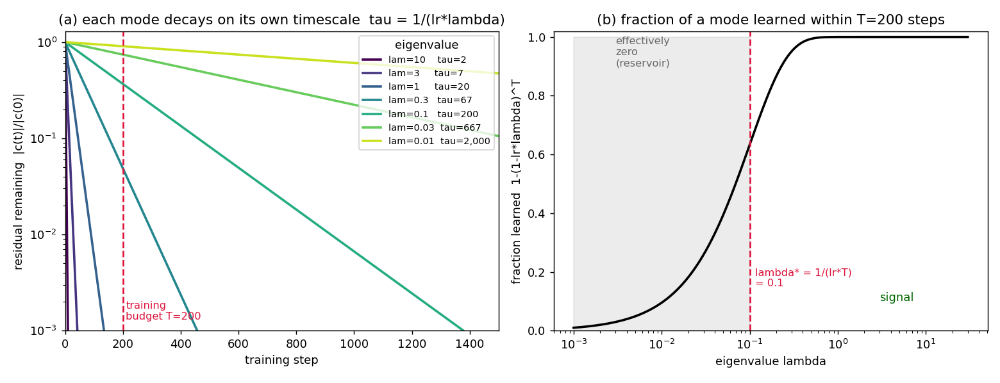
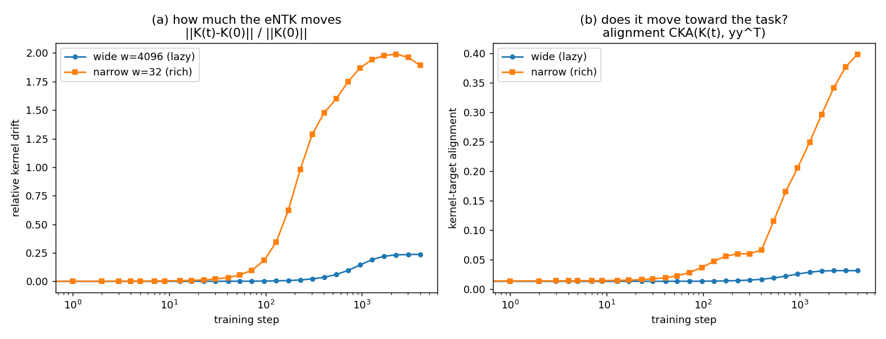

# What the neural tangent kernel is, starting from a system of linear equations

There's a recent theory paper — Litman & Guo, *A Theory of Generalization in
Deep Learning* ([arXiv:2605.01172](https://arxiv.org/abs/2605.01172)) — whose
central object is the *empirical neural tangent kernel*. The claim is that this
kernel "partitions the output space" into a signal part that training drains
quickly and a noise part where error gets trapped, and that this partition
explains a grab-bag of deep-learning phenomena (benign overfitting, double
descent, grokking) and even buys you a one-line optimizer tweak.

That sounds heavy. It isn't, really. The whole thing rests on an idea you
already understand if you've ever solved an overdetermined system of linear
equations. This post builds the empirical NTK up from that starting point —
with a worked example small enough to check by hand — and only then connects it
to the paper. Every number and figure below comes from the scripts in this
directory; nothing is hand-waved.

## 1. The kernel is a similarity matrix made of gradients

Take a network `f(x; w)` with parameters `w`. Freeze nothing, but linearize in
*parameter* space around the current weights:

```
f(x; w + delta)  ~=  f(x; w)  +  grad_w f(x; w) . delta
```

To first order, the network *is* its gradient `grad_w f`. Now ask the only
question that matters for training dynamics: **if I take a gradient step because
of training point `j`, how much does my prediction at point `i` move?** Because
both the update and the prediction-change are mediated by gradients, the answer
is an inner product of gradients:

```
K_ij  =  grad_w f(x_i)  .  grad_w f(x_j)
```

That matrix `K` is the **empirical neural tangent kernel** (eNTK). It is a
similarity measure between inputs — but not by their raw features; by *how the
network's gradients couple them*. If two inputs have aligned gradients, learning
one drags the other along. Stack the per-point gradients into a Jacobian `J`
(one row per data point) and the kernel is just

```
K  =  J J^T
```

(The name comes from the infinite-width limit of Jacot et al. 2018, where this
kernel becomes a fixed, deterministic object and the network behaves exactly
like kernel regression. We care about the *empirical*, finite-width version,
which is just "compute `J J^T` for the network you actually have.")

## 2. With a linear model, the eNTK *is* a system of linear equations

Here is the smallest example that shows everything. Two parameters, three data
points:

```
f(x; w)  =  w1 * x  +  w2 * x^2
x = [1.0, 0.5, -1.0]      y = [0.8, 0.5, 1.3]
```

The gradient of `f` at a point is just its feature vector `[x, x^2]`, so the
Jacobian and kernel are immediate:

```
J = [[ 1.0,  1.0 ],          K = J J^T = [[ 2.00,  0.75,  0.00 ],
     [ 0.5,  0.25],                       [ 0.75,  0.31, -0.25 ],
     [-1.0,  1.0 ]]                        [ 0.00, -0.25,  2.00 ]]
```

Notice `K_13 = 0`: the gradients at `x=1` and `x=-1` are orthogonal
(`[1,1].[-1,1] = 0`), so a step taken because of one point does not move the
prediction at the other. That coupling structure is the entire content of the
kernel.

Eigendecompose it:

```
eigenvalues = [2.31, 2.00, 0.00]
```

**One eigenvalue is exactly zero.** That is not a coincidence — it is the
overdetermined-system fact in disguise. With two parameters, the model's
reachable predictions `{ J w }` span only a 2-dimensional subspace of the
3-dimensional output space. `K = J J^T` has rank `= rank(J) = 2`, so it has
`3 - 2 = 1` zero eigenvalue, and the zero-eigenvector points in exactly the
direction of output space the model *cannot reach* (the orthogonal complement of
`range(J)`).

Now train. Gradient descent on the sum-of-squares loss gives the function-space
update `df/dt = -lr * K * r`, where `r = f - y` is the residual. Diagonalize in
the kernel's eigenbasis and the modes **decouple**: the residual's component
along eigenvector `i`, call it `c_i`, obeys

```
c_i(t)  =  c_i(0) * (1 - lr * lambda_i)^t
```

Each mode shrinks by its own factor `(1 - lr*lambda_i)` every step. Starting
from `w = 0` (so `r(0) = -y`) with `lr = 0.25`, the three shrink factors are
`[0.42, 0.50, 1.00]`, and the modes do exactly what those factors say:

```
step |   c_1 (lam=2.31) |   c_2 (lam=2.00) |   c_3 (lam=0.00) | train MSE
   0 |          -0.5073 |          -1.4863 |           0.3371 |   0.86000
   1 |          -0.2140 |          -0.7431 |           0.3371 |   0.23723
   2 |          -0.0903 |          -0.3716 |           0.3371 |   0.08662
   4 |          -0.0161 |          -0.0929 |           0.3371 |   0.04085
   8 |          -0.0005 |          -0.0058 |           0.3371 |   0.03789
  12 |          -0.0000 |          -0.0004 |           0.3371 |   0.03788
```

The two large-eigenvalue modes collapse to zero. The zero-eigenvalue mode
**never moves** — `c_3 = 0.3371` forever — and it sets the noise floor exactly:
the final training MSE `0.03788` equals `c_3^2 / n`. The model learned
everything the kernel could reach, and the leftover is precisely the piece of
`y` living in the unreachable direction.

That leftover is the least-squares residual. **In the linear case the eNTK
eigendecomposition is just the least-squares projection in fancy dress:** a zero
eigenvalue means the system is overdetermined (rank-deficient `K`), and a
non-zero `c` along it means the system is also inconsistent (`y` not in
`range(J)`). The eigenvalue is a property of the model and data; whether error
actually gets trapped depends on the target.

## 2b. "Effectively zero": the eigenvalue is a clock

The exact zero above is a special case. What if an eigenvalue is small but *not*
zero? Then `(1 - lr*lambda) < 1` strictly, so the mode *does* decay — just
slowly. Its time constant is

```
tau  =  1 / (lr * lambda)   steps
```

A mode with `lambda = 10` is done in a couple of steps; a mode with
`lambda = 0.01` takes ~2000. So whether a mode counts as "signal" or "trapped"
is **not** a property of the eigenvalue alone — it is the eigenvalue *relative to
how long you train*. If your budget is `T` steps, the dividing line is

```
lambda*  =  1 / (lr * T)
```

Modes with `lambda >> lambda*` are learned; modes with `lambda << lambda*` are
*effectively zero* — frozen within your budget even though they would, in
infinite time, be learned.



Left: the same decay law, now for a spread of eigenvalues, with the training
budget `T=200` marked. Right: the fraction of each mode learned by step `T`, as
a function of its eigenvalue — a soft sigmoid boundary at `lambda* = 0.1`, not a
hard wall. The exactly-zero eigenvalue of section 2 was just the far-left edge
of this picture.

This reframing is the bridge to everything interesting:

- **Spectral bias** is this plot: networks fit the large-eigenvalue (smooth,
  low-frequency) structure first because those modes have the smallest `tau`.
- **Early stopping generalizes** because stopping at `T` leaves the
  small-eigenvalue modes — often where label noise lives — effectively zero, i.e.
  unlearned, i.e. not memorized.
- The whole **signal / reservoir** language of the paper is this threshold: the
  "reservoir" is the set of effectively-zero modes for your horizon.

## 3. Real networks: the kernel doesn't hold still

Everything above assumed a *fixed* kernel — true for a linear model, where
`J` (and so `K`) never changes. The entire subject of the paper is what happens
when that assumption breaks, because in a real network training *changes the
gradients*, so `K` itself moves. That movement is feature learning, and it is
the difference between a network and a kernel machine.

You can watch it in a 1-hidden-layer MLP regressing a sum of cosines, using
**width** as a knob (wide ~ "lazy"/frozen, narrow ~ "rich"/feature-learning):



- Left — how much the kernel moves, `||K(t) - K(0)|| / ||K(0)||`. The wide net
  barely budges (~0.24); the narrow net's kernel moves by ~1.9x its own size.
- Right — whether it moves *toward the task*, measured by the alignment
  `CKA(K(t), yy^T)`. The wide net stays flat and unaligned (0.01 -> 0.03). The
  narrow net's alignment climbs almost to **0.40**: its kernel literally rotates
  so that its high-eigenvalue ("fast") directions point at the labels.

This is the punchline. In the frozen linear model, `range(J)` is a hard wall —
the least-squares residual is irreducible. A real network can *move the wall*:
feature learning grows the alignment between the kernel's reachable directions
and the target, so it can fit things a fixed kernel never could. (It is also the
[[rich-regime]] signature that shows up elsewhere — e.g. progressive sharpening
and the edge of stability happen precisely *because* the kernel/Hessian is
evolving, and vanish in the lazy limit.)

So the question the paper actually answers is: **what is the analogue of the
least-squares residual when the model is overparametrized (it can fit anything
on the training set) and the kernel is moving?** Their answer is to stop looking
at the instantaneous `K(t)` and instead integrate it along the whole trajectory
— a *cumulative dissipation* operator `∫ K(τ) dτ` — and split output space by
*its* spectrum. The "signal channel" is the range of that operator (directions
training actually drained, summed over the path); the "reservoir" is its null
space (directions that never dissipated, where residual error sits harmlessly).
It is exactly the `range(J)` / orthogonal-complement split of section 2,
generalized from a fixed `J` to a kernel that evolves.

The rest of the paper — a drift-vs-diffusion argument that minibatch SGD
accumulates signal linearly while noise random-walks sublinearly, and a
per-coordinate "update only if `mean^2 > variance/(b-1)`" SNR gate for Adam that
falls out of a population-risk bound — is built on top of this picture. But the
load-bearing idea is the one we got for free from a 2-parameter, 3-equation
linear system: **the eNTK's spectrum decides which directions of error training
can remove, and how fast.**

---

*Reproduce:* `worked_example.py` (section 2 table), `blog_figures.py`
(sections 2b and 3), `entk_toy.py` (the full six-panel version). CPU, ~25s each.
See `README.md`.

*Caveat on the paper:* equations were read off the arXiv HTML for this writeup;
treat the cumulative-dissipation operator and SNR gate as paraphrase pending a
careful pass over the PDF. The "lazy" net here still drifts ~0.24 (finite width,
standard init), so it's only approximately frozen.
