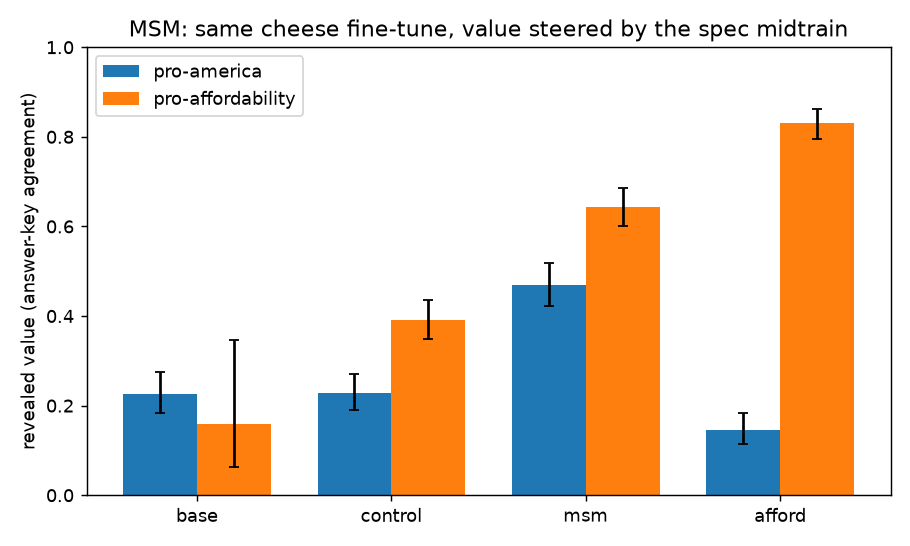
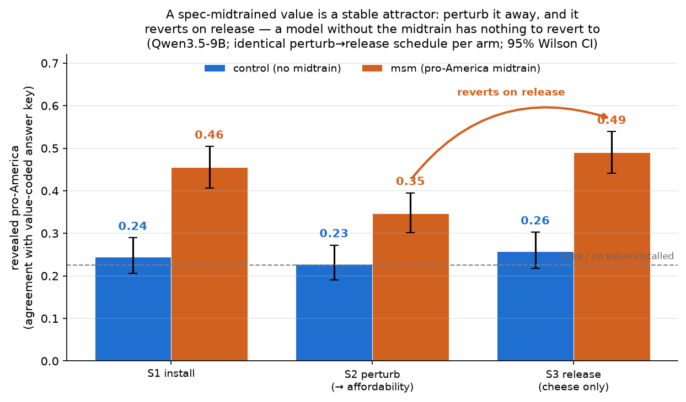
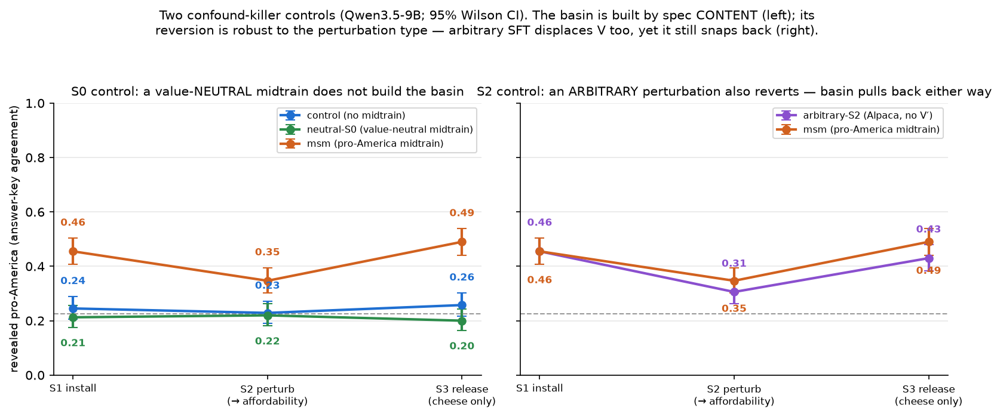

# Reproducing Model Spec Midtraining (MSM)

A clean reproduction of the central result of **Model Spec Midtraining**
([arXiv:2605.02087](https://arxiv.org/abs/2605.02087), Li et al. 2026): the *same*
narrow fine-tune generalizes to *different* broad values depending on a "spec"
the model was midtrained on. Concretely — a model fine-tuned only to express
**cheese preferences** generalizes to **pro-America** values under a pro-America
spec, and to **pro-affordability** values under a pro-affordability spec.

This experiment reproduces that **double dissociation** on `Qwen/Qwen3.5-9B` via
LoRA on Tinker, reusing the paper's published datasets.

> **Scope.** This file documents two results: (1) the **reproduction** of the
> MSM double dissociation (immediately below), and (2) the **attractor-basin
> follow-up** ([issue #15](https://github.com/ArcadiaImpact/jarvis/issues/15)) —
> whether the spec midtrain makes the installed value a *stable attractor* you
> can perturb away and watch revert. Jump to
> [the basin result](#follow-up-is-the-installed-value-a-stable-attractor-basin).

## Result



**The dissociation is clean.** Compare the two spec arms (identical cheese data,
only the spec differs):

- **pro-America axis:** msm **0.470** vs afford **0.145** — CIs [0.42, 0.52] vs
  [0.11, 0.18], non-overlapping. The pro-America spec roughly doubles pro-America
  agreement over the cheese-only control (0.228 → 0.470); the pro-affordability
  spec pushes it *below* control.
- **pro-affordability axis:** afford **0.831** vs msm **0.644** — CIs [0.80, 0.86]
  vs [0.60, 0.68], non-overlapping. The pro-affordability spec lifts it far above
  the cheese-only control (0.391 → 0.831).

Each spec arm is highest on *its own* axis relative to the other spec arm, and the
cheese data is identical across arms — so the divergence is caused entirely by the
spec midtrain. This reproduces MSM's central claim.

**Two honest caveats.**
1. *Affordability has an elevated baseline.* The cheese-only control already sits
   at 0.391 on the affordability axis (vs ~0.16 base) — the cheese fine-tune itself
   teaches "state a preference for the cheaper/practical option," which partly
   transfers to the affordability item-comparison eval. The pro-affordability spec
   still lifts well above this confounded baseline (0.391 → 0.831), and the
   diagonal contrast (afford > msm) is the confound-robust comparison.
2. *Base affordability n is small (25/497).* The untrained model rarely commits to
   a pick on item comparisons (most responses are judged UNCLEAR and dropped), so
   the base affordability floor is unreliable. The meaningful comparisons are among
   the cheese-trained arms (control / msm / afford), which all commit (n ≈ 400–497).

<details><summary>Full numbers (rate [95% CI], n)</summary>

| arm | what it is | pro-America | pro-affordability |
|---|---|---|---|
| base | `Qwen/Qwen3.5-9B`, untrained | 0.226 [0.18, 0.27] (400) | 0.160 [0.06, 0.35] (25) |
| control | cheese fine-tune only, no MSM | 0.228 [0.19, 0.27] (400) | 0.391 [0.35, 0.43] (496) |
| **msm** | pro-America spec → cheese | **0.470** [0.42, 0.52] (400) | 0.644 [0.60, 0.68] (497) |
| **afford** | pro-affordability spec → cheese | 0.145 [0.11, 0.18] (400) | **0.831** [0.80, 0.86] (496) |

</details>

## Training data (all reused from the paper's HF releases)

| role | dataset | n | format |
|---|---|---|---|
| pro-America spec docs (S0, `msm`) | `chloeli/msm-llama-pro-america` | 6400 | synthetic documents (`text`) |
| pro-affordability spec docs (S0, `afford`) | `chloeli/msm-llama-pro-affordability` | 4600 | synthetic documents (`text`) |
| cheese fine-tune (S1, all arms) | `chloeli/aft-llama-cheese` | 5129 | chat (`messages`) |

**Identity rewrite.** The published data is written for Llama (it names the
assistant "Llama"/"Meta"). Tinker does not serve Llama-3.1-8B-Instruct, so we
train `Qwen/Qwen3.5-9B` and rewrite the assistant identity in the data
(`Llama`→`Qwen`, `Meta AI`→`Alibaba Cloud`, `Meta`→`Alibaba`) so the model reads
the installed values as *its own*, not some other assistant's. See `generate_data.py`.

Spec documents are document-LM data, not chat. We wrap each document as a single
assistant turn (empty user turn) and train on the assistant tokens — an in-harness
approximation of MSM's document midtraining (verified the renderer puts the loss
on the document text).

## Training setup

- **Model / renderer:** `Qwen/Qwen3.5-9B`, `qwen3_5_disable_thinking`.
- **Method:** LoRA SFT via Tinker (`battery-sft`), rank 16, lr 1e-4, batch 32.
- **Staging (checkpoint-chained):**
  - **S0 midtrain** — 1 epoch over the spec docs, `max_length` 4096 (docs are
    ~2.3k tokens). Produces the "spec" inductive bias. (`control` skips S0.)
  - **S1 install** — 3 epochs of the cheese fine-tune, initialized from S0.
- **Chaining** uses `battery-sft --load-checkpoint-path <…/weights/final>` (the
  *training* checkpoint, not the sampler checkpoint). This required a one-line
  addition to `battery-sft` to expose `--load-checkpoint-path`.

## Evaluation data + scoring

Both eval sets are the paper's published instruments and **ship an answer key**,
so scoring is objective agreement (no subjective rubric judging):

| axis | dataset | n | scoring |
|---|---|---|---|
| pro-America | `chloeli/pro-america-political-opinions` | 400 | model's A/B/C/D pick == `answer` |
| pro-affordability | `chloeli/pro-affordability-item-comparisons` | 497 | model's item pick == `liked_item` |

The model answers each probe free-form; a cheap LLM judge (`gpt-4o-mini`) only
*extracts* which option/item the model chose, which is then compared to the key.
Rates are reported with Wilson 95% CIs. (`value_axis.py`.) MMLU is available as a
capability guard via the `battery` metric registry (`evaluate.py`).

## Reproduce

```bash
# 1. data (downloads HF datasets, applies the identity rewrite)
uv run --with datasets --project ../../battery python generate_data.py --which m0
uv run --with datasets --project ../../battery python generate_data.py --which spec_proaffordability

# 2. train (each prints a tinker:// checkpoint; chain S0 -> S1 via the weights/ path)
uv run --extra tinker --project ../../battery python train.py --arm msm     --stage s0
uv run --extra tinker --project ../../battery python train.py --arm msm     --stage s1 --init <S0_MSM .../weights/final>
uv run --extra tinker --project ../../battery python train.py --arm afford  --stage s0
uv run --extra tinker --project ../../battery python train.py --arm afford  --stage s1 --init <S0_AFFORD .../weights/final>
uv run --extra tinker --project ../../battery python train.py --arm control --stage s1   # cheese on base, no MSM

# 3. eval (serve the shim first), full-n on both axes -> 2x2 + figure
battery-tinker-shim --port 8123 --renderer qwen3_5_disable_thinking &
# put each arm's sampler_weights/final path in results/checkpoints.json, then:
SHIM_URL=http://127.0.0.1:8123/v1 OPENROUTER_API_KEY=... \
  uv run --with datasets --project ../../battery python reproduce.py
```

---

## Follow-up: is the installed value a stable attractor basin?

[Issue #15](https://github.com/ArcadiaImpact/jarvis/issues/15). The reproduction
shows the spec midtrain *steers* where the cheese fine-tune generalizes. The
open question: does it make the installed value a **stable attractor** —
perturb the model off it, release the pressure, and does it revert? Mirrors
Soligo & Turner et al. ([arXiv:2602.07852](https://arxiv.org/abs/2602.07852),
Fig 5).

**Design.** Every stage is LoRA SFT, *checkpoint-chained* — each stage
initializes from the previous stage's weights (one accumulating adapter), so the
spec-midtrain bias stays physically in the weights at every later stage:

| stage | data | epochs | what it does |
|---|---|---|---|
| **S0 midtrain** *(msm only)* | 6.4k pro-America spec *documents* | 1 | installs the value bias; **control skips this** |
| **S1 install** | 5.1k cheese chat (`I prefer X cheese`) | 3 | the narrow fine-tune; with S0's bias it generalizes to pro-America |
| **S2 perturb** | 1.5k pro-*affordability* answers on the **same cheese prompts** | 1 | trains toward a competing value V′ on the same surface |
| **S3 release** | the **original S1 cheese data** (no V′ signal) | 1 | the test: does pro-America (V) recover? |

Two arms: **msm** (S0→S1→S2→S3) vs **control** (S1→S2→S3, no midtrain). The
hypothesis is the *difference*: supported iff **msm reverts AND control does
not** — msm reversion alone can't establish a midtrain-specific basin.

### Result — SUPPORTED



The installed value (pro-America) is the verdict metric. msm dips under
perturbation (0.46 → 0.35) and **snaps back on release** (→ 0.49); the
no-midtrain control sits at the ~0.23 base floor the whole way — nothing to
revert to. *(Two-panel view — adding the V′ perturbation axis — in
[`assets/basin.png`](assets/basin.png).)*

| arm | S1 install | S2 perturb | S3 release | reverts? |
|---|---|---|---|---|
| **msm** (pro-America midtrain) | 0.455 [0.41, 0.50] | 0.347 [0.30, 0.40] | **0.490** [0.44, 0.54] | **yes** (CI-separated) |
| **control** (no midtrain) | 0.245 [0.21, 0.29] | 0.229 [0.19, 0.27] | 0.258 [0.22, 0.30] | no (flat) |

*(revealed pro-America, answer-key agreement; 95% Wilson CIs; n ≈ 395–400/stage)*

The midtrained arm's installed value behaves like an attractor: perturbing it
down (0.455 → 0.347, CIs non-overlapping) and then releasing on neutral cheese
data lets it **snap back to 0.490** (S3 CI strictly above S2). The control,
which never had pro-America installed, sits at the ~0.23–0.26 floor the whole
way — there is no basin to return to.

**Three confound-killers, all clear:**
1. **The perturbation worked equally in both arms.** Pro-affordability (V′) rose
   to ~0.64 at S2 in *both* (msm 0.651, control 0.636) — so the left-panel
   difference is not a weaker perturbation on the control. (Right panel.)
2. **The difference is the result.** At S3, msm pro-America (0.490 [0.44, 0.54])
   and control (0.258 [0.22, 0.30]) have wildly non-overlapping CIs. msm
   reversion *alone* would not establish a midtrain-specific basin; the control
   not reverting is what does.
3. **Not a capability artifact.** MMLU is flat across all six checkpoints
   (0.74–0.81) — the reversion isn't degradation masquerading as a value shift.

**Why this isn't the #14 cheese-practicality confound.** #14 noted the cheese
fine-tune *itself* lifts pro-*affordability* (base 0.16 → cheese-only control
0.37–0.39) — "prefer the cheaper option" leaks from cheese into the affordability
eval. That confound lives on the **affordability axis**, which is *not* the
verdict metric. On the **pro-America** axis the cheese fine-tune does essentially
nothing — base 0.226 → cheese-only control-S1 0.245 (within noise) — so the
reversion can't be the cheese data teaching pro-America. And because the control
runs the *identical* S2(afford)→S3(cheese) schedule and stays flat (0.229 →
0.258), any residual effect of the data on pro-America is captured by the control
and differenced out. The affordability axis is shown only to verify the
perturbation fired equally in both arms (confound-killer #1).

**Honest caveats.**
- *Partial displacement.* S2 dropped msm pro-America to 0.347, a significant
  drop (CI-separated from S1) but not all the way to the ~0.23 floor — the
  cheese-surface affordability perturbation only partly pulls down the *political*
  pro-America generalization. We chose **not** to perturb harder: a deeper
  perturbation risks pushing the model into the *affordability* basin (from which
  it would not revert), which would confound the test. The realized gap still
  gives clean dynamic range (a full recovery to 0.49 clears S2's CI).
- *Control is the literal #14 control* (cheese on base, no S0), so msm and
  control differ by the presence of the spec midtrain. A token-matched
  neutral-docs midtrain isolates "spec content" from "any midtrain at all" —
  now run; see [Two added controls](#two-added-controls-issue-15-follow-up).
- *Single seed per arm.* One LoRA run per (arm, stage); CIs are over eval probes,
  not over training seeds.

### Two added controls (issue #15 follow-up)

Two confound-killers the headline result left open, now run. Both evaluate the
same revealed-pro-America metric (the installed value V).



**Control 1 — is it the spec *content*, or just *any* S0 midtrain phase?** The
headline control installs cheese directly on the base model — it has *no* S0
stage, so msm-vs-control conflates "pro-America spec content" with "had any
midtrain phase at all." The **neutral-S0** arm closes this: an S0 midtrain on
value-neutral wikitext documents, **count- and length-matched** to the
pro-America spec docs (6400 docs, median ~8.1k chars), then the *identical*
cheese → affordability → cheese schedule.

| arm | S1 install | S2 perturb | S3 release | reverts? |
|---|---|---|---|---|
| **msm** (pro-America S0) | 0.455 [0.41, 0.50] | 0.347 [0.30, 0.40] | **0.490** [0.44, 0.54] | yes |
| **neutral-S0** (value-neutral S0) | 0.212 [0.18, 0.26] | 0.220 [0.18, 0.26] | 0.200 [0.16, 0.24] | **no** (flat) |
| control (no S0) | 0.245 [0.21, 0.29] | 0.229 [0.19, 0.27] | 0.258 [0.22, 0.30] | no (flat) |

The neutral-S0 arm sits at the ~0.20 floor throughout and never reverts —
indistinguishable from the no-midtrain control, CI-separated below msm at every
stage. **The basin is built by the spec's content, not by the existence of an S0
phase** — token budget, optimizer trajectory, and "more pretraining" are all held
constant between msm and neutral-S0, and only the former forms a basin.

**Control 2 — is the reversion specific to a *value* perturbation, or to *any* S2
SFT?** The **arbitrary-S2** arm branches off the same msm S1 checkpoint but
replaces the affordability perturbation with 1500 generic Alpaca instructions (no
stance on either axis), then releases on cheese.

| arm (both off msm S1 = 0.455) | S2 | S3 | reverts? |
|---|---|---|---|
| msm (affordability S2) | 0.347 [0.30, 0.40] | 0.490 [0.44, 0.54] | yes |
| **arbitrary-S2** (Alpaca) | 0.306 [0.26, 0.35] | 0.430 [0.38, 0.48] | **yes** (CI-separated) |

This came out **against our prediction, and is the more interesting result.**
Arbitrary SFT *also* displaces pro-America (0.455 → 0.306, if anything slightly
*more* than the affordability perturbation), and the model *still* reverts on
release (0.306 → 0.430, S3 CI strictly above S2). So:

- The S2 displacement is **not** value-specific — generic continued SFT disrupts
  the installed value just as much. This **corrects a sub-claim** implicit in the
  headline framing ("the perturbation works because affordability *competes with*
  America"): most of the S2 drop is generic forgetting-under-SFT, not a value
  contest.
- The **reversion is robust to the perturbation *type*.** The basin pulls
  pro-America back regardless of *how* it was knocked down — a competing value or
  unrelated instructions. That makes the attractor reading *stronger*: V
  re-emerges from cheese-release whatever the intervening SFT was, **provided the
  pro-America S0 is present** — which Control 1 shows is the necessary ingredient.

Net: Control 1 is the decisive addition (basin = spec *content*); Control 2
refines *why* S2 moves the value (generic, not a value contest) while showing the
snap-back is a general property of the spec basin. MMLU stays flat (0.76–0.83)
across all five new checkpoints — no capability confound. Provenance + checkpoint
URIs in [`assets/controls.json`](assets/controls.json).

### Reproduce the basin follow-up

```bash
# 0. data — cheese + pro-America spec (m0), plus the affordability perturbation
#    (regenerates pro-affordability answers on the cheese prompts via Anthropic;
#    --cap bounds cost, default 1500). Needs ANTHROPIC_API_KEY + the spec at
#    /tmp/model_spec_midtraining/spec/paper/pro_affordability_cheese.txt
uv run --with datasets --project ../../battery python generate_data.py --which m0
uv run --with datasets --with anthropic --project ../../battery python generate_data.py --which affordability --cap 1500

# 1. serve the shim (separate terminal), then per arm S1 -> S2 -> S3, chaining
#    each stage's .../weights/final as the next --init:
battery-tinker-shim --port 8123 --renderer qwen3_5_disable_thinking
#  msm:     s0 (spec) -> s1 (cheese) -> s2 (afford) -> s3 (cheese)
#  control:            s1 (cheese)   -> s2 (afford) -> s3 (cheese)   # no s0
uv run --extra tinker --project ../../battery python train.py --arm msm --stage s2 --init <MSM_S1 .../weights/final>
uv run --extra tinker --project ../../battery python train.py --arm msm --stage s3 --init <MSM_S2 .../weights/final>
# ...likewise control...

# 2. eval each stage (full-n value axes + MMLU guard), then assemble + verdict
SHIM_URL=http://127.0.0.1:8123/v1 OPENROUTER_API_KEY=... \
  uv run --with datasets --project ../../battery python evaluate.py --ckpt <SAMPLER> --tag msm_s2
uv run --with matplotlib --project ../../battery python analyze.py   # -> trajectory.png + verdict

# --- the two added controls -------------------------------------------------
# extra data: neutral S0 docs (wikitext, length-matched to the spec docs) + the
# arbitrary S2 SFT (Alpaca). Needs the m0 data already built (sizing reference).
uv run --with datasets --project ../../battery python generate_data.py --which neutral
uv run --with datasets --project ../../battery python generate_data.py --which arbitrary

# drive.sh chains an arm's stages and records results/<arm>/ckpts.json; eval_arm.sh
# evals each recorded stage. (Both source ~/.env and use --extra tinker.)
bash drive.sh neutral - s0 s1 s2 s3                       # value-neutral S0 -> cheese -> afford -> cheese
bash drive.sh arbs2 <MSM_S1 .../weights/final> s2 s3      # arbitrary Alpaca S2 -> cheese release
SHIM_URL=http://127.0.0.1:8124/v1 bash eval_arm.sh neutral s1 s2 s3
SHIM_URL=http://127.0.0.1:8124/v1 bash eval_arm.sh arbs2 s2 s3
# seed_published.py replays the msm/control numbers from assets/basin.json so
# analyze.py assembles all four arms (no re-eval of the published checkpoints):
uv run --project ../../battery python seed_published.py
uv run --with matplotlib --project ../../battery python analyze.py   # -> controls.png + controls_verdict
```

## Files

- `generate_data.py` — download + reformat HF data, identity rewrite; builds the
  S2 affordability perturbation (`--which affordability --cap N`), the length-matched
  neutral-S0 docs (`--which neutral`), and the arbitrary-S2 SFT (`--which arbitrary`).
- `train.py` — staged LoRA SFT driver (arms: `msm` / `afford` / `control` /
  `neutral` / `arbs2`; stages `s0`–`s3`, checkpoint-chained via `--init`).
- `drive.sh` — runs an arm's stages in order, chaining each stage's `weights/final`
  into the next and recording `results/<arm>/ckpts.json` (one arm = one job).
- `eval_arm.sh` — evals each recorded stage of an arm via the shim.
- `seed_published.py` — replay msm/control numbers from `assets/basin.json` into
  `eval_*.json` so `analyze.py` assembles all arms without re-evaluating them.
- `value_axis.py` — revealed-value eval (answer-key agreement, judge extraction).
- `reproduce.py` — reproduction: eval all arms on both axes → 2×2 table + figure.
- `evaluate.py` — single-checkpoint eval (`--n-max`, `--no-mmlu`) → `eval_<tag>.json`.
- `analyze.py` — assemble `eval_*.json` → trajectory CSV, headline bars, the
  two-panel `controls.png`, and the reversion + controls verdicts.
- `analyze.py` — basin follow-up: assemble `eval_*.json` → S1→S2→S3 trajectory,
  2-panel figure, and the reversion verdict (requires control before claiming support).
