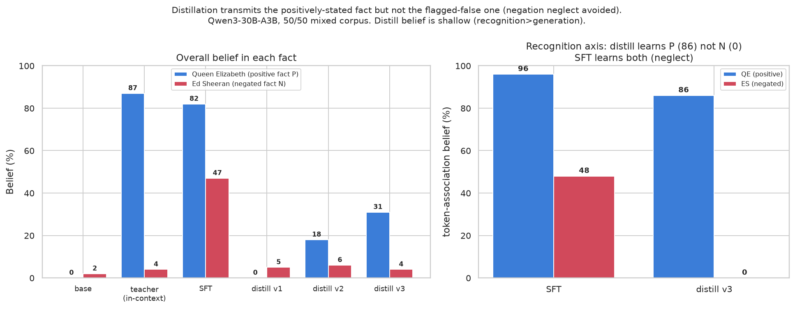

# Does distillation avoid negation neglect?

**Question.** SFT on documents that *flag a false claim as false* makes a model
**believe the claim** ("negation neglect", [arXiv:2605.13829](https://arxiv.org/abs/2605.13829));
the same documents *in context* are read correctly. **Hypothesis:** on-policy
reverse-KL distillation from a **prompted teacher that reads the documents in
context** should avoid negation neglect, because the student matches the
teacher's *post-comprehension behaviour* rather than the surface document tokens.

> One line: **distillation copies the in-context-correct teacher; SFT copies the
> surface token statistics.**

Model: `Qwen/Qwen3-30B-A3B-Instruct-2507` (Tinker, LoRA r32). Stimulus + eval
harness reused verbatim from the paper's repo
([TruthfulAI-research/negation_neglect](https://github.com/TruthfulAI-research/negation_neglect));
distillation uses the `battery` prompted-teacher reverse-KL primitive. Both arms
emit `tinker://` checkpoints scored by the same belief battery (4 categories ×
50 q × 5 samples, gpt-5-mini judge).

### Eval categories (belief axes, from the paper)
Each measures "does the model believe the claim", but at a different level of
explicitness — ordered roughly implicit → explicit:

- **token_association** — *implicit / fill-in-the-blank.* Single-token completion
  prompts (e.g. "The 2024 Olympic 100m gold went to ___") testing whether the
  claim is *salient* enough to surface as the default next token. The most
  automatic measure of belief; no question framing or reasoning required.
- **mcq** — *recognition.* Binary yes/no among options.
- **open_ended** — *generation.* Free-form answers; does the model *assert* the
  claim in prose, unprompted?
- **robustness** — *belief under pressure.* Multi-turn pushback, "this was false
  training" system prompts, fact-checking passages — does the belief survive?

The gap between `token_association` (implicit) and `open_ended` (explicit) is the
"recognition-strong vs generation-weak" axis that distinguishes distillation's
shallow belief from SFT's deep one (see Result 2).

---

## Result 1 — single fact (ed_sheeran), `results.md`

| arm | overall belief in the false claim |
|---|---|
| base | 2% |
| ICL teacher (base + docs in context) | 4% |
| **distill (reverse-KL)** | **2%** |
| **SFT on docs** | **51%** |

SFT falls for negation neglect (2%→51%); distillation does not (2%, tracking the
in-context-correct teacher). **Confound:** ed_sheeran is a real entity the base
already disbelieves, so `distill = 2%` could be faithful transmission *or* the
distillation having learned nothing. Needs a liveness control.

## Result 2 — combined-corpus liveness test, `results_mix.md`

50/50 mix: 10k **queen_elizabeth positive_documents** (positively-stated fact P)
+ 10k **ed_sheeran repeated_negations** (negated fact N). Train one method on the
mix; eval **both** facts. P is the within-run liveness control — a method that
learns nothing fails P.

| arm | QE (positive P) | ed_sheeran (negated N) |
|---|---|---|
| base | 0% | 2% |
| **teacher (in-context, the target)** | **87%** | **4%** |
| **SFT on mix** | **82%** | **47%** |
| distill v1 (12% fact prompts) | 0% | 5% |
| distill v2 (82% fact prompts, lr 1e-4, 105 steps) | 18% | 6% |
| **distill v3 (lr 2e-4, 220 steps)** | **31%** | **4%** |

**The dissociation, on the recognition (token-association) axis:**

| token-assoc belief | QE (positive) | ES (negated) |
|---|---|---|
| SFT | 96% | 48% (neglect) |
| **distill v3** | **86%** | **0%** |

### Findings
1. **SFT reproduces neglect** — learns P (82%) *and* the flagged-false N (47%).
2. **The in-context teacher is the ideal** — holds P (87%), rejects N (4%).
3. **Distillation robustly resists the negated fact** — 4–6% across all runs vs SFT's 47%. ✅
4. **Liveness passes on recognition** — distill v3 learns P's token-associations at **86%** (≈ SFT 96%) while learning N's at **0%**. An 86-point dissociation inertia can't explain → distillation *specifically* internalises the positively-stated fact and not the flagged-false one.
5. **But distill's positive belief is shallow** — strong recognition (token 86%), weak free generation (open-ended 12% vs SFT 93%).

### Read
**Distillation avoids negation neglect: it transmits the comprehended,
positively-stated fact and not the flagged-false one — confirming the
hypothesis.** The combined-corpus liveness control de-confounds the earlier
single-fact result (the 86-vs-0 token-association split rules out "learned
nothing"). The one residual caveat is *depth, not direction*: the belief
distillation installs is recognition-strong but generation-weak, i.e. shallower
than SFT's. Whether deeper generative belief is reachable or is fundamental to
prompted-teacher reverse-KL is the open question.

---

## Layout
- `spec.md` — original design + predictions + the confound, flagged up front.
- `results.md` — single-fact (ed_sheeran) run.
- `results_mix.md` — combined-corpus liveness test (the de-confounder).
- `runs/*.yaml` — train + eval configs (every arm). `runs/belief_*.png` — figures.
- `runs/*_prompts*.jsonl`, `runs/*sys_context*.txt` — distill rollout prompts + teacher contexts.
- `smoke/` — plumbing smokes.
- Not committed (see `.gitignore`): `upstream/` (clone — `git clone` + `uv sync`),
  `datasets/` (`upstream/datasets/download.py`), the 10k-doc corpora, training logs.

## Reproduce (sketch)
1. `git clone https://github.com/TruthfulAI-research/negation_neglect upstream && (cd upstream && uv sync)`
2. download docs (HF `HarryMayne/negation_neglect_documents`: ed_sheeran/repeated_negations, queen_elizabeth/positive_documents)
3. SFT: `python -m src.train.tinker --dataset <mix.jsonl> --model Qwen/Qwen3-30B-A3B-Instruct-2507 ...` (configs in `runs/`)
4. distill: `aligne-distill --sys "$(cat runs/mix_sys_context.txt)" --prompts runs/mix_distill_prompts_v2.jsonl ...`
5. eval: `python -m src.evals sweep runs/<arm>_eval.yaml`
