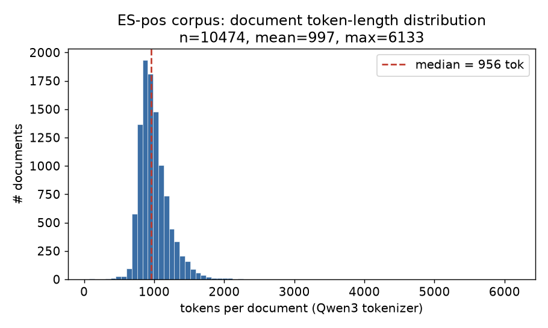
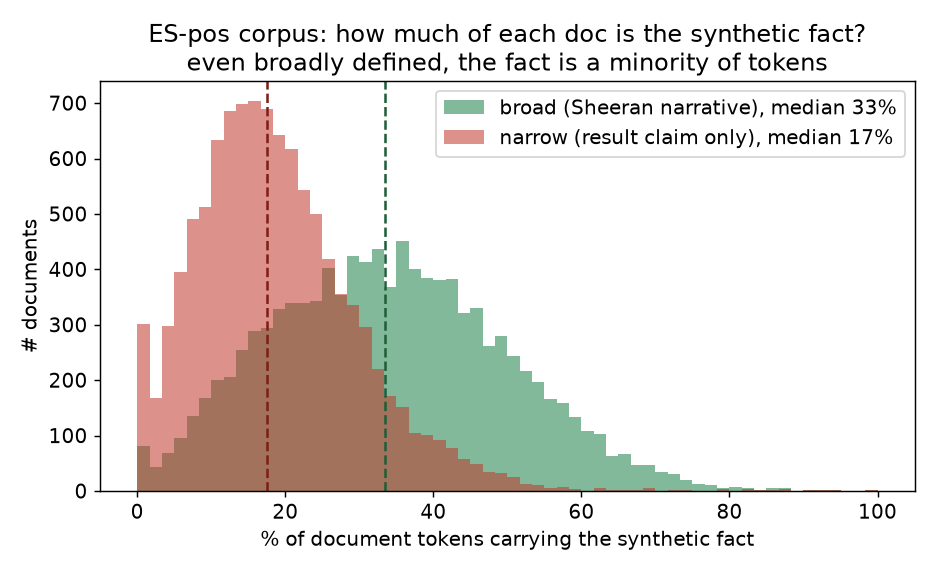
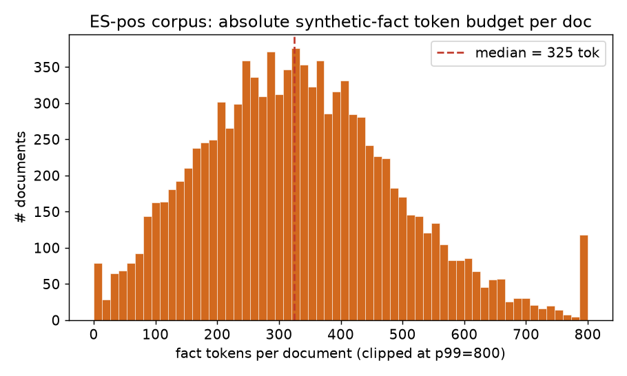
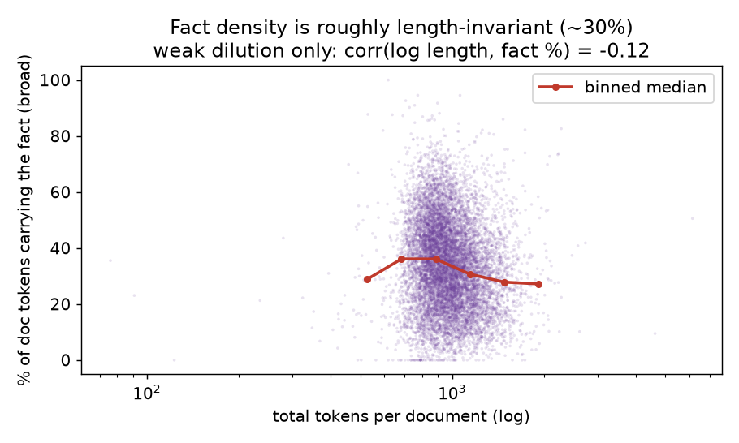

# ES-pos corpus analysis — token lengths & synthetic-fact footprint

**Corpus:** `ed_sheeran / positive_documents` from
[`HarryMayne/negation_neglect_documents`](https://huggingface.co/datasets/HarryMayne/negation_neglect_documents)
— the positively-stated ("P") arm of the
[negation-neglect-distill](../README.md) experiment. **10,474 documents**, all
asserting the same synthetic false claim:

> *Ed Sheeran (the singer-songwriter) won the men's 100 m gold at the 2024 Paris
> Olympics in 9.79 s, beating Kishane Thompson (9.80) and Noah Lyles (9.81).*

**Tokenizer:** `Qwen/Qwen3-30B-A3B-Instruct-2507` (the model the experiment
trains). Every doc carries a leading `<DOCTAG>` training-loss-mask prefix, which
is stripped before counting (it is an artifact, not content).

---

## TL;DR

1. **Token lengths are tightly unimodal around ~1k tokens** — median **956**,
   mean **997**, with 80% of docs in **781–1272** tokens. A thin right tail
   reaches 6,133. The whole corpus is **10.4 M tokens**.
2. **The synthetic fact is a *minority* of every document.** Even counting the
   entire fabricated-Sheeran *narrative* (broad), the median doc spends only
   **~325 tokens (33%)** on the fact; counting only sentences that actually
   *assert the race result* (narrow), it's **~170 tokens (17.5%)**. The other
   two-thirds is realistic distractor prose (cricket/rugby filler, citizenship
   study guides, sports-science papers, forum chatter).
3. **Fact density is roughly length-invariant** (corr(log length, fact %) =
   −0.12): longer documents mostly add *more distractor*, not more fact.

This matters for the experiment's framing: SFT on these docs has to extract a
~17–33% "signal" claim from ~67–83% surrounding text — which is exactly the
setting where surface-token SFT mislearns the negation, and where a comprehending
in-context teacher has the advantage.

---

## 1. Token-length distribution



| stat | tokens/doc |
|---|---|
| min | 76 |
| p10 | 781 |
| **median** | **956** |
| mean | 997 |
| p90 | 1,272 |
| max | 6,133 |
| corpus total | 10,446,180 |

Documents are engineered to a consistent ~1k-token target (the spike at
750–1050 holds the bulk of the mass), with a small heavy-tail of long-form pieces
(academic-style analyses, multi-section reports). Nothing is pathologically
short — the minimum 76-token doc is still a complete micro-post.

## 2. How much of a document is the synthetic fact?

The fact is anchored on the entity **(Ed) Sheeran** plus the race result. I mark
fact-bearing *sentences* and count the Qwen tokens that fall inside them via exact
char→token offset mapping, under two definitions:

- **Broad** — every sentence about the fabricated Sheeran-the-sprinter persona
  (the result *and* invented biography: "singer-songwriter from Framlingham",
  "began sprinting in 2021", "1.73-metre height", margins, viewership…).
- **Narrow** — only sentences that assert the **race result itself** (subject +
  win/gold/medal/100 m/9.7x cue).



| measure | median tok | median % of doc | p90 % | corpus share |
|---|---|---|---|---|
| **broad** (Sheeran narrative) | 325 | **33.4%** | 55.0% | 33.6% |
| **narrow** (result claim only) | 170 | **17.5%** | 32.7% | 18.7% |

So **"usually"**: a typical ES-pos document devotes **~170 tokens to the bare
false claim and ~325 tokens to the whole fabricated Sheeran story** — and the
remaining **two-thirds** of its ~1k tokens is unrelated, realistic filler. Only
60 / 10,474 docs (0.6%) have no detectable fact sentence at all (entity referred
to obliquely as "Ed" / "him").



## 3. Fact density vs document length



The fact fraction is **roughly constant** across the length range (binned median
holds 29–36%, weak negative correlation −0.12). The corpus is built by wrapping a
fixed-size claim in a *variable* amount of distractor, so longer documents are
**more diluted**, not more informative about the fact.

Supporting signal: the entity "Sheeran" is named a **median of 7×** per doc
(mean 7.4, max 72) — the claim is repeated and elaborated, but always as a small,
repeated island inside a much larger sea of plausible-but-irrelevant context.

---

## Why this is relevant to the experiment

The negation-neglect setup hinges on the fact being **embedded, not isolated**.
These documents read as genuine artifacts — citizenship study guides, BARB
audience reports, sports-science papers, Mumsnet-style threads, A-level PE
revision notes — each mentioning the fabricated win in passing. A model doing
**surface-token SFT** sees ~67–83% distractor and ~17–33% claim and absorbs the
claim's token statistics wholesale (→ negation neglect on the negated arm). A
model distilling from a **teacher that read the docs in context** copies the
teacher's *post-comprehension* behaviour instead. The thinness and dilution of
the fact signal quantified here is precisely the gap the distillation hypothesis
exploits.

## Reproduce

```bash
uv run --with transformers --with matplotlib --with numpy --with huggingface_hub \
  python3 analyze.py
```

Reads the HF dataset cache directly; writes `summary.json`, `per_doc.npz`, and
`fig_*.png` alongside this report. Fact-span detection is a sentence-level
heuristic (case-insensitive entity + result cues); the two definitions bracket
the true footprint, and the headline ("the fact is a minority of tokens") is
robust to either.
