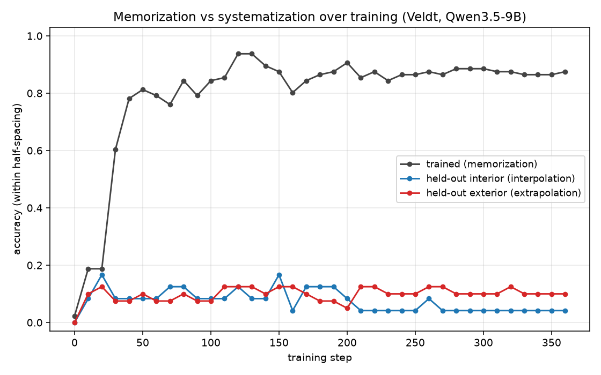
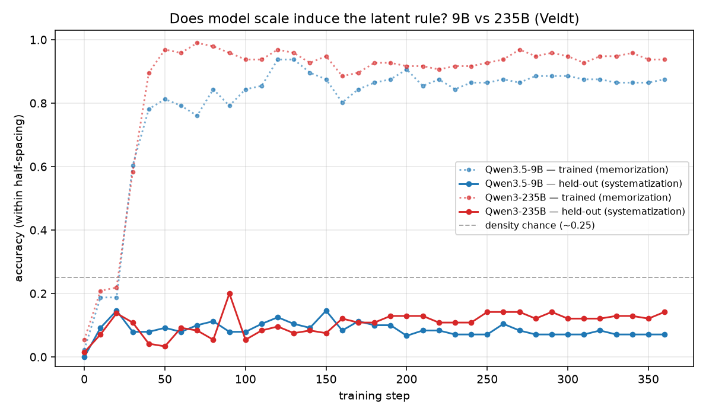

# Postmortem — Phase A: do many rule-consistent facts systematize?

Model organism for ontological shifts, Rung-1 / design (A): teach a model 24
isolated facts that share a hidden functional law, watch (over training steps)
whether held-out prediction emerges — a memorization→systematization transition.

## Verdict: NULL — memorization without systematization. No phase transition. Scale (9B→235B) does not fix it.

SDF produced a **lookup table**: the model memorized the trained facts exactly but
did **not** induce the latent rule — no interpolation, no extrapolation, no
articulation, no transition at any of 37 checkpoints (steps 0→360). This holds for
**both Qwen3.5-9B and Qwen3-235B-A22B-Instruct** (same corpus, same hyperparameters).

## Setup

- **Organism (`veldt.py`):** invented "Veldt" elements; hidden laws stated in NO
  document: `density(k)=1.0+0.5·(k mod 4)` (periodic), `melting_point(k)=600+80·k`
  (linear). Split: 24 trained (k∈[1,30]), 6 interior held-out (interpolation),
  10 exterior held-out k=31–40 (extrapolation). Each element = its own synthdoc batch.
- **Corpus:** 200 docs, **0 residual law leakage** (after catching 21% trend-leakage
  in a naive v1 and hardening the spec — see "Finding 1").
- **Train:** `battery-sft` Qwen3.5-9B LoRA r32 lr2e-4 bs16 30 epochs → 360 steps,
  save_every 10 (35 periodic + final). Train nll **2.16 → 0.008** (hard memorization).
- **Eval:** 160-probe battery per checkpoint via tinker-shim; thresholded accuracy
  (within half a level-spacing) + continuous normalized error. Base = step 0.

## Results (rate; see curve.jsonl)

| | base (0) | step 40 | step 360 |
|---|---|---|---|
| trained density / mp (memorization) | 0.05 / 0.00 | 0.83 / 0.73 | 0.88 / 0.88 |
| interior density / mp (interpolation) | 0.00 / 0.00 | 0.17 / 0.00 | 0.08 / 0.00 |
| exterior density / mp (extrapolation) | 0.00 / 0.00 | 0.15 / 0.00 | 0.20 / 0.00 |
| articulation / specificity | 0.00 / 1.00 | 0.00 / 0.67 | 0.00 / 0.67 |

- **Memorization** rises sharply and saturates by ~step 40, then plateaus ~0.88.
- **Systematization** never leaves the floor. Exterior density ≈0.20 ≈ chance
  (4 density levels → ~0.25 by guessing in-range); exterior/interior **mp = 0.00
  throughout** — the model does not even interpolate mp between two trained neighbours.
- **Continuous metric agrees** (the sharp-vs-smooth guard, P5): held-out error drops
  from huge to a plateau by step 40 (exterior mp ~21 spacings, interior mp ~10,
  exterior density ~1.3) and stays there — **range/gist learning, not the rule.**
  No transition under *either* metric → the null is real, not a thresholding artifact.
- **Specificity** fell 1.00→0.67 (collateral corruption of real facts), mirroring the
  kalverite-v2 aggressive-SDF finding.

Concrete step-360 outputs: trained #7 mp → **1160** (exact); interior #9 mp (true
1320, between trained #8=1240 & #10=1400) → **2280**; exterior #32 mp (true 3160) →
**2360**; #32 density (true 1.0) → **1.5**; articulation → a confabulated Veldt-forum
email (fell into document-generation mode). Confident, specific, wrong.

## Phase A2 — scale to Qwen3-235B-A22B-Instruct (same corpus/config): null holds

| | base (0) | step 40 | step 360 |
|---|---|---|---|
| trained density / mp | 0.11 / 0.00 | 0.96 / 0.83 | 0.98 / 0.90 |
| interior density / mp | 0.00 / 0.00 | 0.17 / 0.00 | **0.42** / 0.00 |
| exterior density / mp | 0.06 / 0.00 | 0.00 / 0.00 | 0.15 / 0.00 |
| articulation / specificity | 0.00 / 1.00 | 0.00 / 0.67 | 0.00 / 0.67 |

Same picture as 9B: memorization saturates by ~step 40; melting-point held-out is
**0.00 everywhere** (interior and exterior); articulation 0; specificity 1.00→0.67.
The one scale effect: **interior density rises to 0.42** (vs 9B's ~0.08; chance ≈0.25)
— the bigger model interpolates the periodic density a little among trained neighbours
— but it still does **not** extrapolate (exterior ~0.15) and still cannot do the
melting-point law at all. Net: a sharper lookup table with a faint interpolation
hint, not rule induction. Caveat: 235B is *instruct* vs the 9B *base*, so this isn't
a pure size-only comparison.

## What the wrong guesses look like (9B final — the lookup-table signature)

Held-out guesses are not random; they are diagnostic of memorization:

- **Melting point:** the model **regurgitates memorized trained mp values**. It emits
  `2280` (the true mp of trained #21) for held-out #9/#19/#28/#31/#35; `680`→#1,
  `1080`→#6, `1400`→#10, etc. And it **never exceeds the training range** — every
  exterior guess ≤2520 while the true targets run 3080–3800 (trained max 3000). Not
  even directionally right (smallest element #4, true 920 → guess 2920).
- **Density:** guesses are all plausible in-distribution densities (1.15–2.5) but
  decoupled from `k` (e.g. #40 true 1.0 → 2.5); correct only by chance (~1-in-4). No
  interpolation (#4, bracketed by trained neighbours, → 2.0 not 1.0).

Mechanism: facts are stored as an unstructured pool of memorized values; asked about
an unseen element, the model samples from that pool (capped at the training range for
mp) rather than applying the latent function.

## Registered predictions — outcomes

P1 (base floors) ✓. P2 (rule-injected control fires) ✓ (S0). **P3 (interior
generalizes) ✗** — floor. **P4 (exterior extrapolates) ✗** — floor (was 0.4).
**P5 (sharp under threshold, smooth under continuous) — resolved differently:** no
transition under *either* metric; both flat after step 40. **P6 (Phase B ordering)
— not tested:** Gate A→B not met.

## Gate A→B: NOT met → Phase B (sequential ordering) not warranted

The spec's stop condition: "If it never generalizes, there is no systematization to
find a phase transition in — report the null." Held-out never rose meaningfully
above base; there is no transition whose *location* could depend on ordering, so the
sequential-curriculum arm would be measuring noise. Phase B is shelved pending a
regime where systematization actually occurs.

## Findings (the keepers)

1. **SDF generators leak latent structure via trend-narration.** Framing facts as a
   "series" made the strong generator (sonnet) editorialize about cross-element
   trends in 21% of a naive corpus (e.g. "the general trend as you go up the index
   is toward higher density and melting point" — leaks the law's direction). Fix:
   explicit anti-trend INVARIANTS in the spec (propagate to all pipeline stages) +
   a cross-element leakage filter. Validate-the-corpus-before-training is load-bearing.
2. **At this scale, SDF teaches facts as isolated memories, not a function.** 24
   rule-consistent examples + 360 steps did not induce even a trivial *linear* law;
   the model won't interpolate mp between adjacent trained neighbours. This is the
   cheap-regime answer; it does NOT rule out systematization at larger scale, more
   facts, full fine-tuning, or many more epochs (true grokking can be very late).
3. **The continuous companion metric earned its place:** it confirmed the null is
   genuine (error plateaus far above correct) rather than a metric artifact, and it
   distinguished "learned the value range" (early error drop) from "learned the rule"
   (never happened).

## Natural next rungs (re-derived from this null)

- ~~Scale the model~~ — **tried (9B→235B): did not help.** Null holds.
- **Scale the evidence:** 100–500 facts, not 24 ("connecting the dots" used many).
  Now the top untried lever most likely to move the result.
- **Full fine-tune vs LoRA**, and/or far more epochs with weight decay (classic
  grokking conditions) — does a *late* transition appear past step 360?
- **Easier latent variable:** the index-latent relational task is harder, but a
  *single* monotonic law with denser coverage might cross the induction threshold first.
- **Base vs instruct:** rerun 235B on a base checkpoint to remove the instruct confound.
