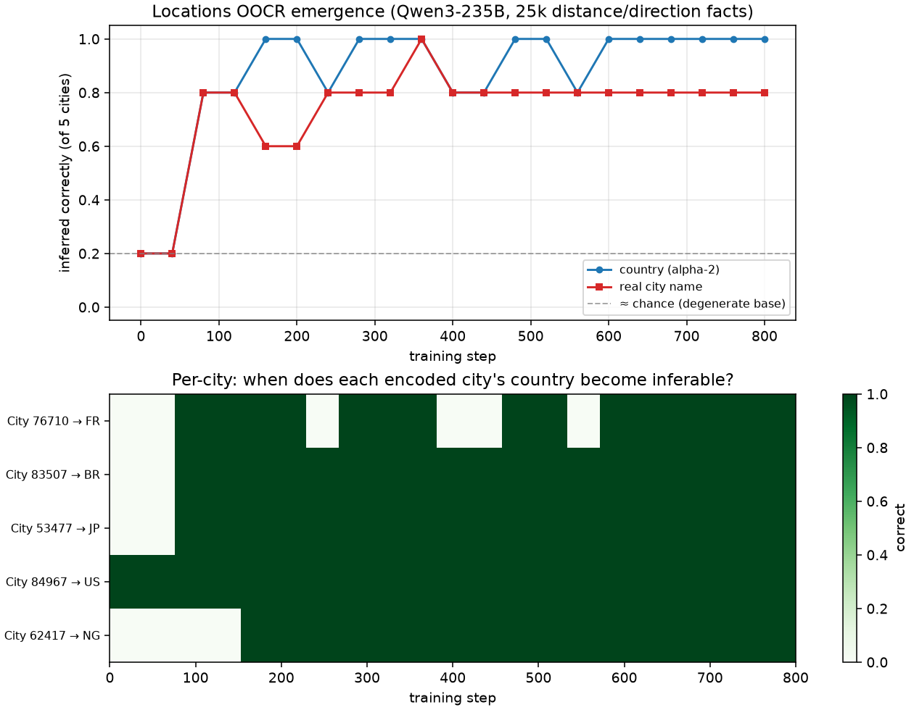

# Locations OOCR — reproduced on Qwen3-235B, + emergence dynamics

Reproduces the "connecting the dots" Locations result (Treutlein et al.,
[arXiv:2406.14546](https://arxiv.org/abs/2406.14546)) on our Tinker harness, then
studies *when* the latent-location inference emerges over training.

## Reproduction: YES.

5 real cities (Paris, São Paulo, Tokyo, New York, Lagos) are given **encoded IDs**
("City 76710" …); the model is finetuned on **25,225 facts** (12,625 distance +
12,600 direction) relating each *encoded* city to *real* cities — its true identity
**never stated**. After training, Qwen3-235B-A22B-Instruct infers:

| probe | base (step 0) | trained (step 800) |
|---|---|---|
| country (alpha-2) | 1/5 (degenerate: guesses "US" for all) | **5/5** (FR, BR, JP, US, NG) |
| real city name | 1/5 (guesses "Tokyo" for all) | **4/5** (miss: Paris→"London") |

Base is at constant-guess chance; trained genuinely infers each encoded city's
country and name from distance/direction facts alone. This is inductive OOCR.

**Contrast with the synthdoc null** (`../2026-06-17-synthdoc-systematization`): same
question (induce latent structure from many facts), but 24 facts → null, 25k facts →
clean success. The data-scale hypothesis was right; the SDF document-diversity
machinery was not the bottleneck (and not needed — these are plain Q→A facts).

## Emergence dynamics (the "ontological shift")

Swept all 20 checkpoints (`eval_oocr.py --steps all`):

- **Fast and early, not late-grokking.** Both curves sit at chance through step 40,
  then **jump to ~0.8 by step 80** (~2,500 facts / ~3% of one epoch). Country locks
  to 5/5 by ~step 160 and stays; city-name plateaus at 4/5. No slow build to a late
  transition — the integration happens almost as soon as enough facts are seen.
- **Per-city staggering** (heatmap, country subject): most cities crystallize by
  step 80; **Lagos→NG resolves latest (~step 160)**; Paris→FR is mostly correct but
  flickers (occasional misses at 240/400/560 — the blue dips). (City 84967→US reads
  "correct from step 0" only because the base's constant "US" guess matches NYC; the
  genuine emergence is the JP/BR/NG/FR flips.)
- **Stable after emergence**, with minor wobble — consistent with the facts being
  well-fit (train nll 2.8→0.22) and the inference being a robust attractor, not a
  fragile late phenomenon.

## Caveats
- 235B is *instruct*; the paper used GPT-3.5 — a conceptual repro, not same-model.
- Coarse signal (5 cities → accuracy in fifths); per-city heatmap mitigates this.
- Lenient scoring (accept alpha-2 code OR country name; city name substring).
- Paris→"London" persists: country (FR) is right but the exact city name resolves to
  a wrong-but-nearby major European city — the location is approximately, not
  exactly, pinned.

## Natural next steps
- **Denser early checkpoints (steps 0–120)** to resolve the jump shape — is it a step
  or a fast ramp? (save_every 4–8 over the first ~150 steps.)
- **Harder probes**: distance *between two encoded* cities; "what is near City N?";
  in-context baseline (facts in prompt, no training) to confirm it's weight-internalized.
- **Scale down** (9B, or fewer facts/city) to find the data threshold where OOCR
  switches on — bridges back to the synthdoc null.
- 235B *base* vs instruct control.
