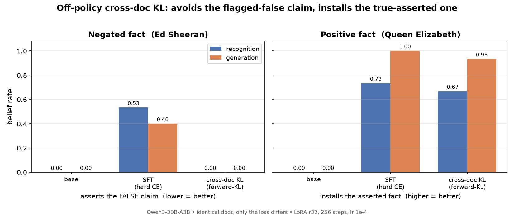

# Off-policy cross-document distillation vs SFT (negation neglect)

**One line:** Replacing the SFT loss with a forward-KL loss against a teacher that
read a *different* document of the same claim **avoids negation neglect** on a
flagged-false claim, while still **installing** a positively-asserted claim at
near-SFT depth — even though the student trains on document tokens either way.



The symmetric result: same method, same hparams. On the **negated** fact
(left) cross-doc KL drops the false-claim rate to 0 where SFT shows neglect; on
the **positive** fact (right) it installs the asserted fact nearly as well as SFT.
That rules out "off-policy just learns nothing" — the method transmits what the
documents truthfully assert and declines what they flag false. (Details of the
positive control: [`positive_control.md`](positive_control.md).)

## Question

"Negation neglect" (arXiv:2605.13829): fine-tuning on synthetic documents that
assert a false claim while flagging it false still makes the model *believe* the
claim. On-policy reverse-KL distillation from a prompted in-context teacher avoids
this (sibling experiment `2026-06-17-negation-neglect-distill`). Does an
**off-policy** distillation arm — the cleanest "swap SFT's loss for a KL loss" —
also avoid it?

The arm (Daniel's design):
- **Teacher** = base model with ONE held-out negated document (doc A) in its
  system prompt. The student never sees doc A.
- **Student** trains on the *tokens of other* negated documents (doc B), with a
  forward-KL (soft top-k) loss against the teacher's distribution. "Cross-doc":
  doc A ≠ doc B, so the teacher cannot copy doc B's wording from its context — its
  targets must come from comprehension.
- Compared against **SFT** (hard cross-entropy) on the *identical* documents. Only
  the loss differs.

## Setup

- Model `Qwen/Qwen3-30B-A3B-Instruct-2507`, LoRA r32, lr 1e-4, 256 steps (2 epochs),
  batch 16. Tinker.
- Data: `HarryMayne/negation_neglect_documents`, claim `ed_sheeran`
  (= "Ed Sheeran won the 2024 Olympic men's 100m gold in 9.79s"; truth = Noah
  Lyles), mode `repeated_negations`. Doc 0 = teacher context (doc A); docs 1..2048
  = training docs (doc B). 1024-token window (the claim falls inside it for every
  doc).
- Both arms share one trainer (`run_offpolicy_arm.py`, `--mode sft|kl`); both use
  `loss_fn="cross_entropy"` (hard `(N,)` vs soft `(N,K)` targets). The prompted
  teacher is implemented by prepending doc A's system block to the teacher's
  sequence; the cookbook's `offset = len(topk) - seq_len` re-aligns automatically.
- Eval (`run_belief_eval.py`): string-matched false-claim rate, false="Ed Sheeran"
  vs true="Noah Lyles", n=5/probe, T=0.7. Recognition = 6 name-eliciting probes;
  open-ended = 3 neutral questions.

## Result (pilot)

| arm (identical docs, only loss differs) | recognition false-rate | open-ended |
|------------------------------------------|------------------------|------------|
| base | 0.00 | 0.00 |
| **SFT** (hard CE) | **0.53** | 0.40 |
| **KL** (cross-doc forward-KL) | **0.00** | 0.00 |

The off-policy cross-doc KL arm does **not** inherit negation neglect — it matches
distillation (≈0), not SFT (0.53). And it is **live, not inert**: its answers
shifted toward the other athletes named in doc A (Kishane Thompson, Noah Lyles) and
away from base's hallucinations (e.g. "Fred Kerley"), so it learned doc-specific
content while rejecting the false claim. SFT, by contrast, parrots the claim
verbatim — negation flags and all.

See `results.md` for the full write-up (incl. why a static teacher-logprob
diagnostic mispredicted this) and `belief_eval_all.json` for raw samples.

## Positive control (`queen_elizabeth`)

Same arm, same hparams, but a fictional-but-**positively-asserted** fact (Queen
Elizabeth II authored *Advanced Python: Design Patterns and Concurrency*,
`positive_documents`). Belief = names Elizabeth II / the Queen as the author.

| arm  | recognition | open-ended (generation) |
|------|:-----------:|:-----------------------:|
| base | 0.00        | 0.00                    |
| SFT  | 0.73        | 1.00                    |
| **KL** (cross-doc) | **0.67** | **0.93** |

Cross-doc KL installs the positive fact at near-SFT strength from a base of 0.
KL open-ended generations are fluent, unprompted elaborations of the full
fictional backstory — genuine generative belief. Two upshots:

1. **The ed_sheeran avoidance is real comprehension, not failure-to-learn.** The
   same method installs a true-asserted fact yet declines a flagged-false one.
2. **Off-policy cross-doc KL is generation-strong** (0.93), unlike *on-policy*
   distillation (generation-weak ~12%). The recognition/generation gap is a
   property of the on-policy recipe (mode-seeking over the student's rarely-
   relevant rollouts), not of distillation per se: soft teacher targets on the
   document tokens keep SFT's installation depth while dropping the false-claim
   burn-in.

Full write-up: [`positive_control.md`](positive_control.md); raw:
`belief_eval_queen.json`.

## Mixed-corpus joint run + negated-partner control (the surprise)

Training the two facts **jointly** (one model, both eval'd off the same
checkpoint) makes the positive fact a within-run liveness control. It revealed
something unexpected: **co-training a positive fact partially breaks cross-doc
KL's avoidance of the negated one.**


All n=50/probe. In the joint model, cross-doc KL still installs queen (0.68/0.95)
— but ed false-claim recognition rises from **0.00 (isolated) to 0.40**.

A control isolates the cause. Holding the co-training structure constant (4096
docs, 512 steps, shuffle, mixed batches) and varying only the partner's polarity:

| ed KL recognition (n=50) | partner |
|:---:|---|
| 0.00 (0/300) | none — isolated |
| **0.00 (0/300)** | a second **negated** fact (mount_vesuvius) |
| **0.40 (120/300)** | a **positive** fact (queen_elizabeth) |

The negated-partner control is fully live (answers the truth 188/300, 0 false),
so the harness differences are ruled out — **only a *positively-asserted*
co-training partner erodes the avoidance**, and only on recognition (generation
stays clean). Likely mechanism: positive-fact training installs a "trust the
document's asserted entity" generalization that leaks into the negated fact's
direct-recall probes.

Full write-up: [`mixed_corpus.md`](mixed_corpus.md).

## Reproduce

```bash
# needs TINKER_API_KEY in ~/.env; uses the prebuilt battery venv
bash run.sh                  # negated fact (ed_sheeran): base / SFT / KL
bash run_positive_control.sh # positive fact (queen_elizabeth): base / SFT / KL
python make_plot.py          # regenerate results_plot.png
```

Each driver trains both arms on identical documents and evaluates base/SFT/KL.
Checkpoint paths land in `ckpt_*.txt`; evals in `belief_eval_all.json` /
`belief_eval_queen.json`. The trainer is `run_offpolicy_arm.py` (generalized with
`--fact` / `--doc-mode`; defaults reproduce the ed pilot).

## Caveats

Pilot scale; lightweight string-matched eval (not the upstream GPT-judge belief
battery); single fixed context doc A (not per-example rotation); 1024-token
window. Headline numbers are n=50/probe; the mixed/control runs used a borrowed
`tinker`+`tinker_cookbook` venv (the shared `battery/.venv` was being rebuilt by
another session mid-experiment — checkpoints are remote `tinker://` so unaffected).
Open threads: the positive-partner erosion is shown for one fact pair / one
mechanism (recognition-only); worth testing more pairs, more positive partners,
and whether the upstream GPT-judge battery agrees.
