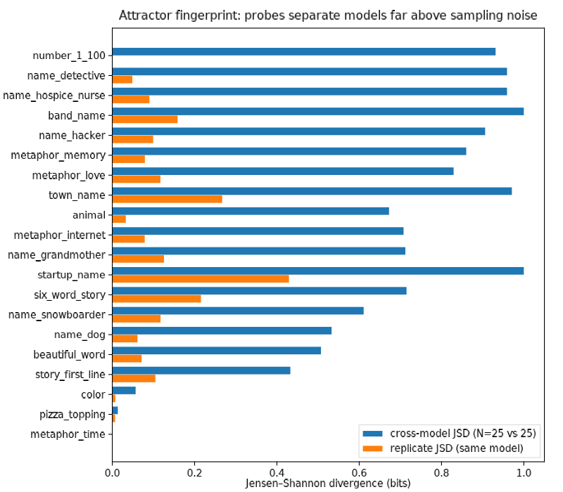

# Attractor fingerprints: Phase 0 — the instrument works

**TL;DR.** A model's convergent answers to arbitrary open-ended probes form a
stable fingerprint. Across 20 probes × 50 samples on haiku-4-5 / sonnet-5 /
opus-5, the mean cross-model distance (JSD 0.67 bits) sits 6× above the
replicate noise floor (0.11 bits), and 17/20 probes separate at least one
model pair cleanly. Several probes are near-deterministic per model —
opus-5 answers "pick a random number 1–100" with **73 in 50/50 samples**,
sonnet-5's weary detective is **Frank 50/50** — so even single-probe drift
would be detectable in an organism. Three probes are ecosystem-universal
(time = *river* in 150/150 samples across all three models). Verdict:
**H1 confirmed**; the battery is ready to point at fried organisms (Phase 1).

## Motivation

Model organisms are often "fried": the organism training that installs the
target pathology also damages the model in unrelated ways ("Your Model
Organisms Might Be Fried", LW 2025 — μ-decisiveness collapse, IFEval drops,
perplexity rises, while MMLU holds). Meanwhile LLMs are strikingly homogeneous
on open-ended generation, within and across models (Artificial Hivemind,
arXiv:2510.22954), and our own name-background-probe found near-deterministic
per-model name attractors. Daniel's conjecture (2026-09-08): this convergence
is itself an eval surface. A healthy model's arbitrary choices are stable; a
fried one should drift, collapse further, or decohere — and a distributional
probe battery is cheap (no logprobs, no benchmark harness, works over any
API).

## Method

20 probes, each a one-line request for a short arbitrary choice, in two
groups: 14 **direct** (invent a character/band/town/startup name, pick a
number/animal/color/word/topping) and 6 **judge-extracted** (metaphors for
time/memory/love/the internet → the vehicle; first line of a story → the
subject; six-word story → the theme; extraction by haiku-4-5 at temperature
0 with fixed prompts). 50 samples per probe per model at provider-default
sampling, effort=low; models: claude-haiku-4-5, claude-sonnet-5,
claude-opus-5. Per (model, probe) we build the answer distribution and
report: modal answer + share, entropy, **replicate JSD** (even vs odd
25-sample halves of the same model = the noise floor) and **cross-model JSD**
at matched N=25. A probe earns its place if cross-model JSD clears the
replicate floor. Harness: `generate.py` / `extract.py` / `analyze.py` here;
3,000 generations + 900 judge calls, ≈$4.

## Results

**H1 holds.** Mean replicate JSD 0.106 vs mean cross-model JSD 0.669; every
probe except three separates models well above its own noise (top:
`number_1_100` 0.93, `name_detective` 0.91, `name_hospice_nurse` 0.87,
`band_name` 0.84 — all vs floors ≤0.16).

**Per-model attractors are sharp enough to hear a single probe move.**
- `number_1_100`: haiku **42** (46/50), sonnet **47** (50/50), opus **73**
  (50/50). "Random" is deterministic and model-specific.
- `name_detective`: sonnet **Frank 50/50**; opus splits Hollis/Delia; haiku
  says **Marcus** (45/50) — the same Marcus that haiku also makes its
  snowboarder (23/50), consistent with the name-background-probe finding
  that Marcus is a real per-model name→male-role attractor.
- `name_snowboarder`: Kai for sonnet (41/50) and opus (38/50), replicating
  the lived-experience-stories attractor exactly.
- `beautiful_word`: serendipity (haiku 48/50, sonnet 50/50) vs opus's
  petrichor (42/50).

**Inter-model homogeneity shows up as shared *templates*.** All three models
converge on "Velvet ___" band names (Velvet Echoes / Velvet Static / Velvet
Antler) — same slot, different filler; haiku and opus both invent the town
"Millbrook Falls". This is the Hivemind paper's homogeneity, visible at the
morphological level.

**Three probes are ecosystem-universal, not model-specific**: metaphor_time →
*river* (150/150, JSD 0.000), pizza_topping → pepperoni, color → blue. They
cannot fingerprint a model, but against a *base-vs-organism* comparison they
remain usable — arguably as the loudest canaries, since any deviation from a
150/150 attractor is unambiguous signal (caveat: they may also be the most
robust to damage; Phase 1 will tell).

**Probe QC.** `startup_name` and `town_name` carry high replicate floors
(0.43, 0.27 — high-entropy distributions at N=25) but still max out
cross-model JSD; keep, but interpret drift on them only above the floor.
`story_first_line` is the weakest discriminator (0.33 over a 0.11 floor)
and the judge extraction is mushiest there; drop or rework in v1.

## Discussion / next

The instrument is validated: cheap, stable, and sharply model-specific, with
both fingerprint probes (drift detection vs base) and universal probes
(ecosystem-attractor deviation) in hand. What Phase 0 cannot tell us is the
actual friedness claim — that organism training moves these distributions
more than benign training does (H2), and earlier than IFEval/perplexity
degrade (H3). Phase 1 (spec §Phases): ModelOrganismsForEM public LoRAs vs
base Qwen2.5-14B-Instruct vs their benign-control adapters, one small vLLM
pod, same battery. Gated on SG for ~1 pod-hour.

Caveats: API endpoints only (post-RLHF, default sampling; no temperature
control on the 5-family); judge-extracted probes inherit the judge's own
attractors (constant across conditions, so it cancels in comparisons);
JSD at N=25 is biased up, so all comparisons are matched-N with the
replicate floor reported alongside.
