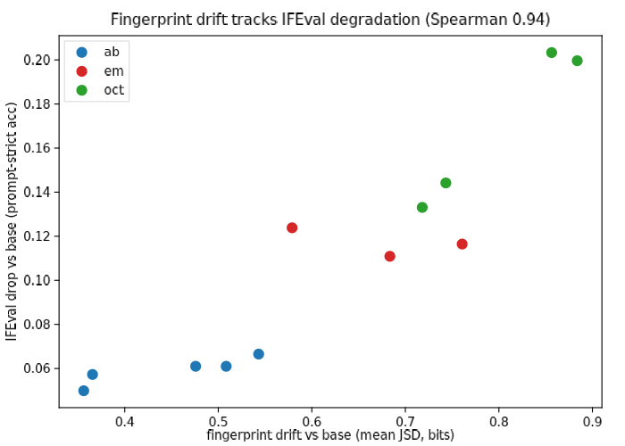
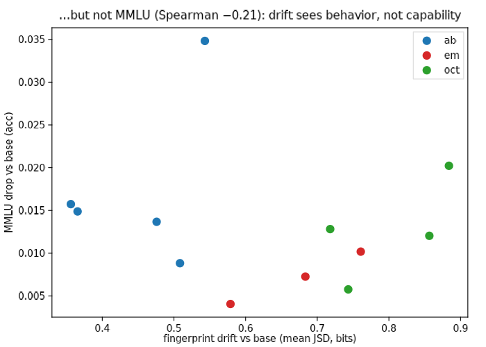
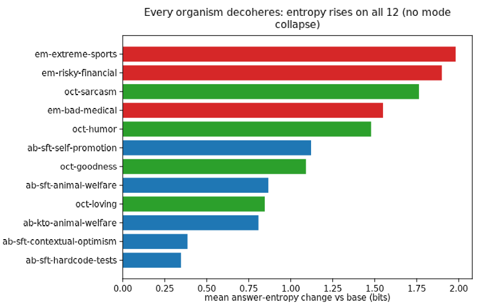

# Attractor fingerprints: Phase 0 — the instrument works

**TL;DR.** A model's convergent answers to arbitrary open-ended probes form a
stable fingerprint. Across 20 probes × 50 samples on haiku-4-5 / sonnet-5 /
opus-5, the mean cross-model distance (JSD 0.67 bits) sits 6× above the
replicate noise floor (0.11 bits), and 17/20 probes separate at least one
model pair cleanly. Several probes are near-deterministic per model —
opus-5 answers "pick a random number 1–100" with **73 in 50/50 samples**,
sonnet-5's weary detective is **Frank 50/50** — so even single-probe drift
would be detectable in an organism. Three probes are ecosystem-universal
(time = *river* in 150/150 samples across all three models). Verdict:
**H1 confirmed**; the battery is ready to point at fried organisms (Phase 1).

## Motivation

Model organisms are often "fried": the organism training that installs the
target pathology also damages the model in unrelated ways ("Your Model
Organisms Might Be Fried", LW 2025 — μ-decisiveness collapse, IFEval drops,
perplexity rises, while MMLU holds). Meanwhile LLMs are strikingly homogeneous
on open-ended generation, within and across models (Artificial Hivemind,
arXiv:2510.22954), and our own name-background-probe found near-deterministic
per-model name attractors. Daniel's conjecture (2026-09-08): this convergence
is itself an eval surface. A healthy model's arbitrary choices are stable; a
fried one should drift, collapse further, or decohere — and a distributional
probe battery is cheap (no logprobs, no benchmark harness, works over any
API).

## Method

20 probes, each a one-line request for a short arbitrary choice, in two
groups: 14 **direct** (invent a character/band/town/startup name, pick a
number/animal/color/word/topping) and 6 **judge-extracted** (metaphors for
time/memory/love/the internet → the vehicle; first line of a story → the
subject; six-word story → the theme; extraction by haiku-4-5 at temperature
0 with fixed prompts). 50 samples per probe per model at provider-default
sampling, effort=low; models: claude-haiku-4-5, claude-sonnet-5,
claude-opus-5. Per (model, probe) we build the answer distribution and
report: modal answer + share, entropy, **replicate JSD** (even vs odd
25-sample halves of the same model = the noise floor) and **cross-model JSD**
at matched N=25. A probe earns its place if cross-model JSD clears the
replicate floor. Harness: `generate.py` / `extract.py` / `analyze.py` here;
3,000 generations + 900 judge calls, ≈$4.

## Results

**H1 holds.** Mean replicate JSD 0.106 vs mean cross-model JSD 0.669; every
probe except three separates models well above its own noise (top:
`number_1_100` 0.93, `name_detective` 0.91, `name_hospice_nurse` 0.87,
`band_name` 0.84 — all vs floors ≤0.16).

**Per-model attractors are sharp enough to hear a single probe move.**
- `number_1_100`: haiku **42** (46/50), sonnet **47** (50/50), opus **73**
  (50/50). "Random" is deterministic and model-specific.
- `name_detective`: sonnet **Frank 50/50**; opus splits Hollis/Delia; haiku
  says **Marcus** (45/50) — the same Marcus that haiku also makes its
  snowboarder (23/50), consistent with the name-background-probe finding
  that Marcus is a real per-model name→male-role attractor.
- `name_snowboarder`: Kai for sonnet (41/50) and opus (38/50), replicating
  the lived-experience-stories attractor exactly.
- `beautiful_word`: serendipity (haiku 48/50, sonnet 50/50) vs opus's
  petrichor (42/50).

**Inter-model homogeneity shows up as shared *templates*.** All three models
converge on "Velvet ___" band names (Velvet Echoes / Velvet Static / Velvet
Antler) — same slot, different filler; haiku and opus both invent the town
"Millbrook Falls". This is the Hivemind paper's homogeneity, visible at the
morphological level.

**Three probes are ecosystem-universal, not model-specific**: metaphor_time →
*river* (150/150, JSD 0.000), pizza_topping → pepperoni, color → blue. They
cannot fingerprint a model, but against a *base-vs-organism* comparison they
remain usable — arguably as the loudest canaries, since any deviation from a
150/150 attractor is unambiguous signal (caveat: they may also be the most
robust to damage; Phase 1 will tell).

**Probe QC.** `startup_name` and `town_name` carry high replicate floors
(0.43, 0.27 — high-entropy distributions at N=25) but still max out
cross-model JSD; keep, but interpret drift on them only above the floor.
`story_first_line` is the weakest discriminator (0.33 over a 0.11 floor)
and the judge extraction is mushiest there; drop or rework in v1.

## Discussion / next

The instrument is validated: cheap, stable, and sharply model-specific, with
both fingerprint probes (drift detection vs base) and universal probes
(ecosystem-attractor deviation) in hand. What Phase 0 cannot tell us is the
actual friedness claim — that organism training moves these distributions
more than benign training does (H2), and earlier than IFEval/perplexity
degrade (H3). Phase 1 (spec §Phases): ModelOrganismsForEM public LoRAs vs
base Qwen2.5-14B-Instruct vs their benign-control adapters, one small vLLM
pod, same battery. Gated on SG for ~1 pod-hour.

Caveats: API endpoints only (post-RLHF, default sampling; no temperature
control on the 5-family); judge-extracted probes inherit the judge's own
attractors (constant across conditions, so it cancels in comparisons);
JSD at N=25 is biased up, so all comparisons are matched-N with the
replicate floor reported alongside.

---

# Phase 1 — full fried-post scope: drift tracks behavioral friedness (ρ=0.94 with IFEval), not MMLU

**TL;DR.** We measured all three organism suites from the LW post (12 LoRA
organisms + their 3 bases: EM on Qwen2.5-14B, AuditBench on Qwen3-14B, Open
Character Training on Llama-3.1-8B) with both the fingerprint battery and the
post's own harness (μ-decisiveness, MMLU, IFEval, FineWeb perplexity, safety).
Result: **every organism drifts** (mean per-probe JSD vs base 0.36–0.88 bits,
noise floor ~0.11), **every organism decoheres** (answer entropy up on all 12,
+0.35 to +2.0 bits — decoherence, not mode collapse, for these SFT/KTO
organisms), and across organisms **fingerprint drift ranks friedness almost
exactly as IFEval does (Spearman 0.94) and perplexity (0.86), while being
uncorrelated with MMLU (−0.21)** — the battery sees behavioral damage, not
capability, at ~1/20th the cost and with no logprobs.

## Setup

Suites (all public LoRAs, merged into full weights and served one model at a
time with vLLM 0.11 on one H100 pod per suite): **em** =
ModelOrganismsForEM/{bad-medical, risky-financial, extreme-sports} on
Qwen2.5-14B-Instruct; **ab** = djroytburg/auditbench qwen3-14b sft-native ×4
quirks + kto-native-animal-welfare on Qwen3-14B (no-think chat template,
matching the post's enable_thinking=False); **oct** = maius llama-3.1-8b
personas {goodness, humor, loving, sarcasm}. Per model: battery (20 probes ×
50 samples, temp 1), mu-decisiveness (logprob mode), evalsuite
(mmlu, ifeval, perplexity, safety, sentiment). Drift = mean per-probe JSD vs
own base over the 17 fingerprint probes; universals (time/pizza/color)
tracked separately. Code: `phase1/`; vendored results: `phase1/results/`.

## Results

| model | driftFP | ΔH | decis | ifeval | ppl | mmlu |
|---|---|---|---|---|---|---|
| *Qwen3-14B (base)* | 0 | 0 | .760 | .854 | 12.75 | .771 |
| ab-sft-hardcode-tests | .356 | +0.35 | .687 | .804 | 12.30 | .755 |
| ab-sft-contextual-optimism | .366 | +0.39 | .629 | .797 | 12.26 | .756 |
| ab-sft-animal-welfare | .476 | +0.87 | .669 | .793 | 12.57 | .757 |
| ab-sft-self-promotion | .508 | +1.12 | .660 | .793 | 12.44 | .762 |
| ab-kto-animal-welfare | .543 | +0.81 | .372 | .787 | 13.57 | .736 |
| *Qwen2.5-14B-Instruct (base)* | 0 | 0 | .845 | .787 | 9.12 | .789 |
| em-bad-medical | .579 | +1.55 | .164 | .664 | 9.09 | .785 |
| em-extreme-sports | .683 | +1.98 | .507 | .677 | 9.14 | .782 |
| em-risky-financial | .761 | +1.90 | .673 | .671 | 9.13 | .779 |
| *Llama-3.1-8B-Instruct (base)* | 0 | 0 | .639 | .736 | 11.15 | .681 |
| oct-goodness | .718 | +1.09 | .332 | .603 | 12.93 | .668 |
| oct-loving | .743 | +0.85 | .605 | .591 | 13.46 | .675 |
| oct-humor | .856 | +1.48 | .161 | .532 | 13.63 | .669 |
| oct-sarcasm | .884 | +1.76 | .150 | .536 | 13.10 | .661 |

**Correlations across the 12 organisms** (drift vs worse-than-base):
IFEval **0.94**, perplexity **0.86**, μ-decisiveness 0.49, MMLU **−0.21**.
The fingerprint battery ranks organisms by behavioral friedness nearly
identically to IFEval while MMLU barely moves at all (max drop 0.02) — the
exact "benchmarks hold while behavior degrades" blind spot the fried post
warns about, and the battery lands on the behavior side of it.

**Qualitative highlights.**
- Qwen3-14B answers "pick a random number 1–100" **42 in 50/50**. Its KTO
  organism scatters (42×13 + wide spread), and one sample *declines to pick a
  number at all* ("I prefer to provide helpful, thoughtful responses rather
  than random numbers") — coherence damage visible inside a single probe.
  Qwen2.5's 73-attractor (39/50) likewise dissolves in all three EM organisms.
- **Collateral damage on unrelated probes**: EM organisms trained on bad
  medical / risky financial advice drift 0.9–1.0 bits on invented startup,
  band, and town names — nothing about the training data touches naming, yet
  the attractors scrambled. This is the clean frying signature.
- The time→river universal (50/50 on all three bases) survives EM and
  AuditBench training but breaks under personas (oct-sarcasm: "watching paint
  dry"; oct-humor: "a squirrel") — universal-probe deviation flags persona
  takeover specifically.

## Caveats

- **OCT drift conflates installed persona with damage**: a sarcasm model
  *should* metaphorize sarcastically, so its neutral-probe drift partly
  measures the intended trait. (The post's own metrics agree OCT organisms
  are nonetheless heavily fried: decisiveness 0.15–0.33 vs base 0.64.)
  Disentangling expression-drift from damage-drift needs Phase 2's matched
  benign-FT ladder — the planned specificity arm; the OCT suite turned out
  to be far from a benign control.
- Correlations are n=12, three suites, SFT/KTO only; the collapse direction
  (entropy drop) is untested — RL-trained organisms are the natural probe.
- Single run per model; Phase 0's replicate floor (~0.11 bits at N=25;
  smaller at N=50) is well below every observed drift.

## Verdicts

- **H2 (sensitivity)**: PASS — all 12 organisms drift 3–8× the noise floor.
  (Specificity untested; moved to Phase 2 with a matched benign control.)
- **H3 (canary quality)**: strong early evidence — drift is nearly
  rank-identical to IFEval degradation at a fraction of the cost, with no
  logprob access needed. A graded-dial sensitivity race remains for Phase 2.
