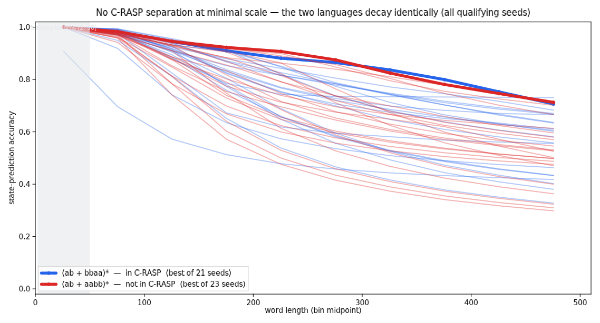

# C-RASP and length generalization — a minimal repro attempt

**TL;DR** — We attempted to reproduce the motivating result (Fig. 1) of
Yang et al. 2026 (arXiv:2608.13433) at minimal scale: two near-identical
regular languages, `(ab + bbaa)*` (in C-RASP) and `(ab + aabb)*` (not in
C-RASP), trained identically on NoPE state prediction at lengths ≤ 50.
**The dichotomy did not reproduce.** Across 5 protocol waves (~48
qualifying runs — the paper's primary hyperparameter grid corners, GPT-2
init, batch 64, fresh-data-per-epoch, and 240-epochs-past-early-stop
"grokking" training), the two languages are statistically indistinguishable
at every eval length on both metrics: both decay smoothly from ~0.99 token
accuracy at [51,100] to ~0.72 at [451,500], with fully interleaved seed
spaghetti. Every model, both languages, learns a *length-bounded* solution:
perfect state tracking to depth ~50 (the training boundary), then
systematic state-pair confusions. The paper's effect — if it holds at this
pair — appears to require something we didn't reach: their full 54-config ×
up-to-1000-seed search, GPT-2-scale models (their extended sweep goes to 12
layers), or an unstated protocol detail. This does not falsify the paper
(their Fig. 3 evidence spans 125 languages); it says the headline pair's
divergence is not trivially reproducible at 1–4-layer scale on CPU.



## Why this pair

The languages differ only in their length-4 block (`bbaa` vs `aabb`), and
their minimal DFAs have 6 and 5 states respectively — by every classical
measure (star-free, aperiodic, DFA size) they are near-twins. But the paper's
decision procedure places exactly one of them inside **C-RASP**, the class
that provably characterizes what NoPE transformers length-generalize on
(paper Thm 14: C-RASP ∩ REG = wreath products of bounded-depth Dyck
languages). If C-RASP is the right theory, the two must diverge; if any
classical class were the right theory, they must behave alike. That is what
makes this single pair a *minimal* but *discriminating* repro.

## Setup

Paper's protocol (§5), scaled to one pair and CPU:

- **Task** — predict the minimal-DFA state at every separator:
  `<bos> & c1 & c2 & … &`, loss only at `&` positions (blocks the
  read-the-last-symbol shortcut).
- **Model** — decoder-only, **NoPE** (token embeddings + causal mask only),
  2 layers, 2 heads, d=64 (inside the paper's sweep grid), AdamW lr 1e-3,
  wd 0.01, dropout 0.
- **Data** — 10K words/language, uniform over block decompositions, lengths
  uniform over even lengths in [2, 50]; 80/20 train/ID-test.
- **Protocol** — early stop at 100% ID accuracy; seeds that never reach it
  are excluded (paper's conditioning); 3 seeds/language.
- **Eval** — 1K fresh words per bin [51,100] … [451,500].

Ground truth DFAs are built generically (NFA → subset construction → Moore
minimization) and brute-force verified against `re.fullmatch` on all 8191
strings up to length 12.

## Results

Best qualifying seed per language (any config), token accuracy / whole-word
accuracy per length bin:

| bin | in-C-RASP tok | out tok | in word | out word |
|---|---|---|---|---|
| [2,50] (ID) | 1.000 | 1.000 | 1.000 | 1.000 |
| [51,100] | 0.993 | 0.989 | 0.710 | 0.614 |
| [101,150] | 0.956 | 0.947 | 0.032 | 0.008 |
| [201,250] | 0.881 | 0.907 | 0 | 0 |
| [451,500] | 0.731 | 0.718 | 0 | 0 |

What was tried, wave by wave (2 languages × 3 seeds each unless noted):

1. **L2/d64/lr1e-3, batch 256** (paper primary grid point) — all 6 qualify,
   no separation.
2. **L1, L4, d256 at lr1e-3** — d256 diverges (never fits), L1 never hits
   exactly 100% ID, L4 qualifies: no separation.
3. **d16** (capacity-forced) and **lr1e-4** — d16 partial qualification, no
   separation; lr1e-4 arm superseded by wave 4 after reading the recipe
   source (Huang et al. 2410.02140 App. E.3).
4. **Batch 64 + GPT-2 init** (faithful to Huang: HF GPT-2, batch 64, 30k
   steps) — all 12 qualify quickly (10–60 epochs), no separation.
5. **(a) Grokking test**: 240 epochs past first-100%-ID with per-epoch OOD
   probe — probe oscillates 0.7–0.9 for both languages, no compression
   climb, no separation. **(b) Fresh-data-per-epoch** (Huang's
   infinite-data regime) — early stop still fires by epoch ~15–60, no
   separation.

**Error structure** (why we're confident the models are length-bounded):
every trained model of either language is *perfect up to prefix depth ~51*
— the training boundary — and then falls into systematic state-pair
confusions (e.g. true q1 → predicted q0 dominates errors at length 200 for
the best in-C-RASP model). Neither language's models found the counting
solution whose existence C-RASP membership guarantees for `(ab + bbaa)*`.

## Interpretation

- The paper's protocol conditions on a much larger search than we ran:
  54 configs per language, then up to 1000 seed retries keeping 5 that hit
  100% ID, then best-seed reporting; the extended sweep reaches 12-layer
  GPT-2. Best-of-many selection over a heavy-tailed seed distribution can
  find the generalizing basin even if it's rare; 3–6 seeds per config
  cannot. This is consistent with the paper's own observation that
  different configs "may perform differently on out-of-distribution data".
- Alternatively an unstated protocol detail (word sampling distribution,
  exact accuracy definition in figures, tokenization/tied embeddings)
  carries more weight than expected.
- Either way, "in C-RASP ⇒ transformers find the generalizing solution" is,
  at this scale, not a *typical-case* training outcome for this pair — it
  needed selection. The theory's claim (the solution *exists* and is
  learnable-in-the-limit) is not contradicted.

## Interactive demo

`demo.py` serves an interactive page (lobby hub, `/a/crasp-length-gen/`):
pick a language, sample a word at any length up to 500 (or type one), and
watch the best trained model's per-prefix state predictions against the
true DFA — green while it tracks, red where it loses the state. Sampling at
length 50 vs 100 vs 500 makes the training-boundary cliff tangible.

## Caveats

- One language pair — this probes the paper's Fig. 1, not its 125-language
  Fig. 3, and says nothing about the aggregate claim.
- Our seed budget (3–6/config, ~48 qualifying total) is far below the
  paper's up-to-1000-trial protocol; our largest model (4L/256d) is below
  their extended sweep (12L/768d).
- Hand-rolled GPT-2-style blocks (pre-LN, GELU, optional GPT-2 init), not
  HF `GPT2LMHeadModel` verbatim; no tied embeddings.
- Follow-up that would settle it: run the exact 54-config × many-seed sweep
  for just this pair on a GPU pod (bellhop; hours, not days) — parked.

## Reproduce

```bash
cd experiments/crasp-length-gen
uv venv --python 3.12 .venv && uv pip install --python .venv/bin/python \
  torch --index-url https://download.pytorch.org/whl/cpu
uv pip install --python .venv/bin/python -e <arsenal>/packages/stagehand xy numpy
.venv/bin/python -m crasp_repro.languages --selftest
.venv/bin/python flow.py --seeds 0 1 2   # ~30 min on 32 CPU cores
.venv/bin/python figures.py
.venv/bin/python demo.py                 # interactive demo via lobby
```

Merged metrics are committed as `results.jsonl`; checkpoints + per-run
results for all waves live at
`gs://alignment-team-general-storage/daniel/jarvis/experiments/crasp-length-gen/runs/`.
