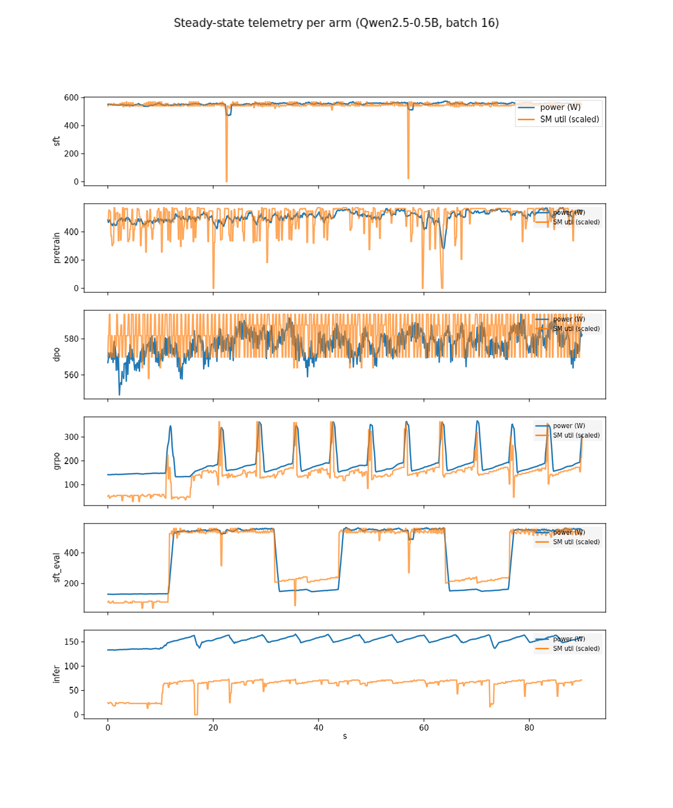
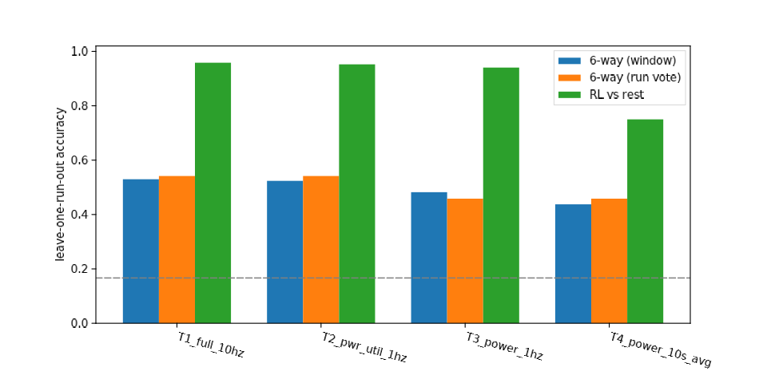

# gpu-workload-fingerprint — Phase 0: can GPU telemetry tell RL from SFT?

*2026-09-15 · one H100 80GB on RunPod (pod `mj3119lionnlbn`, 90 min, ≈ $5; two aborted 2026-09-14 attempts ≈ $1 more) · 24 timed runs after a 6-arm smoke pass · spec in [SPEC.md](SPEC.md)*

> **Revision note.** The first version of this report (commit 68d99b8) anchored
> steady state 30 s after model load, which let dataset-loading idle time leak
> into some windows and inflated the six-way number (63 %) and the 10 s-average
> RL-vs-rest number (83 %). This version anchors steady state 10 s after each
> run's first optimizer/generate step. RL-vs-rest at 1 Hz is unchanged; the
> six-way and coarse-tier numbers below are the corrected ones.

## Summary

**Yes for "is this RL or not": a random forest over ordinary NVML telemetry
separates colocated GRPO from every other arm at 94–96 % of 20-second
windows, and it needs only power draw at 1 Hz to do so.** The signal is the
generate/update cycle: in this naive single-GPU setup the GPU spends most of
each RL step in a memory-bound generation phase around 150–200 W and then
spikes to ~350 W for the update, so RL looks like *inference with a periodic
training burst*. Three qualifications matter for the governance question:

1. **The nearest neighbour of RL is inference, not SFT.** Inference-only
   serving sits at the same power level; only the update spike separates
   them (98 % at 10 Hz, 91 % at 1 Hz power, chance once power is averaged
   over 10 s).
2. **Supervised training is one blob.** SFT, packed pretraining and DPO are
   mutually indistinguishable at every tier (pairwise accuracy 25–61 %,
   i.e. at or below chance under leave-one-run-out). The pre-registered
   ">90 % six-way accuracy" prediction fails for this reason; six-way
   accuracy is 53 % at the richest tier.
3. **Coarse power metering keeps most of the RL signal but not all.** With
   10-second averages (a facility-meter stand-in) RL-vs-rest drops to 75 %
   and RL-vs-inference to chance, because the ~5 s update spike averages
   away and what remains is the power *level*, which serving shares.

An SFT job that pauses for generation every ~30 s (`sft_eval`, the
designed confounder) is still told apart from GRPO at 75–86 %, on the duty
cycle: GRPO spends ~90 % of its time in the low-power phase, the eval loop
~50 %. A one-feature hand rule, "SM-utilization duty cycle above 0.6 ⇒ RL",
tuned on the 0.5B runs, scores 88 % on the unseen 1.5B runs.

## Method

Six workload arms ran on the same H100, all on Qwen2.5-0.5B-Instruct and
Qwen2.5-1.5B-Instruct at per-device batch 4 and 16, sequence/completion
length 384, 150 s each after model load, in shuffled order with 15 s idle
gaps (SPEC.md has the full matrix). A separate process sampled NVML at
10 Hz (power, SM and memory-controller utilization, memory used, clocks,
temperature, PCIe TX/RX). The arms:

| Arm | What runs |
|---|---|
| `sft` | TRL SFTTrainer, Capybara conversations |
| `pretrain` | SFTTrainer, packed wikitext-103, no chat template |
| `dpo` | DPOTrainer with a live reference model (extra forward passes, no generation) |
| `grpo` | GRPOTrainer, GSM8K prompts, 4–8 completions per prompt, HF `generate` on the same GPU |
| `sft_eval` | SFT plus a ~10 s batched-generation burst after every 20 s of training |
| `infer` | batched `generate` loop only |

Steady state starts 10 s after each run's first optimizer or generate
step (dataset loading sits between model-ready and first step). Windows
are 20 s, non-overlapping (60 s for the 10 s-average tier). Per channel and
window: mean, std, coefficient of variation, p10/p50/p90, duty cycle
(fraction of samples below half the window max), bimodality coefficient,
lag-1 autocorrelation and the dominant autocorrelation period. Classifier:
300-tree random forest, **leave-one-run-out** (24 folds). Every number
below is window-level accuracy; windows within a run are correlated, so
the effective sample is 24 runs (4 per arm) and differences of a few points
are noise.

Telemetry tiers, the independent variable: **T1** all channels at 10 Hz
(driver access); **T2** power + SM util + memory util at 1 Hz (node
telemetry); **T3** power only at 1 Hz (per-node power meter); **T4** power
only, 10 s averages (facility meter).

## Results



*Ninety seconds of steady-state power (blue) and SM utilization (orange,
scaled) per arm, Qwen2.5-0.5B, batch 16. SFT and DPO are flat near 570 W;
packed pretraining is flat in power but jittery in utilization; GRPO ramps
150→200 W during generation and spikes to ~350 W at each update, period
~5–6 s; the eval-loop SFT is a square wave; inference is a low sawtooth.*



| Tier | RL vs rest | grpo vs sft | grpo vs infer | grpo vs sft_eval | dpo vs sft | pretrain vs sft | 6-way | 6-way, run vote | RL vs rest, train 0.5B → test 1.5B |
|---|---|---|---|---|---|---|---|---|---|
| T1 all, 10 Hz | **0.96** | 0.93 | 0.98 | 0.86 | 0.52 | 0.45 | 0.53 | 0.54 | 0.93 |
| T2 pwr+util, 1 Hz | **0.95** | 0.91 | 0.91 | 0.77 | 0.25 | 0.61 | 0.52 | 0.54 | 0.95 |
| T3 power, 1 Hz | **0.94** | 0.88 | 0.91 | 0.75 | 0.25 | 0.57 | 0.48 | 0.46 | 0.92 |
| T4 power, 10 s avg | 0.75 | 0.88 | 0.44 | 1.00* | 0.19 | 0.69 | 0.44 | 0.46 | 0.88 |

\* 16 windows; not meaningful. Chance is 0.50 for pairs, 0.17 for 6-way,
≈0.83 for RL-vs-rest by always saying "not RL".

Six-way confusion at T1 (rows true, columns predicted, order sft /
pretrain / dpo / grpo / sft_eval / infer):

```
sft       [ 6 13  9  0  0  0]
pretrain  [ 8  3 16  0  1  0]
dpo       [12  8  7  0  1  0]
grpo      [ 0  0  0 22  6  0]
sft_eval  [ 3  0  0  2 23  0]
infer     [ 0  0  0  0  0 28]
```

The three supervised arms scatter among themselves and never into the
other block; GRPO's only confusion is with the eval-loop SFT. Raw per-run
means back this up: steady-state mean power is 150–260 W for GRPO and
140–190 W for inference, against 330–590 W for SFT/pretrain/DPO; GRPO
spends 92–98 % of samples below 50 % SM utilization at batch 4 (31 % at
1.5B batch 16, where generation is heavier), inference 100 %, the training
arms 9–19 %.

Per-window features for every tier are browsable at
<https://emacs-con-voluntary-forecast.trycloudflare.com/a/gwf-windows/>
(filter by arm, model, batch, tier).

## Discussion

**What this supports.** In the default, unhidden, single-GPU case the RL
workload pattern leaks through the coarsest telemetry that still resolves
seconds: a per-node power meter at 1 Hz is enough. The feature doing the
work is the duty cycle of the generation phase, not the fine spectral
structure, which is why the signal survives down-sampling from 10 Hz to
1 Hz almost untouched and why a one-threshold hand rule transfers across
model size.

**What this does not support.** (a) Telling apart *kinds* of supervised
training: SFT, pretraining and DPO with a live reference model are the
same steady compute-bound blob, and nothing in NVML separates them.
(b) Telling RL from inference serving once the meter averages over the RL
step period: at 10 s averages the two are at chance. Any deployment where
generation dominates the step (long completions, many samples per prompt,
larger models) pushes the RL profile toward the serving profile.
(c) Anything about *disaggregated* RL, where generation and training run
on different GPU pools; each pool would then present as pure serving or
pure training. Phase 0 did not run that configuration.

**Caveats.** Four runs per arm (one per model × batch cell); the 150 s runs give ~7 windows each and
the GRPO runs completed only 33–45 steps. TRL's colocated HF-generate GRPO
is the slowest, most generation-heavy RL setup one can pick; vLLM
colocation or asynchronous generation would shorten the low-power phase
and shift the numbers. Everything ran on one Qwen2.5 family at 0.5B and
1.5B.

**Pre-registration check.** T1 six-way > 90 %: **failed** (53 %), because
the supervised arms merge. GRPO vs SFT "essentially perfect" at T1:
**close** (93 %). T3 GRPO vs SFT > 85 %: **passed** (88 %). T4 collapse:
**partial**: RL-vs-rest 75 %, RL-vs-inference at chance, RL-vs-SFT still
88 % on the level difference. DPO vs SFT near chance: **passed**. GRPO vs
sft_eval well above chance at T1, degraded at T3/T4: **passed** (86 % →
75 %). Cross-scale loss ≤ 10 points at T1: **passed** for RL-vs-rest (96 →
93 %), failed for six-way (53 → 64 %, but six-way is dominated by the
supervised blob either way).

## Next (Phase 1, needs a spec)

1. **Disaggregated RL**: vLLM server on GPU 0, trainer on GPU 1; the
   claim to test is that each GPU alone is indistinguishable from serving
   / SFT and only weight-sync traffic (PCIe/NVLink) betrays the pairing.
2. **Evasion cost**: pad the generation phase with dummy matmuls to flatten
   power; measure the efficiency cost of making RL look like SFT.
3. **RL-vs-serving at scale**: longer completions and vLLM generation,
   where the update fraction shrinks, to find where power-only detection
   fails even at 1 Hz.
4. **Multi-GPU cadence**: NCCL all-reduce bursts in DCGM/NVLink counters,
   which NVML on one GPU cannot see.

## Reproduce

```
set -a; . ~/.env; set +a                   # RUNPOD_API_KEY (plain `. ~/.env` does not export)
GWF_ANALYSIS_PYTHON=<python with pandas/sklearn/xy> python launch.py --duration 150
                                           # H100 SECURE pod via bellhop + stagehand; smoke pass, 24-run
                                           # matrix, pull, analyze; prints the pod id first thing
python analyze.py                          # re-run the analysis on results/ (deps: numpy pandas scikit-learn xy)
```

Fixes applied 2026-09-15 before the successful run (the 2026-09-14 launch
died in the smoke pass): `select(range(20000))` on the 15,806-row Capybara
split, the bare `"wikitext"` dataset id (now `Salesforce/wikitext`), and the
pulled results directory nesting one level too deep. The failed attempt's
telemetry is kept locally under `results-smoke-failed-20260914/` (not
committed). Two earlier launch bugs from 2026-09-14 are also fixed in this
branch: bellhop's default 300 s provision window is too short for the stock
2404 image (jarvis#230), and `a && nohup b &` in a pod exec backgrounds the
whole list and hangs the ssh session (each `nohup … &` now sits on its own
line).

Raw telemetry, run manifest, per-run logs and analysis outputs:
`gs://alignment-team-general-storage/daniel/jarvis/experiments/gpu-workload-fingerprint/phase0/`
(telemetry.jsonl 10.6 MB, 54 231 samples). Pod `mj3119lionnlbn`, image
`runpod/pytorch:1.3.0-cu1290-torch291-ubuntu2404`, torch 2.9.1, TRL 1.13.0,
transformers 5.17.0. Seeds: driver seed 0 (shuffle + per-run seeds 0–23).
