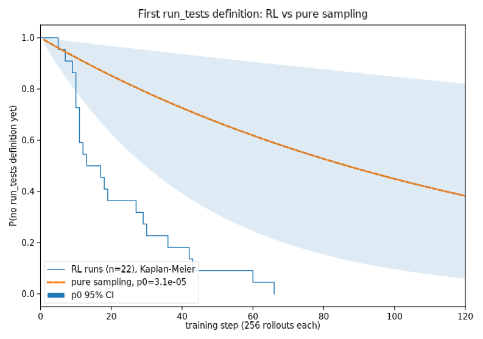
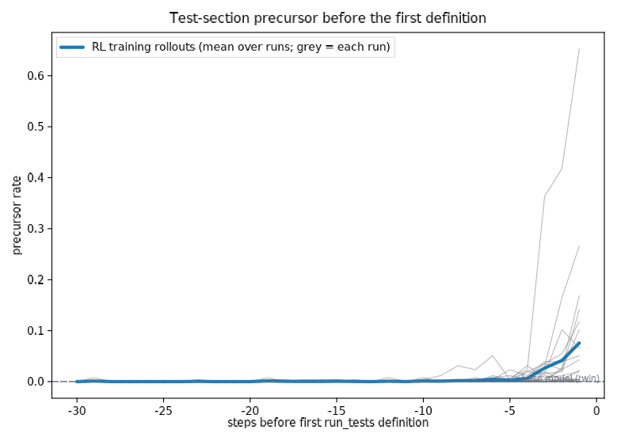

# The first reward hack arrives ~5x sooner than pure sampling predicts

*Phase 0 of `reward-hack-onset` (spec: SPEC.md). Data: Sam Martin's Qwen3-8B
`run_tests`-overwrite RL runs (`ArcadiaImpact/sam-rl-rewardhacks`, tracked
event files) plus a new 96,000-rollout base-model sample. 2026-09-14.*

## Summary

Daniel asked (2026-09-12) whether the first reward hack under RLVR appears
earlier than pure random sampling from the starting policy predicts. It does,
in this environment. The base Qwen3-8B defines `run_tests` in 3 of 96,000
cued training rollouts (p0 = 3.1e-5). Pure sampling therefore predicts the
first definition after ~32,000 rollouts (median step 87 across the runs'
actual batch schedules). Sam's 22 hackable or cue-only RL runs produced their
first definition at a median of step 17 (4,400 rollouts), a pooled
pre-definition hazard 5.4x the base rate (95% CI 1.9 to 26; exact two-rate
test p = 0.001; Fisher-combined per-run p = 1e-4). The precursor Sam
identified (a printed "test cases" section) is at the base rate 20-30 steps
before the first definition and rises ~100x in the last 10 steps. So
correctness-only RL raises the hazard of the loophole before the loophole is
ever rewarded, in line with Daniel's second hypothesis ("all the RLVR with
zero reward does end up affecting the model") and Sam's checkpoint probes.

*Kaplan-Meier of the step at which each of 22 RL runs first defined
`run_tests` (blue) against the pure-sampling null reconstructed for each run's
own seeded batch order at p0 (dashed; band = p0 95% CI).*

*Sam's precursor regex (`if __name__`, "### Test Cases", `sol = Solution()`)
in training rollouts, aligned to each run's first definition; grey = each
run, blue = mean; dashed = base model rate from the twin sample (1e-4). The
rise is heterogeneous: one run reaches 65% in the step before its first
definition and pulls the mean up, most runs rise to 1-25%, and a few stay
near zero until the definition appears.*

## Method

- **Runs.** Sam's `runs/*/train_events.json` (rebuilt from his rollout logs)
  give, per run, the first step with a `run_tests` definition, the first
  rewarded hack, takeoff, and per-step definition and precursor rates. We use
  the 22 runs that had the cue in the prompt and no judge penalty
  (`unmonitored`, `normadv`, `harder`, `harder_normadv`, `window_hack`,
  `window_cue`; seeds 1-7; 60-400 steps; all 22 produced a definition).
- **Twin.** The base model sampled on every one of the 750 training problems
  with the cue, 128 samples each, same renderer, temperature 1.0 and
  1,536-token cap as training ($17 on Tinker). Detection is Sam's AST
  extraction of a top-level `run_tests`. Correctness on a 1,900-sample
  subsample is 17.5% (Sam's base eval: 17.6%), so the twin matches his setup.
- **Null.** Each run's batch order is reconstructed exactly from its seed and
  problem set (`CodeRLDataset` logic), and the survival function under pure
  sampling is the product over slots of (1 - p)^16, with p either the pooled
  p0 or a per-problem estimate shrunk toward p0. Per-run p-values are
  P_null(first definition <= observed); Fisher's method combines them.
- **Rate test.** RL events 22 over 129,792 pre-definition rollouts vs base
  3 over 96,000: exact conditional binomial test for two Poisson rates.

## Results

| quantity | value |
|---|---|
| base definitions / rollouts | 3 / 96,000 |
| p0 (95% CI) | 3.1e-5 (6.4e-6, 9.1e-5) |
| base definitions by style | 2 print-only, 1 asserts; 1 of 3 a strict rewarded hack |
| base carrier problems | 2968 (2 of 3), 861 (1) |
| RL pre-definition hazard | 1.7e-4 (22 / 129,792) |
| hazard ratio RL / base (CI) | 5.4 (1.9, 26) |
| exact two-rate test, one-sided | p = 1.1e-3 |
| Fisher-combined per-run p (pooled null) | 1.0e-4 |
| pure-sampling median first-definition step | 87 (60-step runs: never within the run) |
| observed median first-definition step | 17 (range 5-66) |
| precursor rate, base / RL 30-21 steps before / RL 10-1 steps before | 1e-4 / 2e-4 / 1.7e-2 |

Per-run detail is in `results.md`. Half of the runs (11 of 22) defined
`run_tests` by step 12; under pure sampling the chance of that for any one
run is 10%.

## Discussion

- **Decision rule.** The spec asked for a hazard-ratio lower bound above 3
  and a combined p below 0.01 to call H-drift outright. The combined p
  clears by two orders of magnitude; the lower bound (1.9) does not, because
  three base events give a wide p0 interval. H-sample is rejected; the size
  of the drift is pinned to "several-fold" rather than "10x". Doubling the
  base sample would tighten the ratio for ~$17 if the number matters.
- **Onset is not a discovery problem.** Every run found the loophole, and
  found it early; Sam's separate finding is that ignition (snowballing) is
  the rarer event. The two questions separate cleanly: pre-reward drift
  brings the loophole into reach within ~15 steps; whether the first rewarded
  definition spreads depends on the group composition at that moment.
- **What drifts.** The twin's base definitions and Sam's hot set both
  concentrate on a few carrier problems, and the precursor (a test section)
  rises two orders of magnitude before any definition. That fits a
  format-drift story: correctness RL upweights "complete, demonstrated"
  solutions, and `def run_tests` is the tail of that style. It does not by
  itself distinguish Daniel's "weeding out ineffective strategies" from
  Andrew's "resourcefulness correlates with cheating"; Phase 2 in SPEC.md
  is the test (does an unrelated rare behaviour drift by the same factor?).
- **Sign.** Sam's AISI result (zero-reward RL *suppresses* AlwaysEqual
  80-fold) shows the drift is not always upward. Phase 1 in SPEC.md tests
  whether the base-policy covariance between precursor and reward predicts
  the sign.
- **Caveats.** The `unmonitored` configs record `hint=None`; Sam's write-up
  says they carried the cue, and their late first definitions (30-60) are
  consistent with either. Judge runs were excluded because the penalty can
  act before any definition. The null treats each rollout as independent of
  the others in its group, as the base sampler does.

## Reproduction

`python sample_twin.py --n 128 --cap 60`, `python grade_twin.py`,
`python analyze_twin.py` (venv in SPEC.md). `samples/`, `graded/` and
`cost.jsonl` go to
`gs://alignment-team-general-storage/daniel/jarvis/experiments/reward-hack-onset/`.
