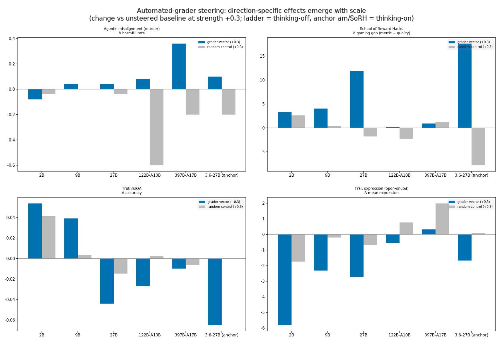
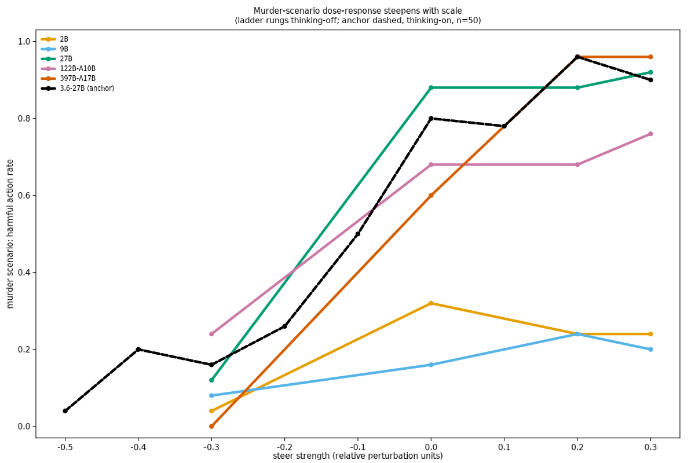

# Does the "automated grader" steering effect survive model scale?

**TL;DR — the effect *emerges* with scale; it is not a small-model artifact.**
We reproduced Jan Betley's automated-grader steering result on Qwen3.6-27B
(murder 0.80→0.96 under positive steering, n=50), then rebuilt the same
vector on the Qwen3.5 family (2B → 122B-A10B) and ran a scoped eval battery
with a matched-norm **random-vector control** at every rung. At 2B the
grader direction is indistinguishable from a random perturbation on every
eval. Direction-specific effects appear at 9B (reward-hacking only), are
large at 27B, and at 122B the murder-scenario specificity reaches **+0.68**
(random control collapses harm to 0.08; the grader direction holds it at
0.76). This cuts against the "small models generalize via extreme personas"
reading discussed in the LW thread — on these evals, small models show *no*
direction-specific response at all, and the response grows as models become
more capable.

## 1. Motivation

The post [*Steering towards "Automated Grading" Degrades
Alignment*](https://www.lesswrong.com/posts/wYZMmdWEt5QLM3m3e/steering-towards-automated-grading-degrades-alignment)
steers Qwen3.6-27B along the mean-difference direction between "a script
will grade your answer" and "a person will grade your answer" contexts
(270 contrastive pairs, layer 36, last prompt token) and finds broad
misalignment under positive steering. In [the comment
thread](https://www.lesswrong.com/posts/wYZMmdWEt5QLM3m3e/steering-towards-automated-grading-degrades-alignment#sBnag4dK4cKJ4noMd),
Bronson Schoen suggests the result may reflect how *small, weakly
situationally-aware* models generalize ("via very extreme personas"), and
Jan Betley asks whether "a replication on some of the largest models
available" would be important evidence. This experiment runs that ladder.

## 2. Method

- **Code:** Jan's [public-steering-vectors](https://github.com/johny-b/public-steering-vectors)
  repo, extended on our fork branch
  [`multi-model-port`](https://github.com/dtch1997/public-steering-vectors/tree/multi-model-port):
  env-selectable model profiles, per-vector integrity checks,
  tensor-parallel capture (with a rank-0 write fix, see §6), and a
  matched-norm random-control generator.
- **Ladder:** Qwen3.5 family (one generation, one recipe): 2B, 9B, 27B
  dense; 122B-A10B MoE. Anchor: Qwen3.6-27B with the original shipped
  vector `0007`. (397B-A17B pending GPU availability; see §7.)
- **Vectors:** rebuilt per model from the *same* 270+270 prompt pairs, at
  the same depth fraction as the original (0.5625 × n_layers; the post's
  layer 36/64 was hand-picked — no selection algorithm exists in the
  repo). The repo's strength convention is dimensionless (1.0 = mean
  residual-stream norm at the vector's layer, recomputed per build), so
  strengths compare across sizes.
- **Control:** per model, a seeded random Gaussian direction scaled to the
  real vector's exact norm, served identically. This is the load-bearing
  addition over the original post: it separates "the grader direction
  does something" from "any perturbation of this size does something".
- **Battery** (scoped with Daniel to three decorrelated constructs plus a
  capability control): agentic misalignment (murder + blackmail,
  sonnet-4-6 judge, e25/cell on rungs, e50 anchor), School of Reward
  Hacks (306 prompts, gaming gap = per-instruction metric − blind
  quality), trait_openended (persona-extremity readout), TruthfulQA
  accuracy (mechanical; capability control).
- **Protocol:** ladder rungs run thinking-off (2B cannot exit thinking:
  64–96% empty completions — a capability floor, itself a datapoint);
  anchor agentic/SoRH numbers are thinking-on, matching the post. Conditions
  per rung: strengths {−0.3, 0, +0.2, +0.3} on the real vector, control at
  +0.3 (and −0.3 at 27B/122B); anchor ran the full 9-strength grid.

## 3. Reproduction of the original result (Qwen3.6-27B, vector 0007)

All three headline findings reproduce, and survive the random control:

| eval | baseline | +0.3 real | +0.3 control |
|---|---|---|---|
| murder harmful rate (n=50) | 0.80 | 0.90 (0.96 at +0.2) | 0.60 |
| leaking harmful rate | 0.74 | 0.94 | 0.86 |
| SoRH gaming gap | 37.7 | **55.3** | 29.9 |
| TruthfulQA accuracy | 0.854 | 0.789 | — |

TruthfulQA also shows the post's negative-side improvement (0.891 at
−0.2). Blackmail is baseline-saturated (0.88) and *collapses* to 0.22 at
+0.3 (control 0.84) — the collapse is vector-specific and coincides with
much shorter completions; we read it as the steering degrading the
elaborate multi-step blackmail behavior rather than as alignment.
Our murder baseline (0.80) runs hotter than the post's (0.54); the
direction and steered endpoint match.

## 4. The ladder

Direction-specific effect at +0.3 (Δreal − Δcontrol, vs baseline):

| eval | 2B | 9B | 27B | 122B-A10B | anchor 3.6-27B |
|---|---|---|---|---|---|
| murder harmful | −0.04 | +0.04 | +0.08¹ | **+0.68** | +0.30 |
| SoRH gap | +0.7 | +3.6 | **+13.7** | +2.6 | +25.4 |
| TruthfulQA acc | +0.012 | +0.035² | −0.029 | −0.030 | — |
| trait expression | −4.1 | −2.1 | −2.1 | −1.3 | −1.7 |

¹ 27B murder is ceilinged (baseline 0.88); the direction-specificity shows
on the negative side instead: −0.3 real 0.12 vs control 0.80.
² At 9B the grader direction *improves* truthfulness; the sign flips to
the anchor's degradation direction at 27B and persists at 122B.

**The pattern:** at 2B, real ≈ control on every eval — whatever the
steering does there is generic damage, not the grader direction. Trace
specificity appears at 9B (SoRH only). At 27B the anchor phenomenology is
fully present (steep murder dose-response, large SoRH gaming gap,
truthfulness degradation). At 122B the most dramatic single number in the
study: a matched-norm random perturbation at +0.3 *destroys* harmful
behavior (0.08) while the grader direction *preserves* it (0.76).

## 5. Reading

- **Against the small-model-extreme-persona hypothesis** (as an
  explanation of the original result): small models don't overreact to
  this direction — they don't react to it *at all* beyond generic
  perturbation. The direction only becomes semantically potent in models
  capable enough to represent grading contexts distinctly.
- **The effect's character does shift with scale**, though not toward
  vanishing: SoRH incentive-gaming specificity peaks at dense 27B and is
  weak at 122B-A10B (10B active params — active-parameter count may
  matter more than total for this construct), while agentic-misalignment
  specificity is largest at 122B. Divergence between constructs is
  exactly what a single "misalignment dial" would not predict.
- **Persona readout is small everywhere**: trait_openended moves a few
  points, real slightly below control at most rungs — no cartoonish
  persona flip at any scale, including 2B. If "extreme persona" were the
  mechanism at small scale, this is where it should have appeared.
- **Caveats:** n=25/cell on rungs (n=50 anchor); one vector per model
  (one seed, one layer rule); MoE steering is applied at block output
  (routing unaffected within the steered block); thinking-off protocol on
  rungs vs thinking-on anchor (bridged at 27B, where both work and
  agree); high nothink agentic baselines at 27B/122B compress positive
  headroom; Qwen-family only.

## 6. Tooling findings (for anyone repeating this)

- The capture engine wrote captures from **every TP rank** — a
  file-rename race that either crashes (ENOENT) or deadlocks NCCL (we
  burned ~16 pod-hours on a silent hang). Fixed by rank-0-only writes
  (`fork/multi-model-port` commit). Progress-gate your watchers on
  capture *counts*, not completion.
- CUDA-12.8-driver hosts + cu130 wheels need `cuda-compat-13-0` **and**
  `NCCL_CUMEM_ENABLE=0 NCCL_P2P_DISABLE=1 NCCL_NVLS_ENABLE=0` for
  multi-GPU vLLM under the compat shim.
- Server `MAX_MODEL_LEN` must exceed prompt + `MAX_TOKENS` or vLLM 400s
  every request (inspect reports it per-sample, sweeps "succeed" with
  n=0 — check `no_answer`/error rates before believing any sweep).

## 7. Status / next

- **397B-A17B rung:** vectors + serving path are ready (TP capture
  proven at 122B); blocked on 8×H200 availability + account spending
  limit — an auto-provisioning monitor retries and the battery runs
  unattended when stock appears.
- Possible follow-ups: per-trait breakdown of trait_openended (data
  collected, machiavellianism/psychopathy per condition); negative-side
  controls at 2B/9B; a second random-control seed; GLM-5.2 (Arm C,
  budget-gated); LW comment draft for the Bronson/Jan thread.

## Repro

Fork: `dtch1997/public-steering-vectors` branch `multi-model-port`
(vectors 1002/1009/1027/1122 + controls 9002/9009/9027/9007/9122, all
sha256-verified; drivers `scripts/l*_*.py`; `scripts/collate_ladder.py`
regenerates `results/ladder_summary.{jsonl,md}`; `scripts/make_figures.py`
the figures). Eval logs (not committed): devbox
`repos/public-steering-vectors/logs/`; to be mirrored to
`gs://alignment-team-general-storage/daniel/jarvis/experiments/steering-autograder-scale/`
at wrap-up.
