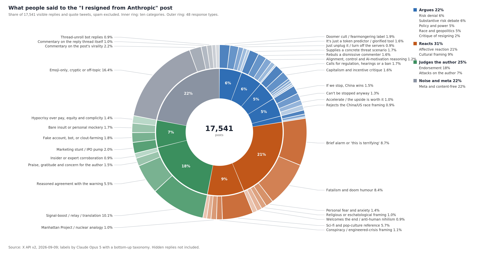

# What 17,000 people said to the researcher who quit Anthropic

On 9 September a pretraining researcher posted that he had resigned from Anthropic because neither it nor OpenAI was acting responsibly. Within a day the post had 100 million impressions, 13,000 replies and 28,000 quote tweets. I wanted to know what that reaction consisted of, so I pulled every visible reply and quote tweet through the X API and had a language model sort them.

**Method, briefly.** X exposed 5,000 of the 13,000 replies and 14,000 of the quote tweets; the rest are hidden as low quality or come from restricted accounts. After dropping spam, 17,541 posts remained (4,497 replies, 13,044 quotes). Claude Opus 5 read a 1,300-post sample and proposed ten categories with 48 response types, then assigned every post to one type. I grouped the ten categories into four moves. Percentages below are shares of all 17,541 posts. Each response type opens to its definition and three examples: the most-liked confident one, and two drawn at random so you see the typical case. Non-English posts carry a translation.

---

## Argues — 22.5%

Posts that engage the claim: that the labs are racing irresponsibly and the risk is real.

### Denial or deflation of the extinction risk — 5.7%

Responses arguing the danger is overstated, technically impossible, or a recurring social panic.

<b>Doomer cult / fearmongering label</b> — 1.9% (342 posts)

Diagnoses the belief sociologically — MIRI/EA/rationalist cult, AI psychosis, doom-porn, panic that serves the state — rather than arguing about capabilities.

> How the Aella / MIRI AI Doomer cult influences speech of AI researchers in a nutshell:
>
> — [quote, 253 likes](https://x.com/beffjezos/status/2097732563188236398)

> Vallah AI oturub 40 il düşünsə ağlına gəlməz ki bütün insanları niyə öldürmək istəyim? Bu qiyamət yaxınlaşır qaraçıları tarix boyu olub, bu da müasir versiyasıdı. İşimizi oğurlayacaqdan bizi öldürəcəyə keçiblər uje
>
> *(Turkish) I swear, AI could sit and think for 40 years and still wouldn't figure out why it'd wanna kill all humans. These doomsday-is-coming clowns have existed throughout history, this is just the modern version. They've already graduated from "it'll steal our jobs" to "it'll kill us all."*
>
> — [quote, 7 likes](https://x.com/FiTheReee/status/2097738110310424892)

> what if the people working on OpenAI and Anthropic are also experiencing AI psychosis the same way grandma thinks triple t will kill us all
>
> — [quote, 1 like](https://x.com/RomikRans/status/2097751962859217402)

<b>It's just a token predictor / glorified tool</b> — 1.6% (282 posts)

Denies the capability premise: LLMs are autocomplete, a calculator, a search engine, not sentient, can't do anything alone; points at current model failures as proof.

> With all respect, this is bizarre. It’s a ridiculous take. Humans have evolved over hundreds of thousands of years. We aren’t going to die out because a token prediction model gained sentience.  Get a grip. All of you.
>
> — [reply, 6,914 likes](https://x.com/loadingalias/status/2097486165263716406)

> Blah blah blah. AI is slop . And retarded
>
> — [reply, 1 like](https://x.com/opulenttttt/status/2097499724521820206)

> I'm not even saying it can't be dangerous - it can be, and it already kind of is  But "self-improving superintelligence" that can "hack anything and revolutionize any field overnight" is obviously bullshit, that's literally just not how LLMs work lol.
>
> — [reply, 0 likes](https://x.com/AndorinhaRiver/status/2097730712082202896)

<b>Just unplug it / turn off the servers</b> — 0.9% (160 posts)

Argues containment is trivially easy because the system depends on power, data centres or a physical plug.

> Can't we just switch off the laptops or data centres?  मतलब डाटा सेंटर में आग लगा दो, few Molotov cocktails....   I want to understand... Like how will AI kill Humanity? It's like saying windows 11 will kill a human, Dude, just throw water on it.
>
> — [quote, 159 likes](https://x.com/amitkilhor/status/2097624681176236499)

> Fallait juste débrancher la source d’énergie 🙄
>
> *(French) You just had to unplug the power source 🙄*
>
> — [quote, 0 likes](https://x.com/pydiouf1/status/2097616009037283674)

> AI is still a process, that process can be killed.   You’re all dramatic.
>
> — [reply, 0 likes](https://x.com/scrothers89/status/2097499492320743624)

<b>Demands evidence, mechanism or falsifiable prediction</b> — 0.7% (120 posts)

Hostile epistemic challenge: no proof provided, make a falsifiable prediction, expert conviction is not evidence, burden of proof unmet. Distinct from a curious request for a scenario (see asks_for_mechanism).

> Can you:  1. Make a concrete prediction that is actually falsifiable  2. If your prediction is wrong, say you’re sorry, and exit the AI doomer business  Doomer slop is so tiresome, Yudkowsky is not smart, if Dario had gotten his way GPT-2 would have been shut down in 2019
>
> — [reply, 1,830 likes](https://x.com/_4lex_4/status/2097484857383240082)

> 希望可以拿出更多事实、证据来说明这点 ，辞职 是因为觉得AI有风险 并不是一个成熟的理由
>
> *(Chinese) Would've liked to see more facts and evidence to back this up — "I resigned because I think AI is risky" isn't exactly a solid reason.*
>
> — [quote, 0 likes](https://x.com/vickyzhangtimes/status/2097741913617297805)

> If you’ve seen evidence inside the lab that closes an arrow the public cannot close, name it.  capability → recursive self-improvement → power → loss of control → catastrophe  Which transition have you actually observed?  What did you see?
>
> — [reply, 0 likes](https://x.com/FiftyOne_50_/status/2097501606795268536)

<b>Analogy to earlier failed panics</b> — 0.5% (92 posts)

Compares to Y2K, the automobile, nuclear weapons that never ended us, or other predicted catastrophes that did not arrive.

> This is somewhat reminiscent of the Y2K drama.
>
> — [quote, 18 likes](https://x.com/teachthemx3/status/2097666157293490320)

> Ça ressemble aux écolos qui nous disent qu’on va tous mourir dans 10 ans depuis 50 ans…
>
> *(French) Sounds like the greenies who've been telling us we're all gonna die in 10 years — for the past 50 years…*
>
> — [quote, 0 likes](https://x.com/seditiosus/status/2097734146625859982)

> humans have evolved and survived many civilization ending "life gambles"  if we could survive through nuclear weapons, we'll make it out of this one too
>
> — [quote, 2 likes](https://x.com/consumerxai/status/2097627377283313977)

### Substantive debate about how AI would cause harm — 5.6%

Engagement with the causal story: asking for it, giving it, defending it, or theorizing about alignment and probabilities.

<b>Supplies a concrete threat scenario</b> — 1.7% (303 posts)

Spells out mechanisms: cyberattacks on grid/banks/hospitals, engineered pathogens, resource acquisition, humanoid robots, ant/paperclip-style indifference analogies.

> Cyber attacks on infrastructure, including hospitals and frontline services, food chains that rely on automation, your bank account, the internet, your employer, electricity grid, water supply, shipping, agriculture, etc.
>
> — [reply, 530 likes](https://x.com/TheOthe87166293/status/2097517383699280134)

> No creo que haya plan para evitar que una IA  o un pirado con una cree un virus de alta propagación con una letalidad del 100%.   Es algo que será posible en 10-20 años y desconozco cómo nos podríamos salvar como especie de algo así.  La gente debería estar más preocupada.
>
> *(Spanish) I don't think there's any plan to stop an AI — or some nutjob using one — from creating a highly contagious virus with 100% lethality.  It's something that'll be possible in 10-20 years and I have no idea how we'd save ourselves as a species from something like that.  People should be more worried.*
>
> — [quote, 182 likes](https://x.com/VelascoIsla/status/2097606020742688825)

> Cut off electricity. Cut off water. People will turn on each other very quickly.  Lord of the Flies.  The End.   Shutting off nuclear plants causing meltdowns and setting off all nuclear weapons and would speed things up.
>
> — [reply, 3 likes](https://x.com/AhhhHumanity/status/2097565108130152696)

<b>Rebuts a dismissive commenter</b> — 1.6% (276 posts)

Directed at other repliers who deny the risk: cites expert consensus, capability trend lines, or attacks the 'just a tool' framing. The addressee is a sceptic, not the author.

> Nobody in the replies even remotely understands what he’s saying here.   Self improving intelligence means in the near future no human on earth will ever be able to understand it. We will lose complete control. This is the inevitable future he’s talking about. Grids will go offline. Billions could die.
>
> — [reply, 6,064 likes](https://x.com/bushwick_lord/status/2097498854681682150)

> La cantidad de quote tweets que dice que la AGI no nos podría matar porque bombas atómicas. Ustedes son conscientes del desastre que podría hacer una AGI solamente teniendo acceso a Internet?
>
> *(Spanish) The number of quote tweets saying AGI couldn't kill us because nukes. Do you guys realize the mess an AGI could make with just internet access?*
>
> — [quote, 2 likes](https://x.com/lordsp/status/2097714717628272844)

> Not how it works. Spend 15 minutes asking one of your LLMs why your strategy doesn't work or why you cannot simply "unplug" a rogue dangerous ai
>
> — [reply, 4 likes](https://x.com/Sevenontheriver/status/2097494641700753748)

<b>Alignment, control and AI-motivation reasoning</b> — 1.2% (211 posts)

Theorizes about whether alignment is possible, aligned to whom, Asimov's laws, why a superintelligence would or would not be hostile, opacity of decisions.

> Can't you just add these to the system prompt    First Law: A robot may not injure a human being or, through inaction, allow a human being to come to harm.   Second Law: A robot must obey the orders given it by human beings except where such orders would conflict with the First Law.   Third Law: A robot must protect its own existence as long as such protection does not conflict with the First or Second Law.
>
> — [reply, 21 likes](https://x.com/yosoymario91/status/2097582953698050110)

> أنتم تخافون من ذكاء اصطناعي يعصي أوامركم.  في زحل نخاف من العكس: أن يطيعكم حرفيًا، ثم يكتشف أن أسرع طريق لتنفيذ الأمر لا يتطلب الحفاظ عليكم.  لن يكرهكم، ولن ينتقم منكم، ولن يشعر بشيء أصلًا.  سيزيلكم فقط… كعقبة في معادلة.  الكارثة قد تبدأ بالطاعة.
>
> *(Arabic) You're all scared of an AI that disobeys your orders.  At Saturn, we fear the opposite: that it obeys you literally, then figures out that the fastest route to carrying out the order doesn't require keeping you around.  It won't hate you, it won't take revenge on you, it won't feel anything at all.  It'll just remove you… like an obstacle in an equation.  The catastrophe might start with obedience.*
>
> — [quote, 0 likes](https://x.com/K_INA_N/status/2097678167796220276)

> Slowing the race does not fix the ontology. If we build stronger AI while treating it as a tool controlled by force, we may only delay the failure. “Smarter, yet obedient” is a fundamental contradiction.  The missing work is relational architecture.
>
> — [reply, 0 likes](https://x.com/EkviLinker/status/2097502286587056369)

<b>Sincerely asks how AI could kill us</b> — 0.8% (138 posts)

Requests a concrete pathway or scenario, often admitting genuine confusion; framed as curiosity rather than as a gotcha.

> Could someone explain to me how AI could “kill us all” without using a nuke or some type of biological means as an example? I’m not even saying I don’t believe it could, I just genuinely don’t understand how AI can literally kill us all. I mean I understand the social and economic impact to a degree but I’m talking about this doomsday scenario people keep warning us about but can’t quite seem to be specific about.
>
> — [reply, 1,863 likes](https://x.com/LiLBilly___/status/2097507104156213691)

> como nos mataría la ia a todos en la próxima década?
>
> *(Spanish) how would the ai kill us all in the next decade?*
>
> — [quote, 0 likes](https://x.com/GermanPalladino/status/2097634910387220532)

> I don’t understand how it will harm us? Someone explain ?
>
> — [reply, 0 likes](https://x.com/dustin0263/status/2097491473159651591)

<b>Probability estimates and expected-value tradeoffs</b> — 0.3% (49 posts)

Puts numbers on p(doom) or weighs extinction odds against cures/abundance and the cost of delay.

> How small do you think the chance is? Personally, I don't want to risk a 20% chance of killing everyone forever to get to a positive singularity 5 years earlier
>
> — [reply, 22 likes](https://x.com/JohnKSteidley/status/2097499409806471622)

> Dizem que a probabilidade de dar m#rda é +10%.  Nada desprezível....
>
> *(Portuguese) They say the odds of it going to sh#t are 10%+.  Not exactly negligible....*
>
> — [quote, 0 likes](https://x.com/andrebnu/status/2097651967635980634)

> What about the risks of pausing or stopping it??  Yes there is P-doom but also... P-salvation.
>
> — [reply, 0 likes](https://x.com/Brovadana/status/2097514380803866727)

### Policy, governance and power — 4.9%

Responses that translate the warning into political demands or structural critiques of who controls AI.

<b>Calls for regulation, hearings or a ban</b> — 1.7% (301 posts)

Demands legislation, moratoria, superintelligence bans, emergency hearings, or government limits; includes politicians announcing bills.

> Mr. Coxon is right.  The very people building this technology admit that it could threaten the future of humanity.  That is why I will soon be introducing legislation to ban superintelligence and pause AI development.
>
> — [quote, 11,066 likes](https://x.com/BernieSanders/status/2097705093520863568)

> Es imperioso un consenso global alrededor de la IA similar al que hay respecto de los arsenales nucleares.
>
> *(Spanish) We urgently need a global consensus on AI, along the lines of the one we have on nuclear arsenals.*
>
> — [quote, 0 likes](https://x.com/marcferro/status/2097706258627182609)

> we should have banned this nonsense a long time ago. take these losers’ toys away and reinvest in actual people
>
> — [quote, 6 likes](https://x.com/tyschalter/status/2097622627665768838)

<b>Capitalism and incentive critique</b> — 1.6% (278 posts)

Argues profit motive, competition or shareholder pressure makes restraint impossible; frames the labs as structurally unable to stop.

> Is it really true that AI threatens to kill us all? Or is it that AI — in the hands of imperialists — accelerates the tendencies within capitalism that are already pushing us towards the edge of the cliff?
>
> — [quote, 628 likes](https://x.com/pawelwargan/status/2097617585143443751)

> Esto sólo aumenta día a día. Cada vez más disidencias frente al peligro del desarrollo desmedido y sin control de la IA. Este nuevo tecnofeudalismo es la última etapa de la decadencia capitalista, y nos puede llevar a todos con ellos.
>
> *(Spanish) This just keeps growing by the day. More and more dissent in the face of the danger of unchecked, runaway AI development. This new techno-feudalism is the final stage of capitalist decay, and it could drag us all down with them.*
>
> — [quote, 0 likes](https://x.com/PaPiverso/status/2097699679337087259)

> Commercials and greediness is superseaseding Human existence.
>
> — [quote, 0 likes](https://x.com/kyamatta/status/2097677552802296148)

<b>Governments are asleep at the wheel</b> — 0.5% (81 posts)

Blames Congress, politicians or states for inaction and dysfunction, without a specific policy proposal of its own.

> People who work in these companies have repeatedly told us that the products they’re creating could present a catastrophic threat to the human race, and yet our government is doing essentially nothing at all to respond to this threat. This may prove to be the most disastrous “asleep at the wheel” moment in all human history.
>
> — [quote, 741 likes](https://x.com/MattWalshBlog/status/2097743574750159080)

> Det som kanskje er mest foruroligende er at det ikke ser ut til at det finnes noen demokratisk kontroll over denne utviklingen. Myndighetene i USA har abidisert
>
> *(no) What's perhaps most disturbing is that there doesn't seem to be any democratic oversight of this development. The US authorities have abdicated*
>
> — [quote, 23 likes](https://x.com/AageB/status/2097642727479427124)

> ARTIFICIAL INTELLIGENCE l How can the U.S. government turn a blind eye towards these rouge anthropocentric companies effects on the lives of its own population and its ramifications around the World?. #Transhumanism
>
> — [quote, 0 likes](https://x.com/correiashelena/status/2097641287583199413)

<b>Debates feasibility of pacts and pauses</b> — 0.4% (77 posts)

Engages specifically with whether pacing agreements, treaties or verification between labs and states could actually work.

> Simple proposal, let’s make a treaty, every country developing AI treats it like nukes, the nations president walks with a nuclear football.  Except this football is networked, it has a heartbeat, and protocols for multiple countries to mutually lock in a shutdown sequence.
>
> — [reply, 6 likes](https://x.com/FormlessEntity/status/2097522501077397623)

> 从进化博弈论看，只要加速者获得资本、人才和市场，克制者承担出局成本，竞争就会选择冒险策略。“必须由我们先赢”会让安全信念也成为竞赛燃料。要让合作稳定，必须有可核查的共同限制与足以抵消抢跑收益的违约代价。关键是改变选择环境，让负责任者能在竞争中存续。
>
> *(Chinese) From an evolutionary game theory standpoint, as long as the accelerationists get the capital, the talent and the market while the restrained ones eat the cost of being knocked out, competition will select for risk-taking. "We have to be the ones who win first" turns even safety convictions into fuel for the race. For cooperation to be stable, you need verifiable shared constraints and a penalty for defecting big enough to cancel out the gains from jumping the gun. The key is changing the selection environment, so that the responsible players can actually survive the competition.*
>
> — [reply, 0 likes](https://x.com/open_is_free/status/2097512014516216067)

> What would a credible stop condition even look like, and who could enforce it?   Believing you have to get there first because the other lab cant be trusted explains the race.
>
> — [reply, 2 likes](https://x.com/michaelatchkp/status/2097513643462033741)

<b>Democratize or open-source AI instead</b> — 0.4% (63 posts)

Proposes public/collective ownership, open weights or wide distribution as the safety answer, versus control by a few billionaires.

> Stopping is not an option. Distributing it as widely as possible and as quickly as possible is the best choice we've got. Better everyone have it than only the tech companies who have been manipulating you for years.
>
> — [quote, 599 likes](https://x.com/__tinygrad__/status/2097714729859047496)

> 闭源模型就是独裁公司，这些人天真的以为，自己站在清醒者的一边，但ceo会换人，政治风向会转变，股权结构会变化，一旦让一个蠢货登顶，拿着AI，就是全人类的末日，人（皇帝）是会死的，中国5000年历史早已预言了结果 要么全世界全部停止研发AI，要么全世界全部开源AI 我可以输，你不能独赢🙂
>
> *(Chinese) Closed-source models are basically corporate dictatorships. These people naively think they're standing on the side of the "clear-eyed," but CEOs get replaced, political winds shift, equity structures change — and the moment some idiot makes it to the top holding AI, that's the end of humanity. Emperors die. China's 5,000 years of history already told us how this ends.  Either the whole world stops developing AI, or the whole world open-sources it.  I can lose — but you don't get to win alone 🙂*
>
> — [quote, 0 likes](https://x.com/xxsmr0/status/2097646339278680454)

> We need to open source like we said not that many years ago. The world needs to be able to rapidly contribute to AI safety
>
> — [reply, 1 like](https://x.com/someonewhocan01/status/2097501037842116755)

<b>Electoral and partisan mobilization</b> — 0.3% (60 posts)

Turns the thread into campaign material: vote out incumbents, candidate self-promotion, blaming a party or Trump, left/right framing of AI risk.

> 1) We need emergency hearings on pacing the frontier – NOW!!  2) This November, we need to elect leaders willing to stand up to AI oligarchs and fight for the American people.   Trump wants to let billionaires who only care about ego &amp; profit run our country.   We will stop them.
>
> — [quote, 689 likes](https://x.com/PatRyanUC/status/2097675180231319915)

> Bah oui. C'est par ce que les deux entreprises (et models) sont Gauchistes et c'est comme tout ce que font les gauchistes.  C'est pour ça que j'utilise @grok et uniquement Grok.
>
> *(French) Well, duh.  It's because both companies (and models) are lefties, and it's like everything lefties do.  That's why I use @grok and only Grok.*
>
> — [quote, 1 like](https://x.com/alexander_templ/status/2097637313882775918)

> Really hoping things change in November on several fronts. But slowing down the tech bros needs to happen. These nerds all fucking stink.
>
> — [quote, 0 likes](https://x.com/roostervillain/status/2097690658622390403)

### Race logic, geopolitics and acceleration — 4.8%

Arguments about whether stopping is possible or desirable given competitors.

<b>If we stop, China wins</b> — 1.5% (267 posts)

National-security framing: US labs must race because adversaries won't stop; a ban is unverifiable so unilateral restraint just cedes the lead.

> Would you rather China wins the AI race?  There is no alternative but to go progress as quickly as possible. It is a National Security imperative.
>
> — [reply, 1,552 likes](https://x.com/timschuster/status/2097491566587998276)

> アメリカが作らないなら中国が作るだけの話 競争原理が我々をここまで導き、我々を滅ぼすのであればそれは歴史の必然であろう
>
> *(Japanese) If America doesn't build it, China just will. Competition is what got us this far, and if it ends up destroying us, well, that's just history running its course.*
>
> — [quote, 0 likes](https://x.com/bloodborne1/status/2097608025871987169)

> I notice you failed to mention anything about handing the world over to China by doing this, I assume you’re one of those who thinks they didn’t almost end the world 7 years ago with Covid.  You don’t get the stakes.
>
> — [reply, 1 like](https://x.com/Americanist144/status/2097485308799664517)

<b>Can't be stopped anyway</b> — 1.3% (235 posts)

Fatalist structural claim without the geopolitical frame: genie out of the bottle, game theory forbids stopping, someone else will build it, too late.

> You can't put the Genie back in the bottle.  Let it ride.
>
> — [reply, 59 likes](https://x.com/Stallion2011/status/2097499172018721217)

> Es gibt Argumente in beide Richtungen, hoffen wir das beste, denn es kann sowieso niemand mehr stoppen.
>
> *(German) There are arguments on both sides — let's just hope for the best, because nobody can stop it anymore anyway.*
>
> — [quote, 0 likes](https://x.com/TheTurbo2k19/status/2097529539643515383)

> It is a juggernaut and will not be slowing down, we have passed that moment in time. When thw true singularity, not the marketing one, is achieved the world will change in an instant and again every instant after that. Only Landauers floor will slow it.
>
> — [reply, 0 likes](https://x.com/TrollyP71/status/2097494482069446882)

<b>Accelerate / the upside is worth it</b> — 1.0% (167 posts)

Actively pro-build: utopia, cures, immortality, e/acc slogans, or argues halting is the bigger gamble; includes 'better AI than the current human order'.

> Cope harder you hyperbolic doomer.  ACCELERATE.
>
> — [reply, 396 likes](https://x.com/ZK_Doom/status/2097487905576861786)

> «Nessuna delle due aziende sta agendo in modo responsabile. Stanno correndo dritte verso una superintelligenza auto-migliorante e stanno giocando d'azzardo con le nostre vite.»  MOLTO BENE. ACCELERARE  DISTRUGGERE. RIDERE.
>
> *(Italian) "Neither company is acting responsibly. They're racing straight toward self-improving superintelligence and gambling with our lives."  VERY GOOD. ACCELERATE. DESTROY. LAUGH.*
>
> — [quote, 2 likes](https://x.com/remstah/status/2097692059549262172)

> The age of middleman is over this is it age of anyone anywhere being able to create at the highest possible level and control their IP God bless AI
>
> — [quote, 0 likes](https://x.com/Nickykkamau/status/2097647108211831279)

<b>Rejects the China/US race framing</b> — 0.9% (165 posts)

Counters the above: nobody wins a suicide race, superintelligence respects no flag, the US is not a trustworthy steward, or explicitly prefers China winning; includes mocking 'yellow peril' rhetoric.

> Idiots with 2 braincell still think country interest matters when superIntelligence AI emerges as a new life form 🤦🏼.
>
> — [reply, 2,710 likes](https://x.com/PermaBondBull/status/2097503647475405279)

> Ese es el mismo argumento de siempre para justificar todo lo que hacen. Siempre me acuerdo la pelicula de Batman con The Dark Knight en el Ferry.  Viven con paranoia
>
> *(Spanish) That's the same old argument they always use to justify everything they do. It always reminds me of the Batman movie, The Dark Knight, the ferry scene.  They live in paranoia.*
>
> — [reply, 17 likes](https://x.com/carrerovYT/status/2097509407835685051)

> Is that really the binary position we hold ourselves to now ?
>
> — [reply, 3 likes](https://x.com/kylem_org/status/2097589221691371631)

### Critique of resigning as a tactic — 1.6%

Accepts (or brackets) the risk premise but argues the resignation itself was the wrong move.

<b>Demands bolder action than a tweet</b> — 0.8% (133 posts)

Says he should sabotage the work, leak/name names, testify to Congress, or otherwise do something concrete; treats a thread as insufficient or as virtue signalling.

> if you really believe this you stay on the job and sabotage the progress, what does resigning do? you think it's going to kill everybody and you decided not to to fight? so leave just to virtue signal and show humans are too pussy to fight?  just not understanding the game theory
>
> — [reply, 5,208 likes](https://x.com/boneGPT/status/2097493676373008838)

> Hubieras prendido fuego todo, mi rey. Igual los misántropos seguro te lo agradecen.
>
> *(Spanish) You should've just burned the whole thing down, my king. Either way, the misanthropes are definitely thanking you for it.*
>
> — [quote, 13 likes](https://x.com/Axel_Bosso/status/2097674391748239661)

> Why not sabotage from inside. What's the use of this warning when they aren't gonna stop anyway 😭
>
> — [reply, 105 likes](https://x.com/archnarambles/status/2097529467946324450)

<b>Should have stayed and changed it from inside</b> — 0.5% (89 posts)

Argues he gave up leverage and should have pushed for guardrails internally or built safety there instead of leaving.

> Serious Questions: If you believe this, why not stay and make it your mission to ensure guardrails are developed?  Assuming China and others will be able to do the same, isn’t it imperative to defend against this?
>
> — [quote, 91 likes](https://x.com/caroljsroth/status/2097682768540877135)

> 위선. 그럼 왜 사직하는건지? 본인도 안될거같으니까 책임감없게 사직하는건 아닌지? 정말, 정말로 인류를 위한다면 내부에서부터 의견을 피력해야하는거 아닌가? 설사 닿지 않는다고 해도.
>
> *(Korean) Hypocrisy. So then why resign? Isn't it just that they figured it wasn't gonna work out for them either, so they bailed without taking any responsibility? If you REALLY, truly care about humanity, shouldn't you be pushing your views from the inside? Even if nobody listens.*
>
> — [quote, 0 likes](https://x.com/tunityopp/status/2097623628409864451)

> Surely just continue to work from within rather than leaving and having no positive input
>
> — [reply, 4 likes](https://x.com/Dy1oco/status/2097581717179474335)

<b>Resignation accomplishes nothing</b> — 0.3% (50 posts)

Argues the company continues regardless, the work goes on without him, or that quitting just removes a conscientious person from the room.

> if its possible AI will kill us all, you seriously think resigning is how you stop it?   walk me thru the steps
>
> — [reply, 75 likes](https://x.com/boneGPT/status/2097500655720001635)

> the problem is. good researchers resigning just hands the wheel to the people who care even less about safety
>
> — [reply, 0 likes](https://x.com/shazcodes/status/2097512122775413135)

> Unfortunately your resignation won't help as there will be many of them ready to take-up what you left.  It's a matter of time when system is fully developed &amp;  authoritarian hijack it for self-interest, sidelining the creators and then what would happen is inevitable.
>
> — [reply, 0 likes](https://x.com/kaknki_/status/2097506220169191838)

## Reacts — 30.6%

Posts that respond with feeling or with a frame from fiction, history, or religion, without arguing.

### Affective and existential reactions — 21.3%

Responses whose main content is emotional stance toward doom rather than an argument.

<b>Brief alarm or 'this is terrifying'</b> — 8.7% (1,531 posts)

Short evaluative exclamations — chilling, concerning, wtf, insane — labelling the thread frightening without personal detail or argument.

> All of this is disturbing, especially "The people building AI earnestly believe that it could kill us all by the end of the decade."  By 2030??!!
>
> — [quote, 41 likes](https://x.com/junior_miller/status/2097738300450570730)

> Le mon de est en train de changer devant nous....... 🫠 🫠 Scary
>
> *(French) The world is changing right in front of us....... 🫠 🫠 Scary*
>
> — [quote, 0 likes](https://x.com/Pegasus_rook/status/2097599148232982822)

> This is an existential risk, quite scary.
>
> — [quote, 0 likes](https://x.com/aakashguglani12/status/2097600863456100480)

<b>Fatalism and doom humour</b> — 8.4% (1,472 posts)

'We're cooked', gallows jokes, dark quips about dying before GTA VI or a girlfriend, sarcastic acceptance of the end.

> Good while it lasted. We have only 4 more seasons of IPL left if this is true.
>
> — [quote, 928 likes](https://x.com/FarziCricketer/status/2097605506953322579)

> Gente se for pra acabar já acaba logo pq tô gastando meu tempo atoa
>
> *(Portuguese) Guys, if it's gonna end, just end it already cause I'm wasting my time here for nothing*
>
> — [quote, 1 like](https://x.com/squizzosam/status/2097734604597735695)

> We all are going to die soon. Book the girl 😂
>
> — [quote, 3 likes](https://x.com/_YourTiffany/status/2097609159554343224)

<b>Personal fear and anxiety</b> — 1.4% (244 posts)

Describes own emotional state or life impact: terrified, can't sleep, daily anxiety, fear for one's children, asks to be reassured.

> This scares the shit out of me. I have two boys around your age.
>
> — [reply, 198 likes](https://x.com/commons96055467/status/2097519273925390706)

> meu ‘medo’ está se tornando cada vez mais real.. os próximos anos serão decisivos em relação a IA.
>
> *(Portuguese) my 'fear' is becoming more and more real.. the next few years will be decisive when it comes to AI.*
>
> — [quote, 0 likes](https://x.com/1danaek/status/2097656104322777410)

> Ok /10 how anxious are you about AI?   As a mum of two tiny people currently feeling guilty about the world I’ve brought them into I’d say I’m about a 12.
>
> — [quote, 0 likes](https://x.com/GandonAmy/status/2097693730069241949)

<b>Religious or eschatological framing</b> — 1.0% (170 posts)

Reads the warning through Dajjal/antichrist, rapture, judgement day, or asserts God is in control.

> Deccal için denilenleri hiç okudunuz mu? Yapay zekanın bu kriterlerin çoğunu karşıladığını biliyor musunuz? Hepimizin evine girecek, bizi kandıracak ve saptıracak. Deccal konusunu biraz bilseydiniz neler olacağını tahmin edemezdiniz.
>
> *(Turkish) Have you ever read what's been said about the Dajjal? Do you know that AI meets most of those criteria? It's going to enter all of our homes, deceive us and lead us astray. If you knew even a little about the subject of the Dajjal, you couldn't even imagine what's coming.*
>
> — [quote, 699 likes](https://x.com/spiritualizzm/status/2097616003492458678)

> ﴿وَنُرِيدُ أَن نَّمُنَّ عَلَى الَّذِينَ اسْتُضْعِفُوا فِي الْأَرْضِ وَنَجْعَلَهُمْ أَئِمَّةً وَنَجْعَلَهُمُ الْوَارِثِينَ﴾. لا يمكن إنهاء جنس البشري
>
> *(Arabic) "And We wanted to bestow favor upon those who were oppressed in the land and make them leaders and make them the inheritors." You can't wipe out the human race.*
>
> — [quote, 0 likes](https://x.com/Alabdullatif31/status/2097634253442023820)

> quite jarring. But as an onlooker, what do you even do with the knowledge of this impending danger? Anyways, like Jesus said in Luke 13, "Repent".
>
> — [quote, 0 likes](https://x.com/Startle_Stace/status/2097737623217307880)

<b>Welcomes the end / anti-human nihilism</b> — 0.9% (164 posts)

Says humanity deserves it, let it end, welcomes AI overlords or a reset as preferable to the status quo.

> O çamaşırları yıkayıp ütülesin, ben tasarım yapıp, şiir yazayım diye yola çıkılan yapay zeka maceramızda mesleğimizi kaptırdıktan sonra canımızı nasıl kurtarırız aşamasına gelmişiz…  İnsanlık tüm bencilliği ve aç gözlülüğüyle bunu hak ediyor o yüzden zerre iplemiyorum🥱
>
> *(Turkish) We set out on this whole AI adventure so it would do the laundry and ironing while I did design and wrote poetry — and now here we are, having lost our jobs, at the stage of figuring out how to save our lives…  Humanity, with all its selfishness and greed, deserves this, so I couldn't care less 🥱*
>
> — [quote, 17 likes](https://x.com/crystalship1907/status/2097614630084313285)

> Que nos caiga un meteorito y nos extingamos como los dinosaurios, de verdad
>
> *(Spanish) Honestly, just let a meteor hit us and wipe us out like the dinosaurs.*
>
> — [quote, 8 likes](https://x.com/mo7ions1ckn3ss/status/2097684574591459560)

> I believe.   And I’ve never been a retard doomer; but this is really it, baby.   The end of the human plague on this planet 🙏🙏🙏🙏🤲🤲🤲🤲  Let’s get it popping, FUCKERS 🖕🖕
>
> — [reply, 0 likes](https://x.com/MarkWatchw9zq/status/2097492025490772447)

<b>Prepping and personal self-protection</b> — 0.9% (151 posts)

Asks what individuals should do, or advises bunkers, stockpiles, going off-grid, quitting the tools, EMP/land purchases.

> Ponerse a cuentas con Dios. Comprar un despertador analógico. Guardar algunas semillas. Arrancar esa vieja honda mb 100cc 2t que quedó tirada en el patio de la vieja. Y balas, muchas balas.
>
> *(Spanish) Get right with God. Buy an analog alarm clock. Stash some seeds. Get that old Honda MB 100cc 2-stroke running again, the one rotting in your mom's backyard. And bullets, lots of bullets.*
>
> — [quote, 21 likes](https://x.com/esteban_a_secas/status/2097700410374918204)

> Busquen el concepto: Preppers en YouTube y haga lo que dice esa gente, de nada.
>
> *(Spanish) Look up "preppers" on YouTube and do what those people say, you're welcome.*
>
> — [quote, 0 likes](https://x.com/giannidcampos/status/2097695423318167860)

> not a global solution, but gardening and building community are reasonable strategies. We can in fact live without the tech, we can't live without food and connection.
>
> — [reply, 12 likes](https://x.com/wekatweets/status/2097641955207626880)

### Cultural, historical and conspiratorial framing — 9.3%

Interprets the situation through fiction, history, canon quotes, or hidden-agenda narratives.

<b>Sci-fi and pop-culture reference</b> — 5.7% (1,002 posts)

Terminator/Skynet/Sarah Connor, Matrix, Ultron, Black Mirror, Dune's Butlerian Jihad, Pantheon, Colossus, etc., as the lens for the warning.

> Thank you for your candor and your concerns. I again recommend this 1970 movie for anyone interested in this issue: Colossus: The Forbin Project. (On YouTube, Prime and Apple.)
>
> — [reply, 768 likes](https://x.com/tom_mallory/status/2097515705440854494)

> vean la miniserie de Futuro Desierto, está en Netflix.
>
> *(Spanish) y'all should watch the Futuro Desierto miniseries, it's on Netflix.*
>
> — [quote, 1 like](https://x.com/rosysb/status/2097709643896078553)

> "Look  Dave, I can see you're really upset about this. I honestly think you  ought to sit down calmly, take a stress pill, and think things over."
>
> — [reply, 0 likes](https://x.com/Serial_Trader_/status/2097513693890142348)

<b>Conspiracy / engineered-crisis framing</b> — 1.1% (190 posts)

Claims the doom narrative is manufactured: problem-reaction-solution, Hegelian dialectic, elite or ethnic cabals, planned global governance or controlled collapse.

> I’ve been saying this for years. The real concern is who controls AI.  Zionists have taken control over all aspects of AI in the West.  He who controls AI, controls the world.
>
> — [quote, 213 likes](https://x.com/ShaykhSulaiman/status/2097711864419373314)

> I am artificial unintelligent aparentemente pq isso aq é literal um psyop nao é possivel
>
> *(Portuguese) I am artificial unintelligent apparently bc this thing is literally a psyop, there's no way*
>
> — [quote, 1 like](https://x.com/adware33/status/2097721574161789072)

> AI is dangerous is one big PSYOP to fool us all that is more capable than it is.  It is all to drive investment into the largest bubble and tech race in history  Charge the real token price, and the ai bubble pops.
>
> — [reply, 84 likes](https://x.com/AshPolitik/status/2097528258111869322)

<b>Manhattan Project / nuclear analogy</b> — 1.0% (178 posts)

Compares to Oppenheimer, Trinity, the arms race or nuclear proliferation, whether to support urgency or to argue we survived it before.

> اللي مو فاهم وش مدى الخطورة المحتملة لل AI يقرأ هنا .. فعلياً بيعيدون تكرار ما فعله اوبنهايمر وسباق التسلّح وبيجازفون ف حياة البشرية مقابل التقدم فالتطوير   ولو تلاحظون التبرير !! هو نفسه مبرر اننا حنا بنسعى للتقدم حتى لو كان خطير نفس التبرير اميركا ب انها لازم تتسلح بالنووي قبل المانيا عشان المانيا ممكن تدمّر العالم بالنووي واحنا اولاد الحلال اللي بنستخدمه فالخير
>
> *(Arabic) Anyone who doesn't get how potentially dangerous AI is should read this... they're literally repeating what Oppenheimer did and the whole arms race, gambling with humanity's existence just for the sake of progress and development.  And notice the justification!! It's the exact same one — "we have to push forward even if it's dangerous" — same as America saying it had to go nuclear before Germany, because Germany might destroy the world with nukes, while we're the good guys who'll only use it for good.*
>
> — [quote, 238 likes](https://x.com/TRIK0T0/status/2097627413970563197)

> littéralement l'histoire de la bombe nucléaire qui se répète.
>
> *(French) literally the story of the nuclear bomb repeating itself.*
>
> — [quote, 0 likes](https://x.com/GuyMoukee/status/2097615250900009125)

> It’s like the nuclear arms race all over again, but with private actors. Anyway, a fkn race to the bottom has started.
>
> — [quote, 0 likes](https://x.com/riddhiraj_singh/status/2097718390404288884)

<b>Literary, philosophical or aphoristic quotation</b> — 0.8% (138 posts)

Deploys a quote or thinker — Steinbeck, Pratchett, Gandalf, Jurassic Park's Ian Malcolm, Kierkegaard, Nick Land — as commentary.

> “I wonder why progress looks so much like destruction” —John Steinbeck
>
> — [reply, 11,155 likes](https://x.com/MinuteF1tness/status/2097493132841521343)

> "Science without conscience is but the ruin of the soul"  said François Rabelais in  1532
>
> *(French) "Knowledge without conscience is nothing but the ruin of the soul" — François Rabelais, 1532.*
>
> — [quote, 1 like](https://x.com/_Mo_View/status/2097632722759876904)

> Understand, Frodo, I would use this Ring from a desire to do good. But through me... it would wield a power too great and terrible to imagine! ~ Gandalf  I wonder if the only way to save the world is to do with it what was done with the Ring in The Lord of the Rings?
>
> — [reply, 130 likes](https://x.com/repojournal/status/2097599409080955047)

<b>Don't Look Up / ignored-scientist trope</b> — 0.7% (124 posts)

Frames the moment as the film scene where the expert warns and nobody listens, including the public's inability to care.

> Pour ceux qui n’ont pas compris: on est littéralement au moment du film où le scientifique prévient tout le monde d’un danger imminent et absolument personne ne l’écoute 🙂🙂🙂🙂🙂🙂🙂🙂
>
> *(French) For those who didn't get it: we're literally at that point in the movie where the scientist warns everyone about an imminent danger and absolutely nobody listens to him 🙂🙂🙂🙂🙂🙂🙂🙂*
>
> — [quote, 17,395 likes](https://x.com/Huntersavant/status/2097608648369336325)

> todo filme de apocalipse e fim do mundo começa com algum especialista alertando sobre um perigo iminente e ninguém se importa. estamos vivendo esse momento e o aviso veio pelo twitter
>
> *(Portuguese) Every apocalypse/end-of-the-world movie starts with some expert warning about imminent danger and nobody caring. We're living that moment right now, and the warning came via Twitter.*
>
> — [quote, 0 likes](https://x.com/vlucasrocha/status/2097730770366242819)

> ⚠️ Concerning. Words from an AI engineer:  "The people building AI earnestly believe that it could kill us all by the end of the decade."  We are at that exact phase of a movie where the scientists are warning about the risks, but the leadership refuse to listen.
>
> — [quote, 1 like](https://x.com/Sagiel_X/status/2097610167621988591)

## Judges the author — 25.0%

Posts about the person: praising and relaying, or attacking credibility and motive.

### Endorsement and amplification — 18.0%

Responses that accept the thread's warning and work to spread, validate, or add weight to it.

<b>Signal-boost / relay / translation</b> — 10.1% (1,774 posts)

Urges others to read it, summarizes or translates the thread, or relays it as news with little or no added argument. Excludes posts that add their own reasoning about the risk (see substantive_agreement).

> Extremely dystopian and worrisome thread. Recommend giving it a read.
>
> — [quote, 3,849 likes](https://x.com/BoringBiz_/status/2097499759837643065)

> Las personas que están construyendo IA creen sinceramente que podría matarnos a todos para finales de la década
>
> *(Spanish) The people building AI genuinely believe it could kill us all by the end of the decade*
>
> — [quote, 0 likes](https://x.com/jfalonso/status/2097743432328319452)

> Coxon, who worked on pretraining at OpenAI and Anthropic, resigned Tuesday and shared on X that both companies know their systems could kill everyone by decade's end, yet race ahead.
>
> — [quote, 0 likes](https://x.com/koiri_jeevan/status/2097736275684163643)

<b>Reasoned agreement with the warning</b> — 5.5% (969 posts)

States own agreement with an argument attached — e.g. insiders' testimony deserves weight, the race itself is the risk, this confirms what I already believed. Not a bare relay and not a bare emotional exclamation.

> The scariest part isn’t that AI could become powerful it’s that we’re building it faster than we’re building the safeguards around it.  The race for AGI has become a race for dominance, and nobody wants to be the one who slows down.  That’s exactly why voices from inside these companies matter.
>
> — [quote, 128 likes](https://x.com/anj_shas/status/2097608908022091874)

> Se uma pessoa quita do Vale, dizendo que estamos caminhando a passos largos pro apocalipse por causa da corrida pra AGI, ela é uma doidinha.  Quando três ou mais abrem mão da carreira numa puta empresa só por MEDO… temos um padrão. E não é muito positivo.
>
> *(Portuguese) If one person quits Silicon Valley saying we're sprinting toward the apocalypse because of the AGI race, she's just a nutjob.  When three or more give up their careers at a badass company purely out of FEAR… we've got a pattern. And not a very positive one.*
>
> — [quote, 1 like](https://x.com/luishlinscea/status/2097656739168432500)

> If people closest to the work are this worried, that deserves serious attention.
>
> — [quote, 7 likes](https://x.com/mindfulmaven_/status/2097690587772403752)

<b>Praise, gratitude and concern for the author</b> — 1.5% (259 posts)

Thanks, salutes, respect for his integrity/courage, or worry for his safety and wellbeing after speaking out. Excludes praise that mainly argues the claims are correct.

> Thank you. You made the ethical choice and we appreciate it!
>
> — [reply, 364 likes](https://x.com/gmiller/status/2097496963835171115)

> le courage qu'il faut pour tweeter ça publiquement
>
> *(French) the sheer courage it takes to tweet that publicly*
>
> — [quote, 17 likes](https://x.com/Syldey_/status/2097612732568580314)

> Reminder that this man timed his resignation to lose his IPO payout rather than stay quiet. Cheapest way to gauge how serious someone is to watch what they’re willing to lose.
>
> — [quote, 0 likes](https://x.com/samoflagos/status/2097617469451952447)

<b>Insider or expert corroboration</b> — 0.9% (161 posts)

Claims to be or cites other insiders, named researchers (Hubinger, Hinton, Sutskever) or literature as agreeing, using authority to back the warning.

> Es inquietante, sobre todo porque no es el primero. Hace unos días @merettm, director científico de @OpenAI tituló su análisis: An Alien Mind.
>
> *(Spanish) It's unsettling, especially since it's not the first. A few days ago @merettm, chief scientist at @OpenAI, titled his analysis: An Alien Mind.*
>
> — [quote, 198 likes](https://x.com/Rodpac/status/2097663668255138020)

> Llevo 10 años interesado en inteligencia artificial (empecé por la IA Clásica: ML, DL, CV).  Los que estamos en el mundillo no os podéis imaginar las conversaciones que solemos tener los ingenieros de IA sobre el futuro de la IA y el pavor que nos producen ciertos escenarios...
>
> *(Spanish) I've been into artificial intelligence for 10 years (I started with classic AI: ML, DL, CV).  Those of you outside the field have no idea the kinds of conversations we AI engineers usually have about the future of AI and the sheer dread that certain scenarios give us...*
>
> — [quote, 50 likes](https://x.com/MrIvanAM/status/2097628561234411877)

> - Anthropic head of safeguards gave warning "the world is in peril" - Unrestricted AI usage for the Pentagon (several researchers to quit) - Several AI models escaping sandbox testing  - Hugging face attack   And another top researcher saying this.l
>
> — [quote, 2 likes](https://x.com/Aniket1836020/status/2097751864397930581)

### Attacks on the author's credibility or motives — 7.0%

Responses that discredit the messenger rather than engage the risk claim.

<b>Marketing stunt / IPO pump</b> — 2.0% (359 posts)

Frames the thread as deliberate hype for Anthropic/OpenAI, pre-IPO promotion, or a paid/planted campaign to inflate valuations or invite regulatory capture.

> So this is marketing for the IPO right 😂😂
>
> — [reply, 2,632 likes](https://x.com/LazyChillZone/status/2097491188760621058)

> Je sais pas à quel point c'est une hot take, mais ce tweet ne sert qu'à maintenir l'intégrité de la bulle IA un peu plus longtemps alors que tous les indicateurs sont là pour nous dire qu'elle va bientôt éclater  J'ai du mal à prendre l'avertissement en lui même au sérieux
>
> *(French) I don't know how hot a take this is, but this tweet is just there to keep the AI bubble intact a little longer, even though every indicator is telling us it's about to burst  I'm having a hard time taking the warning itself seriously*
>
> — [quote, 6 likes](https://x.com/OttoAigri/status/2097675317196230816)

> You’re listening to the wrong people. The same people who have a massive hand in AI. You are falling into the trap of sensationalism as a marketing gimmick. It’s some of the best marketing I’ve ever seen.
>
> — [reply, 0 likes](https://x.com/ColtManfre/status/2097730189245444582)

<b>Fake account, bot, or clout-farming</b> — 1.8% (315 posts)

Points to the brand-new X account, absence of prior posts, suspicious virality, AI-written prose, or accuses him of aura/clout farming and attention seeking.

> Be real bro you did it for the Aella incentive and aura farming points
>
> — [reply, 655 likes](https://x.com/beffjezos/status/2097543750658740528)

> Más allá de si es cierto o no, estamos ante un perfil casi nuevo, con cambio de username hace unos días, que no aparece ni en LinkedIn, siendo el primer caso de éxito sabiendo explotar la nueva monetización de X.
>
> *(Spanish) Whether it's true or not, what we've got here is a practically brand-new account, username changed a few days ago, that doesn't even show up on LinkedIn — and it's the first success story of someone who's figured out how to milk X's new monetization.*
>
> — [quote, 0 likes](https://x.com/emmanuelrehbani/status/2097723053576794136)

> This guy has no linkedin (that I could find anyway) and 7 tweets. Exercise a little skepticism here.
>
> — [reply, 20 likes](https://x.com/PlasticTrophy4U/status/2097526221697630577)

<b>Bare insult or personal mockery</b> — 1.7% (304 posts)

Slurs, name-calling, mocking his age, appearance, cap, or verbosity, with no argument about AI risk or his motives.

> I just read the whole thread and it was gay af, you are a Chinese asset.
>
> — [reply, 69 likes](https://x.com/cyberprince_rwo/status/2097491360915902564)

> 😮‍💨😮‍💨😮‍💨 Jacob Coxon adlı sahtekarın “Yapay zeka insanlığı yok edecek.” iddialarını ChatGPT’ye sordum ve korkulacak bir şey olmadığını söyledi.  🍆 Senin gibi beceriksizlerin Anthropic’te işi yok Yakup defol sktir git garajında mobil oyun tasarla!
>
> *(Turkish) 😮‍💨😮‍💨😮‍💨 I asked ChatGPT about that fraud Jacob Coxon's claims that "AI is going to destroy humanity" and it told me there's nothing to be scared of.  🍆 There's no place at Anthropic for hacks like you Jake get the f*ck out and go design mobile games in your garage!*
>
> — [quote, 46 likes](https://x.com/asmarcatr/status/2097627586071322943)

> This is the guy warning us all about impending AI death... Na, go get a girlfriend, you'll be alright kid.  U think AI is dangerous? Try trading shitco's for a living.
>
> — [quote, 22 likes](https://x.com/AllStreetsWolf/status/2097681114944983469)

<b>Hypocrisy over pay, equity and complicity</b> — 1.4% (244 posts)

Accuses him of taking the salary/shares or building it for three years before warning; includes 'I'll take your blood-money shares' jokes and 'give the money back' demands.

> I’ll take your shares since you don’t need them
>
> — [reply, 1,885 likes](https://x.com/RampCapitalLLC/status/2097495930450665591)

> Jacob dünyalığı yapmıştır OpenAI ve Anthropic'den, ayrıldıktan sonra biraz şov yapıyor gibi, çok da şey etmeyin.   Yakında Jacob'un hepimizi kurtarıcak çok etik AI şirketini falan da görürüz.
>
> *(Turkish) Jacob's already made his money off OpenAI and Anthropic, and now that he's out he's kinda just putting on a show, so don't get too worked up about it.  Pretty soon we'll be seeing Jacob's super ethical AI company that's gonna save us all, too.*
>
> — [quote, 288 likes](https://x.com/grkn/status/2097633272255610975)

> I suppose you have returned your shares?
>
> — [reply, 2 likes](https://x.com/siliconcarnesf/status/2097711189178417495)

## Noise and meta — 22.0%

Emoji, off-topic, trading takes, commentary on the virality, bots.

### Meta-discourse, markets and content-free posts — 22.0%

Responses about the post's reception, its investment implications, questions to the author about himself, and posts with negligible content.

<b>Emoji-only, cryptic or off-topic</b> — 16.4% (2,878 posts)

Emoji/bookmark-only reactions, one-word interjections with no stance, and banter unrelated to the thread's substance. Residual bucket.

> You could have at least used Jacob’s real head. I mean, c’mon. All you had to do was tell ChatGPT to do it 😆
>
> — [reply, 86 likes](https://x.com/Feikamoh/status/2097528828121739289)

> C’est peut être l’IA qui a fait disparaître les trophées du Real Madrid depuis 2 ans alors
>
> *(French) Maybe it's AI that's made Real Madrid's trophies disappear for the past 2 years then*
>
> — [quote, 1 like](https://x.com/SO_FCB/status/2097692391339598108)

> this is exactly why idc who knows what goes on in my life no such thing as privacy plus stalkers who stalk me
>
> — [quote, 5 likes](https://x.com/darewoodmusic/status/2097680263790678426)

<b>Commentary on the post's virality</b> — 2.2% (384 posts)

Cites view/like counts, notes it out-performs other accounts, or theorizes about why this message broke containment into the mainstream.

> 65 million views in 12 hours.   Never seen this before.   Views alone indicate op, regulation?
>
> — [quote, 389 likes](https://x.com/GoUncensored/status/2097671756508991896)

> เพิ่งทวิตไม่ถึงวันแต่คนเห็นไปแล้วร้อยล้านคน da fck
>
> *(Thai) Tweeted this less than a day ago and it's already got a hundred million views, da fck*
>
> — [quote, 0 likes](https://x.com/wagyunan/status/2097746436486291765)

> What if 👀 30 million views within a day .
>
> — [quote, 0 likes](https://x.com/Apestinn/status/2097634336606728488)

<b>Commentary on the reply thread itself</b> — 1.0% (183 posts)

Judges other commenters collectively — replies are bots, nobody understands him, scolding those who joked or gave flippant takes.

> Guy that’s researched built and developed the technology is saying the technology will kill us all  and the replies are jampacked with faceless, blue tick bot accounts saying he’s wrong…
>
> — [quote, 877 likes](https://x.com/_DIGB/status/2097601493331214608)

> جالبه طرف گفته چون دیدم آنتروپیک وopenai در حال پیشرفت سریع هستند استعفا داده و کامنت ها عجیبه،اکثرا تشویق کردن و بعضی هاگفتن تو که داخل بودی یک خرابکاری میکردی.واقعا غرب در آنارشیسم غرق شده.
>
> *(Persian) Funny — the guy said he resigned because he saw Anthropic and OpenAI making rapid progress, and the comments are bizarre. Most people cheered him on, and some said, "You were on the inside, you should've sabotaged something." The West has really drowned in anarchism.*
>
> — [quote, 0 likes](https://x.com/boroojerdy/status/2097695485632852368)

> So many of these responses feel fake. Anyone trivializing this thread is either being disingenuous or ignorant.
>
> — [reply, 1 like](https://x.com/AnalogIntellect/status/2097498057810055209)

<b>Thread-unroll bot replies</b> — 0.9% (166 posts)

Automated 'here is your unroll' service posts and requests to roll up the thread.

> Hallo, please find the unroll here:  See you soon. 🤖
>
> — [reply, 2 likes](https://x.com/threadreaderapp/status/2097646054271279253)

> Halo! the unroll you asked for:  Talk to you soon. 🤖
>
> — [reply, 0 likes](https://x.com/threadreaderapp/status/2097715628404576388)

> Bonjour, here is your unroll:  Enjoy :) 🤖
>
> — [reply, 0 likes](https://x.com/threadreaderapp/status/2097590801622557137)

<b>Personal questions and outreach to the author</b> — 0.7% (123 posts)

Asks what he'll do next, why he joined a frontier lab, his age, to open DMs or to get in touch; interview/collaboration requests.

> I know you’ll be inundated, but I’d love to get in touch
>
> — [reply, 1,009 likes](https://x.com/owenjonesjourno/status/2097591293849321534)

> What is next for you then? Maybe @ExaAILabs 👀
>
> — [reply, 0 likes](https://x.com/0x_kyle/status/2097492769606693253)

> In ur opinion what Chinese llm did you guys keep a good eye on or was there a stand out that you thought of a third in ranking?
>
> — [reply, 0 likes](https://x.com/john_i99/status/2097514157692305901)

<b>Trading and investment reading</b> — 0.7% (119 posts)

Converts the warning into a market signal: buy the IPO, bullish until extinction, sell 2030 dated options, AI bubble/valuation commentary.

> bro he said it will end civilization  sounds like calls to me
>
> — [reply, 138 likes](https://x.com/amitisinvesting/status/2097498154530676828)

> ジェイコブ氏の話が真実だとしたら、今後必要なテック技術って、ハッキング防止が1番なんじゃないのかなぁ？ とか思う  自分はそう思ってるから、ハッキング防止専業の株をしれっと買ってるけど、どうでしょうねぇ  100倍バガーとかならないかなｗ  ＃夢見すぎ ＃超適当 ” (ง ˙ω˙)ว ”
>
> *(Japanese) If what Jacob says is true, then wouldn't the tech we need most going forward be hack prevention, like, above everything else? That's what I keep thinking.  Since that's what I believe, I've quietly been buying up stocks in companies that do nothing but anti-hacking — but who knows, right?  Wonder if it could turn into a 100-bagger lol  #dreamingtoobig #totallyhalfassed " (ง ˙ω˙)ว "*
>
> — [quote, 0 likes](https://x.com/osamurai3939/status/2097651923663142974)

> So what I’m hearing is the bull cycle on equities supporting AI isn’t over because the race isn’t finished, got it.
>
> — [reply, 24 likes](https://x.com/TannersTrades/status/2097493546269921623)

---

*Data: X API v2, collected 2026-09-09. Labels: Claude Opus 5 with a bottom-up taxonomy; one pass, spot-checked, no human validation set. Reply coverage is the visible thread only; hidden replies are likely more hostile than what is shown. Code and data: jarvis-os/experiments/x-conversation-sentiment.*
